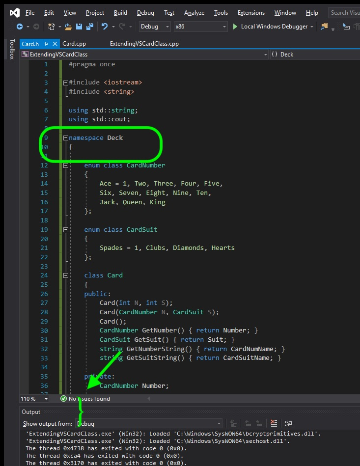
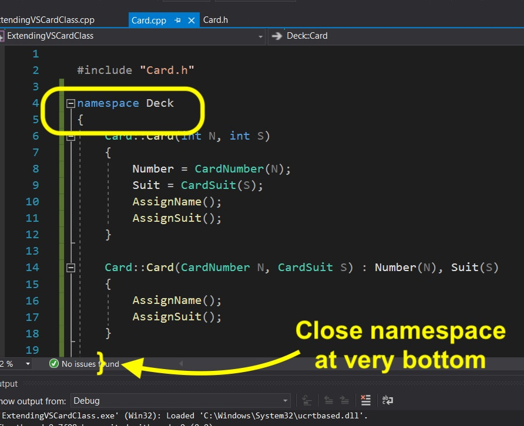
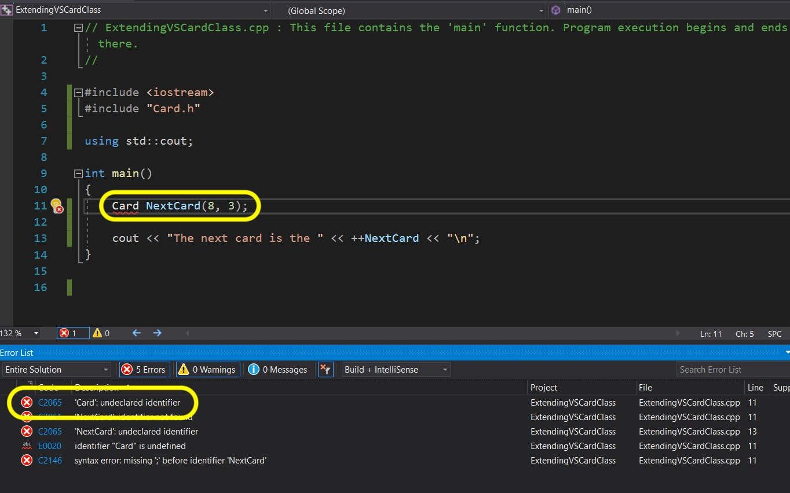
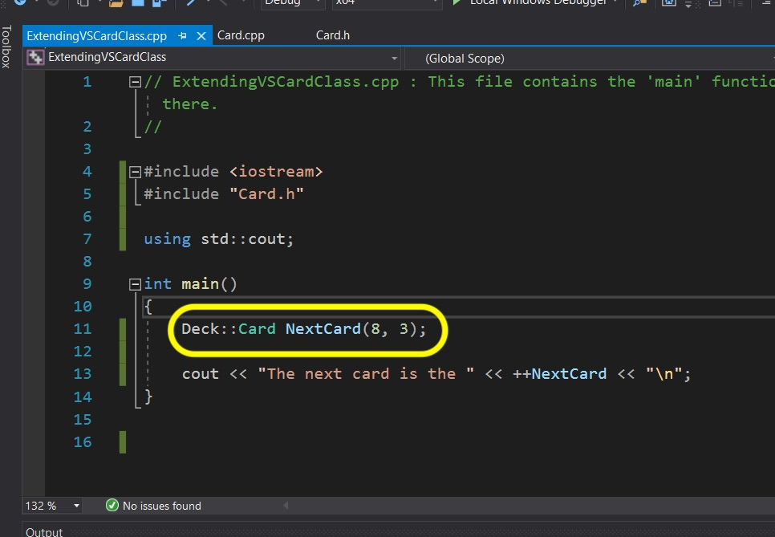
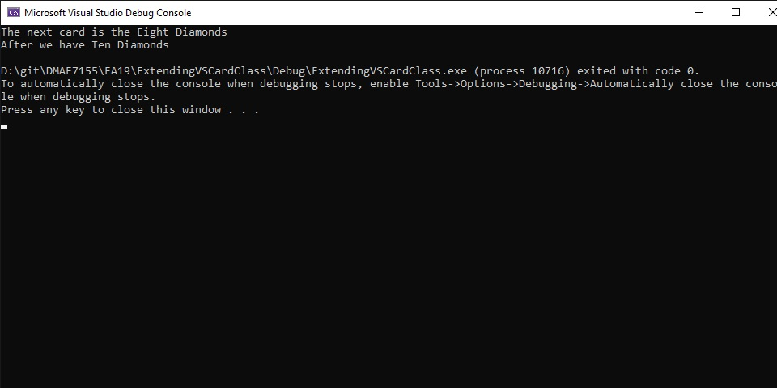

### Add Namespace

[previous](../) • [home](../README.md#user-content-gms2-top-down-shooter) • [next](../)

Now it is always a good idea when creating a class to add its own [namespace](https://en.cppreference.com/w/cpp/language/namespace).  Namespace is a method for preventing conflicts in large projects.  UE4 is a large project and there are thousands of classes and names to contend with.  The chances of reusing a name they have already used is great.

 

---

##### `Step 1.`\|`SPCRK`|:small_blue_diamond:

Lets add a **Namespace** to the project.  Why use a namespace on a new class in such a small project?  This class is generic enough that I might want to reuse it on multiple projects. **Cards** is a fairly generic name, and it is quite possible I might try and use it where there is another class called **Cards**.  By giving it a namespace it is less likely that I will have a collision (use the same name of a class and member where the compiler will pick one of the two (or not compile).    Lets wrap the entire **.h** with the namespace `Deck`.  Now compile and we break the entire **.cpp** as it is lo longer in the same global namespace.

##### `Step 2.`\|`FHIU`|:small_blue_diamond: :small_blue_diamond: 

Open **Card.cpp** and put all the definitions within the `Deck` namespace.

##### `Step 3.`\|`SPCRK`|:small_blue_diamond: :small_blue_diamond: :small_blue_diamond:

Try compiling and go back to the ExtendingVSCardClass.cpp tab.  Notice that it can't find the **Card** class.

##### `Step 4.`\|`SPCRK`|:small_blue_diamond: :small_blue_diamond: :small_blue_diamond: :small_blue_diamond:

Now instead of wrapping the entire main function in a namespace we can just add `Deck::` in from of `Card` so that the compiler recognizes the class name we are trying to access. 

##### `Step 5.`\|`SPCRK`| :small_orange_diamond:

Now compile and fix any errors.  Run the project and you should see what we had at the end of the previous project.  We have refactored the **Card** class into its own proper **.cpp** and **.h** file.  

___

| [previous](../)| [home](../README.md#user-content-gms2-top-down-shooter) | [next](../)|
|---|---|---|
