### Auto

[previous](../) • [home](../README.md#user-content-gms2-top-down-shooter) • [next](../)

Sometimes, we might know the type of the object we are pointing to.  C++ has a keyword `auto` that will deduce the type for us.  Lets take a look.

 

---

##### `Step 1.`\|`SPCRK`|:small_blue_diamond:

We can deduce type at runtime.  Sometimes we don't know the exact type of the object we are trying to access.  The `auto` keyword lets the initializer determine the type.  So if we add two **integers** together the resulting variable would derive to **int**.  

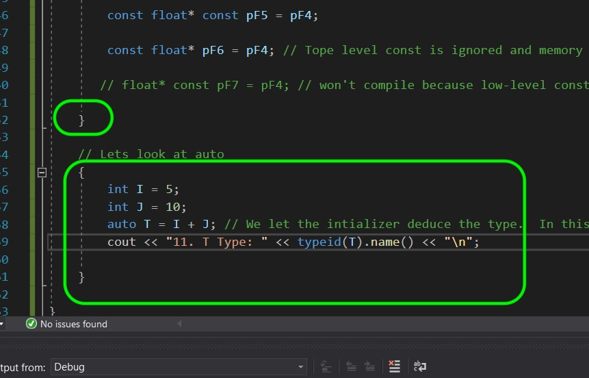

##### `Step 2.`\|`FHIU`|:small_blue_diamond: :small_blue_diamond: 

Prove it by running the program and seeing what type is derived by `auto`:

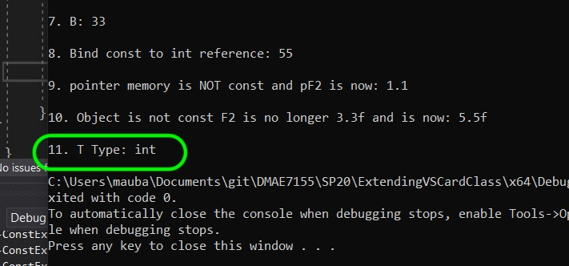

##### `Step 3.`\|`SPCRK`|:small_blue_diamond: :small_blue_diamond: :small_blue_diamond:

Be careful when you are mixing types. It is not immediately obvious to what type it will resolve to with the `auto` keyword.  Try and guess what type `S` will be?

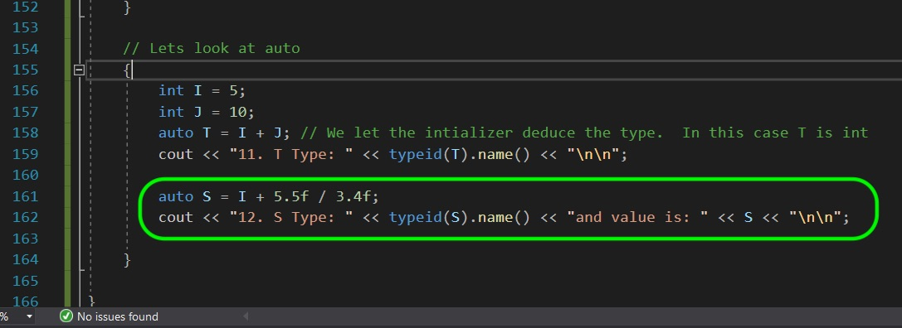

##### `Step 4.`\|`SPCRK`|:small_blue_diamond: :small_blue_diamond: :small_blue_diamond: :small_blue_diamond:

Did you guess that this value is with **int** and 2 **floats** resolved to a float?  Well it did...

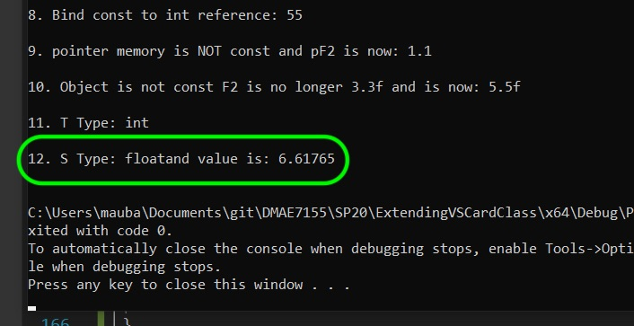

##### `Step 5.`\|`SPCRK`| :small_orange_diamond:

The `auto` keyword ignores **top-level const**. Lets look at an example of what a const pointer const type looks like.

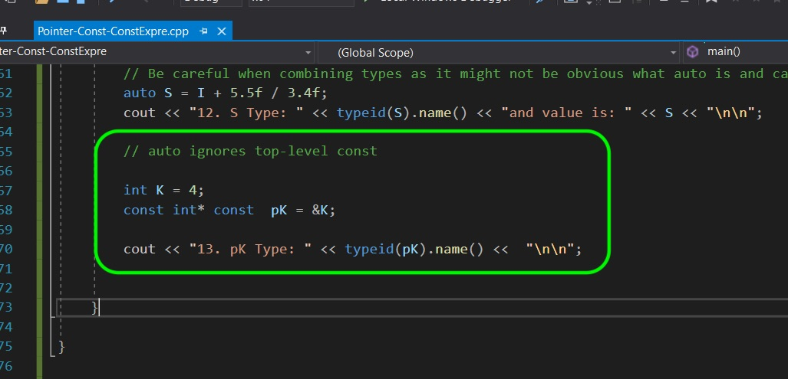

##### `Step 6.`\|`SPCRK`| :small_orange_diamond: :small_blue_diamond:

 When we look at the type it only shows us the **low-level const**.

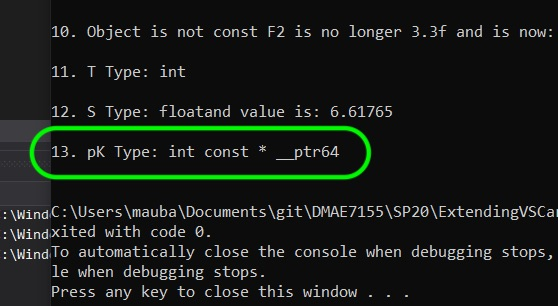

##### `Step 7.`\|`SPCRK`| :small_orange_diamond: :small_blue_diamond: :small_blue_diamond:

But notice that the **top-level** const holds as you can't reassign the pointer to another object of the same type.

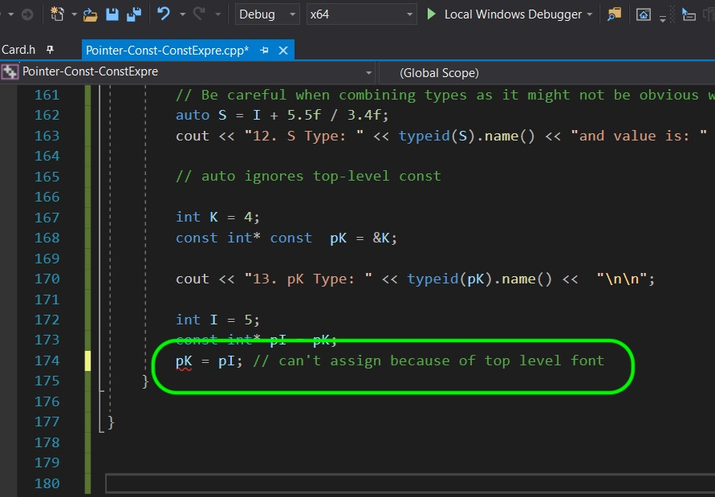

##### `Step 8.`\|`SPCRK`| :small_orange_diamond: :small_blue_diamond: :small_blue_diamond: :small_blue_diamond:

Now lets look at what happens with `auto`.  It does not copy the **top-level** const.  Lets let `auto pJ = pI` and see what happens.

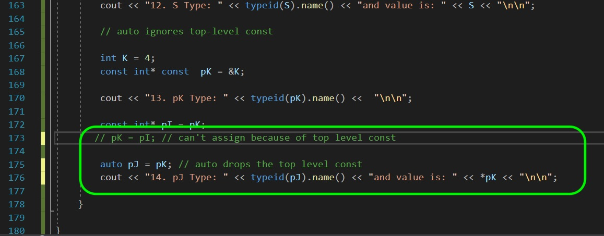

##### `Step 9.`\|`SPCRK`| :small_orange_diamond: :small_blue_diamond: :small_blue_diamond: :small_blue_diamond: :small_blue_diamond:

 When you run it, it looks the same as before without showing the **top-level** const.

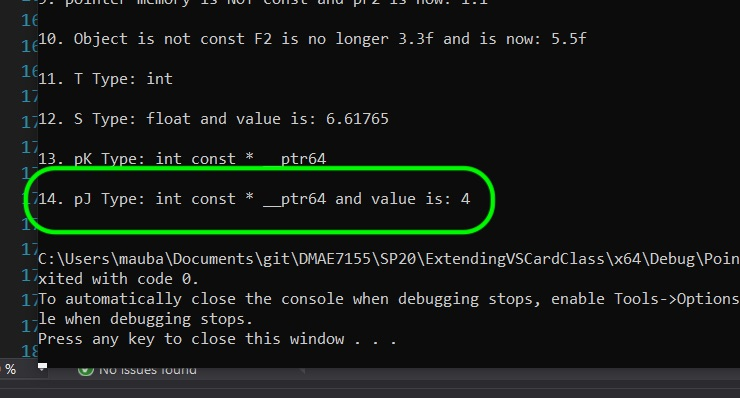

##### `Step 10.`\|`SPCRK`| :large_blue_diamond:

Now we can reassign the pointer to another object as **auto** did not in fact copy the **top-level const**.

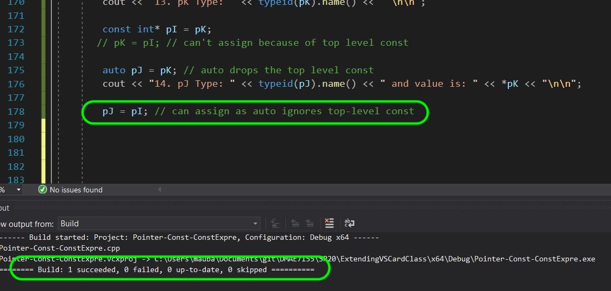

##### `Step 11.`\|`SPCRK`| :large_blue_diamond: :small_blue_diamond: 

We can also force `auto` to a **low-level const**.  If we declare `const auto` then that variable will be const regardless of the type on the right hand side of the `=` sign.  Now we have an `int K` that is not const.  But if we assign it to `const auto L` lets see if it is const?

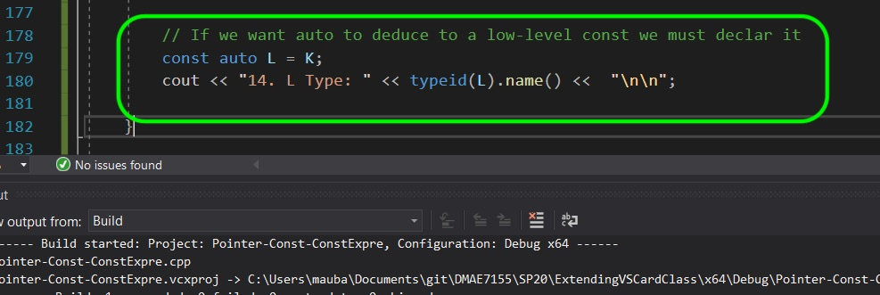

##### `Step 12.`\|`SPCRK`| :large_blue_diamond: :small_blue_diamond: :small_blue_diamond: 

Run it, and you see that the type is deduced to **int**. [In all cases, cv-qualifiers are ignored by typeid](https://en.cppreference.com/w/cpp/language/typeid#Explanation).  This means that the constness of literals will not be shown. On the next page we will prove that it is const.

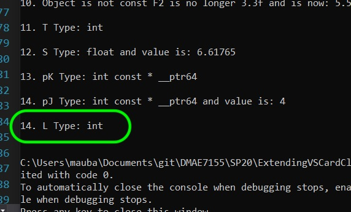

___

| [previous](../)| [home](../README.md#user-content-gms2-top-down-shooter) | [next](../)|
|---|---|---|
