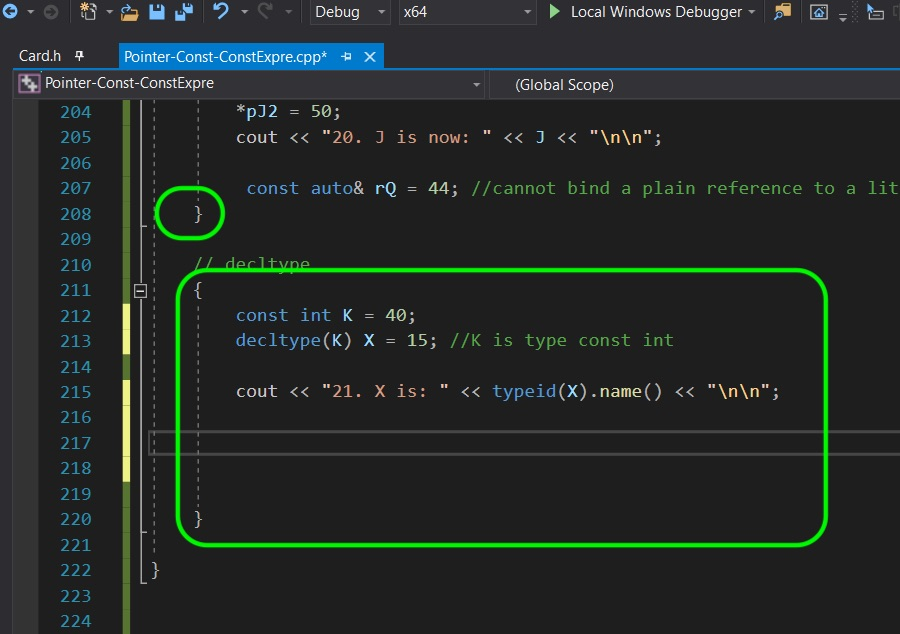
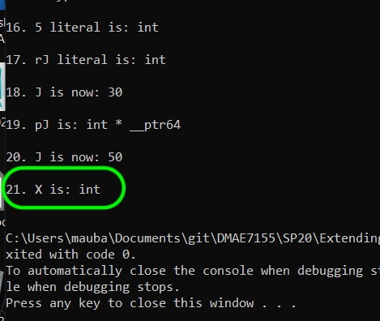
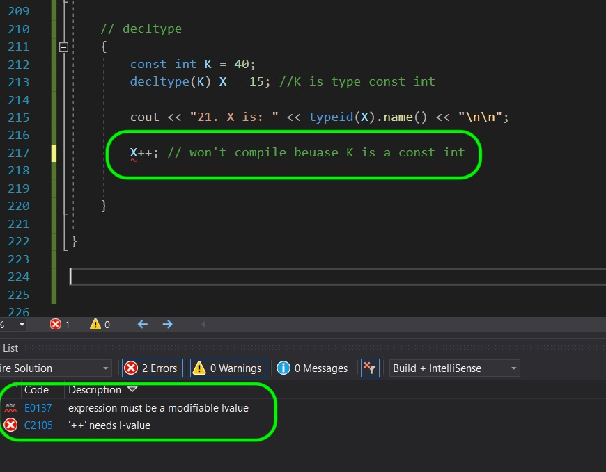
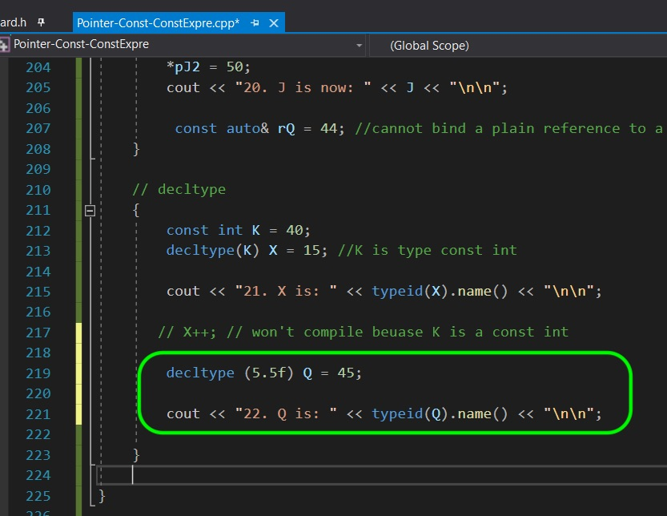
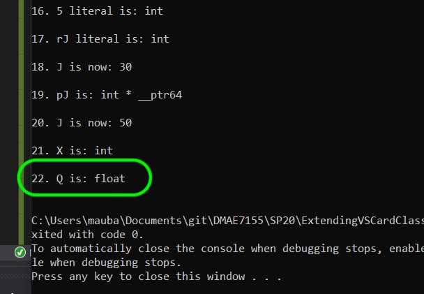
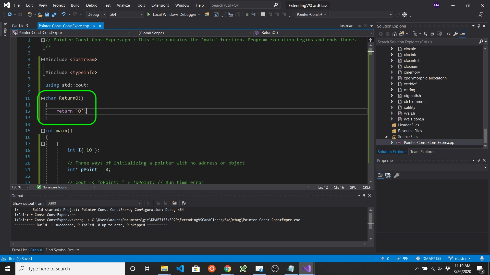
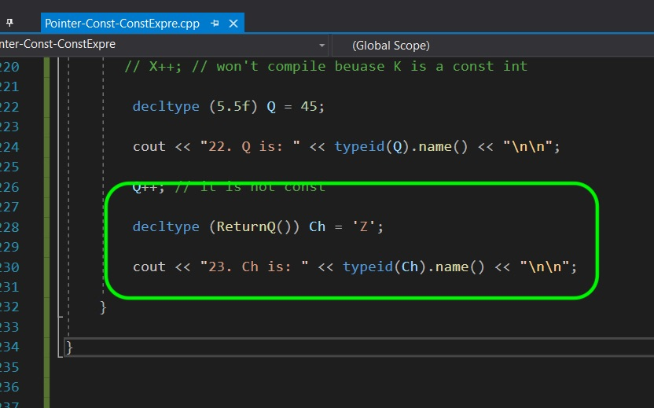
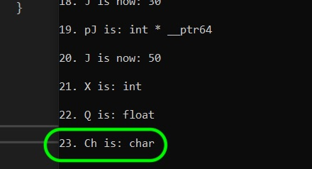

### Decltype

[previous](../) • [home](../README.md#user-content-gms2-top-down-shooter) • [next](../)

We have another way of deriving type.  We have `decltype()` that returns the type of what is passed to it.  Lets look at a few examples. 

 

---

##### `Step 1.`\|`SPCRK`|:small_blue_diamond:

 `decltype(type)` derives the type to what is passed within parenthesis.  In this case it derives from `K` a **const int**. 

##### `Step 2.`\|`FHIU`|:small_blue_diamond: :small_blue_diamond: 

The type is derived by `decltype()` and is the same as `K` an **integer**. Again we can't see the const-ness.

##### `Step 3.`\|`SPCRK`|:small_blue_diamond: :small_blue_diamond: :small_blue_diamond:

So to test whether the const got carried by the **decltype()** lets try and increment this new variable.  We get a compiler error saying that it is const.

##### `Step 4.`\|`SPCRK`|:small_blue_diamond: :small_blue_diamond: :small_blue_diamond: :small_blue_diamond:

Now we can also pass a literal expression and have **decltype()** derive the type.  So in this case we pass a float literal to **decltype()**.  To make it trickier, we are passing it an integer.

##### `Step 5.`\|`SPCRK`| :small_orange_diamond:

So sure enough it did derive the type as a **float**.

##### `Step 6.`\|`SPCRK`| :small_orange_diamond: :small_blue_diamond:

 Now you can also use **decltype** to derive the return type of a function.  Lets create a simple function to see it in practice that returns a **char**.

##### `Step 7.`\|`SPCRK`| :small_orange_diamond: :small_blue_diamond: :small_blue_diamond:

So now we are determining the type of `Ch` with the return type of the function `ReturnQ()`.

##### `Step 8.`\|`SPCRK`| :small_orange_diamond: :small_blue_diamond: :small_blue_diamond: :small_blue_diamond:

Now when you run it you see that it correctly derived the type **char** from the return of the function. Next up we will apply these concepts in Unreal engine in our small card class.

___

| [previous](../)| [home](../README.md#user-content-gms2-top-down-shooter) | [next](../)|
|---|---|---|
