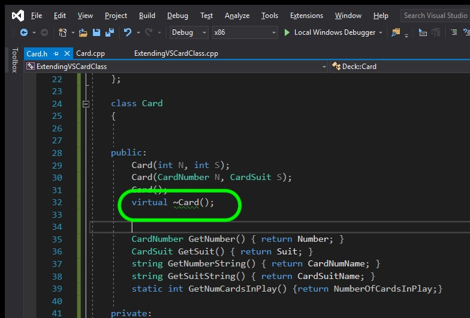
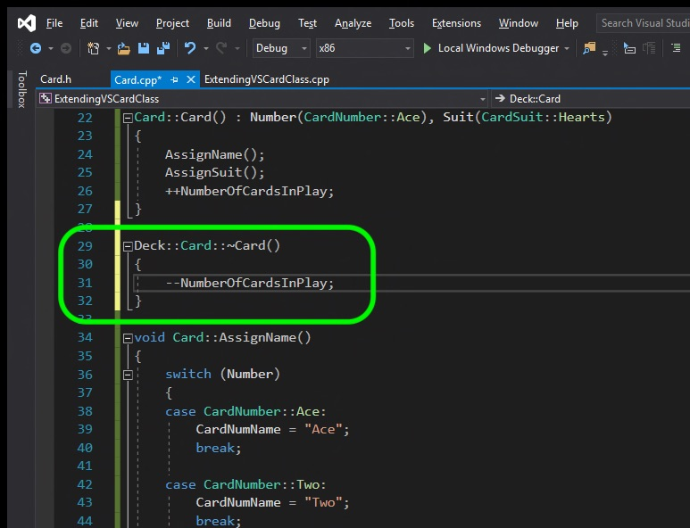
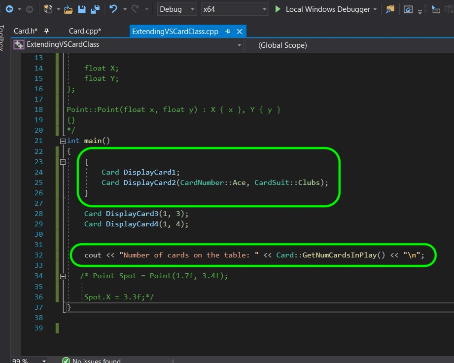
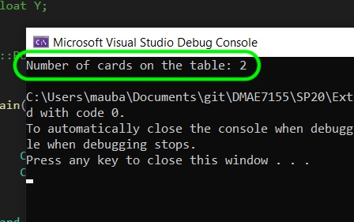

### Destructor

[previous](../) • [home](../README.md#user-content-gms2-top-down-shooter) • [next](../)

A [destructor](https://en.cppreference.com/w/cpp/language/destructor) is a special function that is called when the object is no longer in scope and is destroyed. The purpose is for any functionality that is required like adapting to the change or freeing up resources.

 

---

##### `Step 1.`\|`SPCRK`|:small_blue_diamond:

Now what happens when a card is no longer is scope and is not in memory?  We have a problem, our static member will still show 4 cards.  There is a special function that is run when the class is destroyed.  It is the destructor special function for the class.  It is defined with the name of the class preceded by the `~` symbol.  This is the very last function to run before the object is de-allocated. It has the `virtual` keyword that we will get into later.

##### `Step 2.`\|`FHIU`|:small_blue_diamond: :small_blue_diamond: 

 Now in the destructor definition all we need to do is subtract a card from the deck.

##### `Step 3.`\|`SPCRK`|:small_blue_diamond: :small_blue_diamond: :small_blue_diamond:

All we need to do is to put curly braces `{}` around two of the cards and they will go out of scope and the destructor will run after **line 26** when those two objects go out of scope.

##### `Step 4.`\|`SPCRK`|:small_blue_diamond: :small_blue_diamond: :small_blue_diamond: :small_blue_diamond:

Compile and fix all errors.  Run the program and you will see that the destructor ran on **DisplayCard1** and **DisplayCard2** when they went out of scope (the memory is freed up when they go out of scope).  It subtracts `1` twicevand it is now only `2` cards left on the table (in memory).

___

| [previous](../)| [home](../README.md#user-content-gms2-top-down-shooter) | [next](../)|
|---|---|---|
