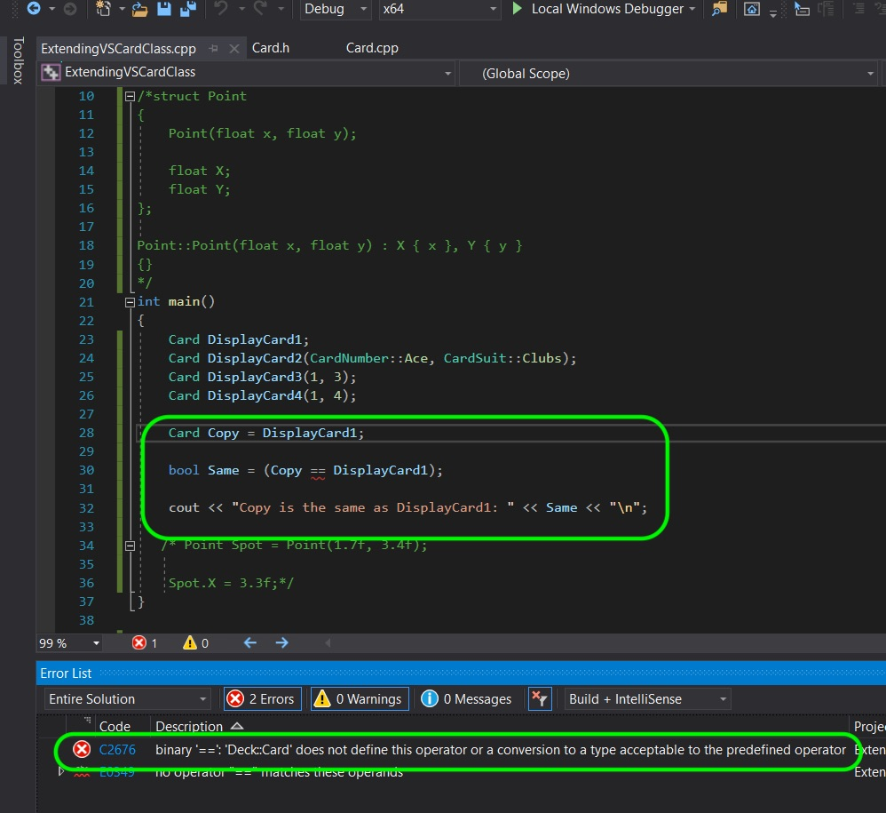
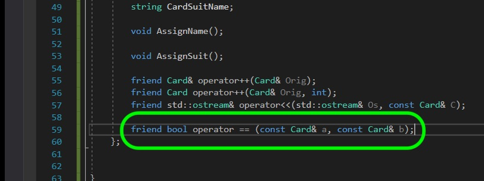
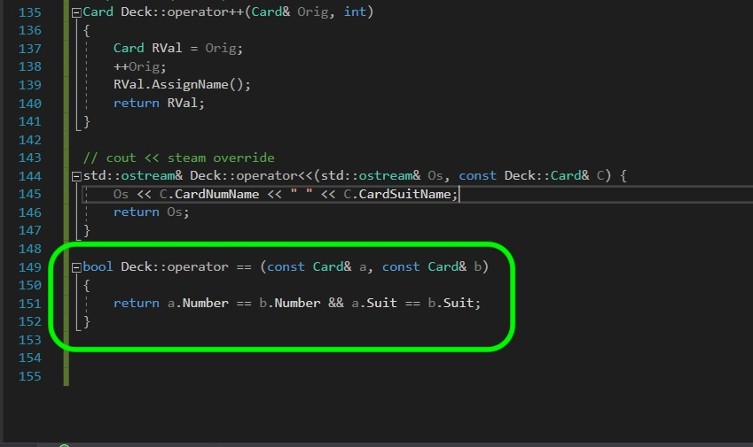
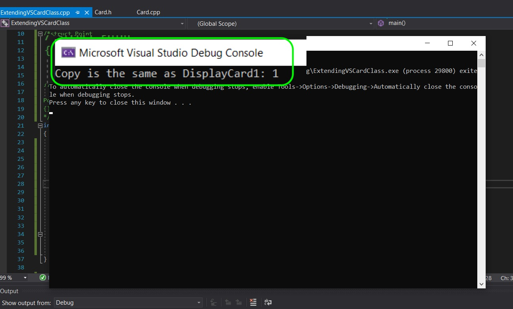
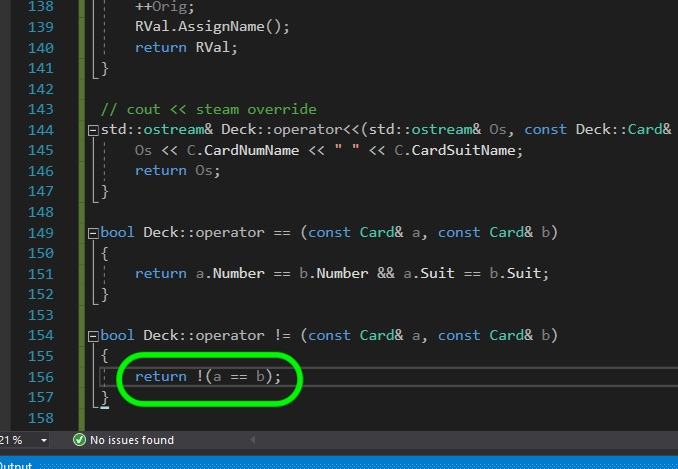
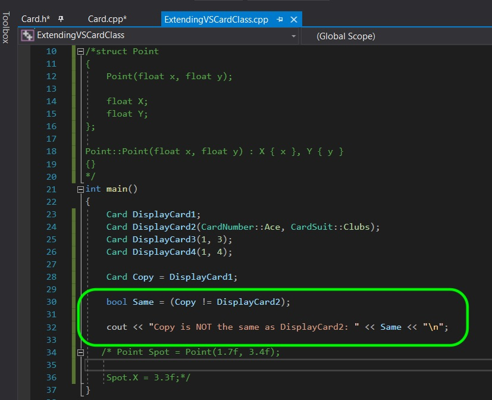
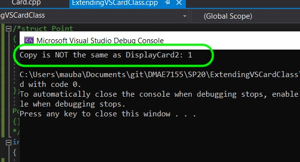

### Equal & Not Equal Operators

[previous](../) • [home](../README.md#user-content-gms2-top-down-shooter) • [next](../)

Now we have overlooked a very important issue with this class. What is we want to compare two cards and find out if they are the same suit & number?  This class does not know what its members are and what makes one card the same as the other.  For example we could have two cards with different designs on the back, but they have the same number and suit.  It is up to us to determine what makes a **Card** same or different.

 

---

##### `Step 1.`\|`SPCRK`|:small_blue_diamond:

We will start by ensuring that we have two classes that are the same. 
Now lets make a copy.  But what happens when we check to see if two variables are the same and we find out that it won't compile as `==` is not found for the **Card** class. The compiler doesn't know what a card class is so it has no way of determining of one object is the same as another.

##### `Step 2.`\|`FHIU`|:small_blue_diamond: :small_blue_diamond: 

Go to **Card.h** and add another declaration for the `operator ==` and make it a friend so the operator can access this private member.  Remember a friend class allows another type the ability to read your members set to **friend**.

##### `Step 3.`\|`SPCRK`|:small_blue_diamond: :small_blue_diamond: :small_blue_diamond:

Now in the definition we are looking to see if both the **Number** and the **Suit** are the same.  We we check both values and return whether they are both the same.

##### `Step 4.`\|`SPCRK`|:small_blue_diamond: :small_blue_diamond: :small_blue_diamond: :small_blue_diamond:

Comnpile and fix all the errors.  Run the game and you will see that the comparison operator works. Remember a true boolean will be `1`.

##### `Step 5.`\|`SPCRK`| :small_orange_diamond:

Now we need to declare the `!=` operator as well.  Lets declare it in **Card.h**.

##### `Step 6.`\|`SPCRK`| :small_orange_diamond: :small_blue_diamond:

We define it in **Card.cpp** and all we do is call the `==` operator and invert the boolean with a `!`.

##### `Step 7.`\|`SPCRK`| :small_orange_diamond: :small_blue_diamond: :small_blue_diamond:

Now lets alter the **main()** function and test the `!=` symbol and make sure it works.

##### `Step 8.`\|`SPCRK`| :small_orange_diamond: :small_blue_diamond: :small_blue_diamond: :small_blue_diamond:

Compile and run the game to test it out.  Seems to work fine.  Remember a true boolean will be `1`.

___

| [previous](../)| [home](../README.md#user-content-gms2-top-down-shooter) | [next](../)|
|---|---|---|
