### Equality in UE4 Card Class

[previous](../) • [home](../README.md#user-content-gms2-top-down-shooter) • [next](../)

Lets make sure we can compare two cards to find out if they are the same number and suit. 

 

---

##### `Step 1.`\|`SPCRK`|:small_blue_diamond:

 Lets add a new blueprint to hold the text to indicate sameness of the two cards.  Press the **Add New** button and select a **Actor Blueprint Class** and add it to the **Blueprints** folder. Call this new blueprint `BP_Same_Message`.

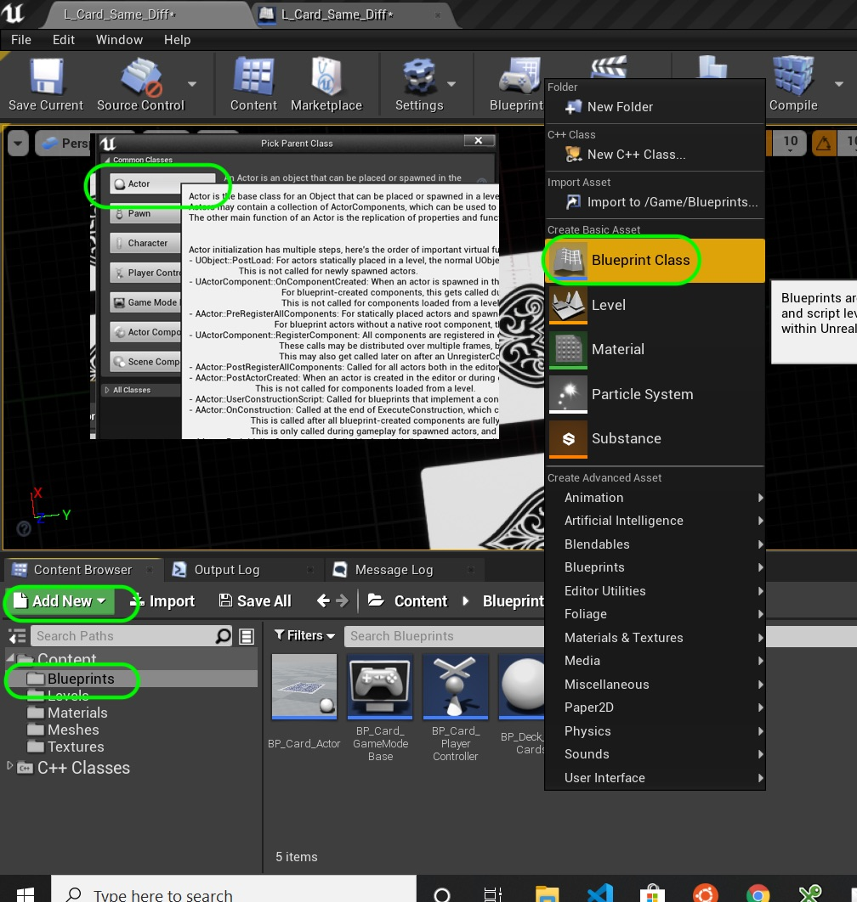

##### `Step 2.`\|`FHIU`|:small_blue_diamond: :small_blue_diamond: 

Open the **BP_Same_Message** blueprint and add a **TextRender** component.

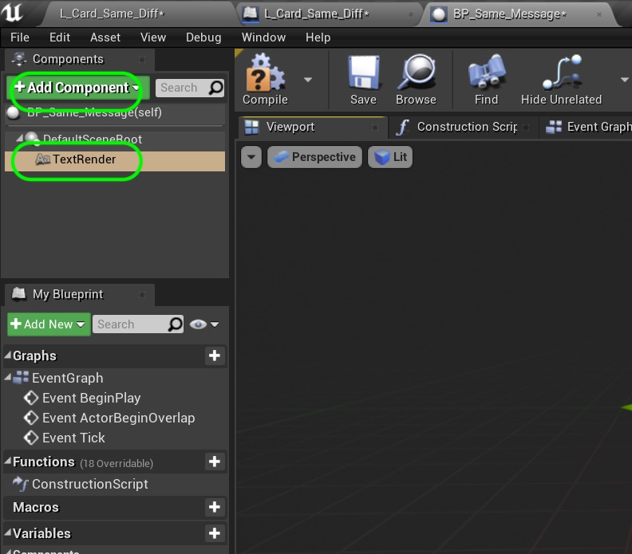

##### `Step 3.`\|`SPCRK`|:small_blue_diamond: :small_blue_diamond: :small_blue_diamond:

Add `The two cards are` to the **Text** box.  Pick a bright color.  **Center** the **Horizontal Alignment**.

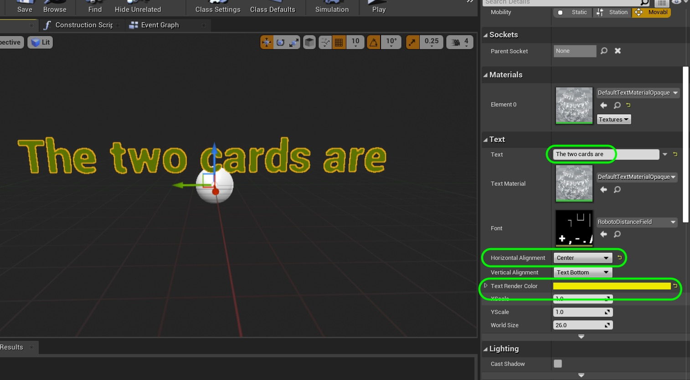

##### `Step 4.`\|`SPCRK`|:small_blue_diamond: :small_blue_diamond: :small_blue_diamond: :small_blue_diamond:

Click on the Material for the Text Render and we need to change it as this will not work in an unlit room.  Click on the **View Options** eyeball and select **Show Engine Content**.

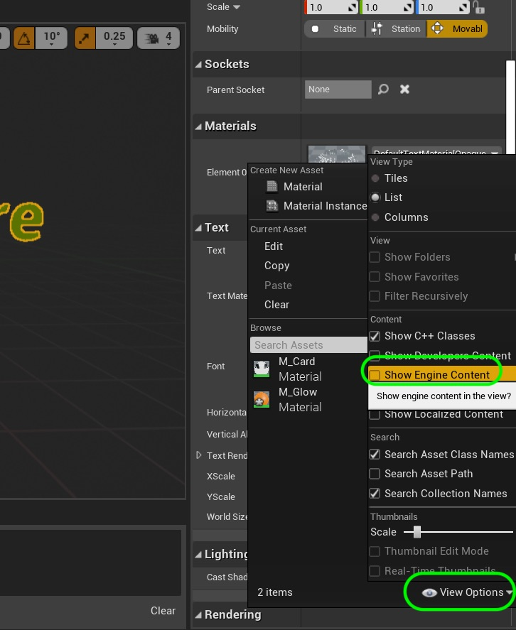

##### `Step 5.`\|`SPCRK`| :small_orange_diamond:

Search and select **Unlit Text** node that comes with the engine.

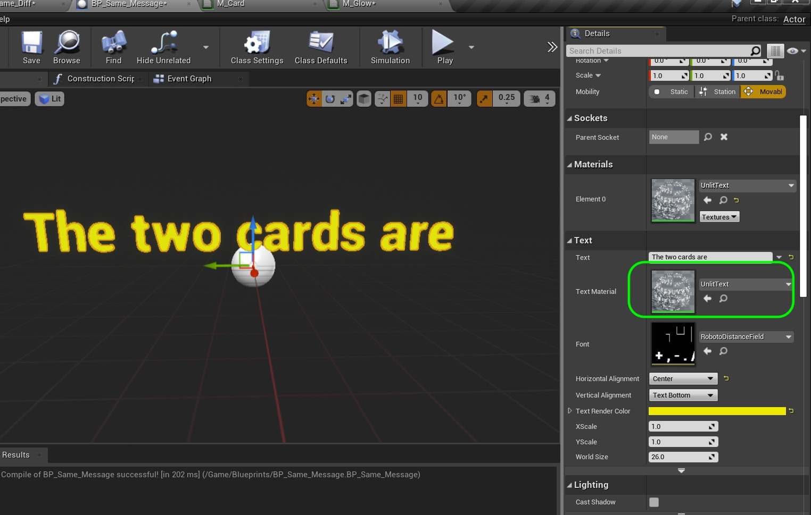

##### `Step 6.`\|`SPCRK`| :small_orange_diamond: :small_blue_diamond:

 Drag a reference to BP_Same_Message and rotate it so that it is in the correct direction and is facing the camera.  It should look something like this.  On the next page we will move into C++ and add the operator override.

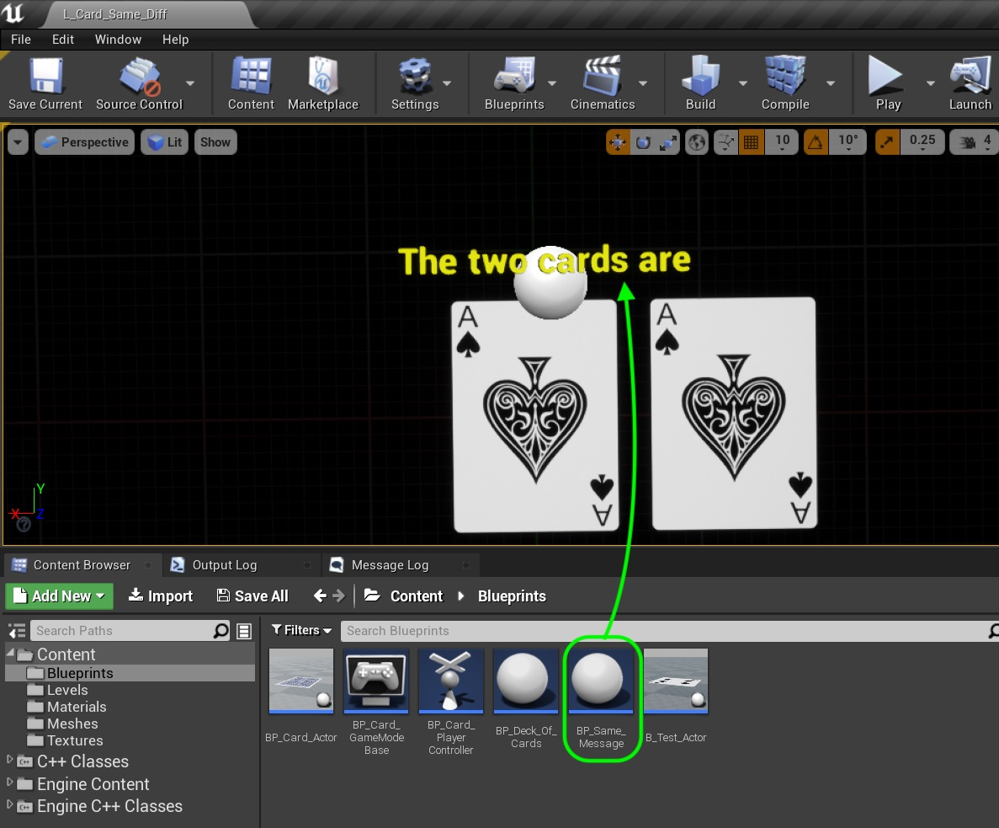

##### `Step 7.`\|`SPCRK`| :small_orange_diamond: :small_blue_diamond: :small_blue_diamond:

Open up **Card_Actor.h** in **Visual Studio** and add to the bottom of the class. Some documentation suggests that you have to make it INLINE and use the UE4 FORCEINLINE macro.  This means that you define the overloaded operator inside the .h. Otherwise this is identical to how we implemented it in our pure C++ Card class.

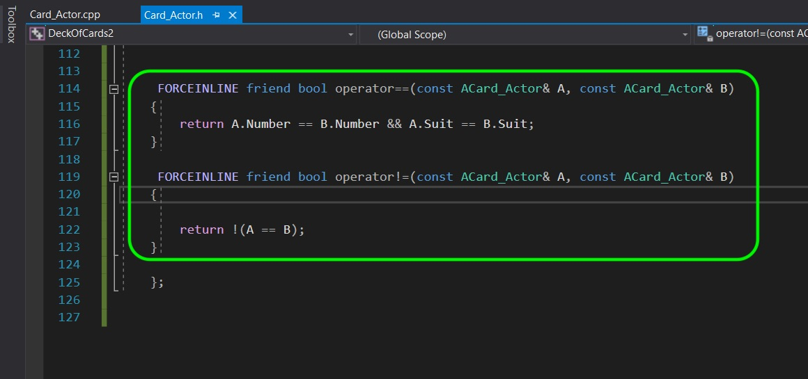

##### `Step 8.`\|`SPCRK`| :small_orange_diamond: :small_blue_diamond: :small_blue_diamond: :small_blue_diamond:

Now we want the user to call this function outside the instance of an object.  Since this is not comparing self with other and is comparing two others we wnat to be able to call this outside an instance of the object.  In fact, we will be calling it within the level blueprint.  By making the function static we can call it within any blueprint without having to be inside the BP_Card_Actor.  Also we will use pointers so that we can compare two objects to see if they are the same (use the operator override we just wrote) we will make both the object it is pointing to and the pointer **const**.  This tells the user of this method that we are not changing anything within this function.

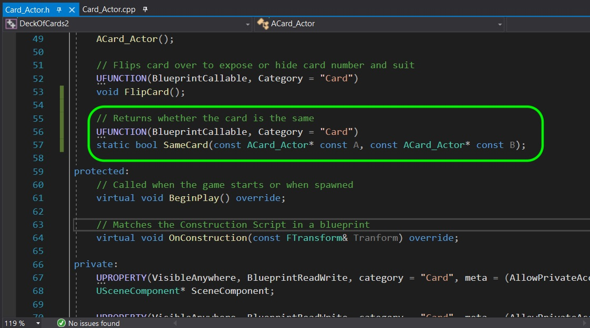

##### `Step 9.`\|`SPCRK`| :small_orange_diamond: :small_blue_diamond: :small_blue_diamond: :small_blue_diamond: :small_blue_diamond:

Now lets define this new function in **Card_Actor.cpp**. We simply return a comparison of the two classes.

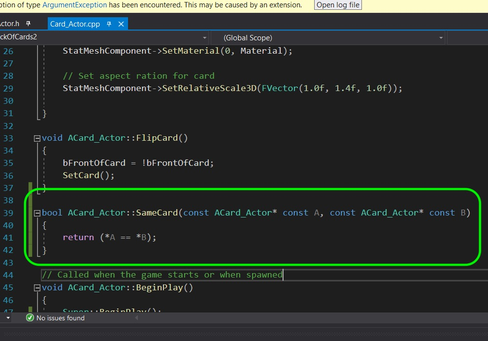

##### `Step 10.`\|`SPCRK`| :large_blue_diamond:

 Go back to the game and select the first card in the **World Outliner**.

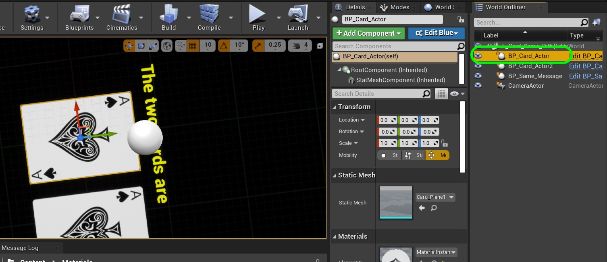

##### `Step 11.`\|`SPCRK`| :large_blue_diamond: :small_blue_diamond: 

Now open the **Blueprint \| Open Level Blueprint** right click on the **Event Graph** and select **Create a Reference to BP_Card_Actor**.

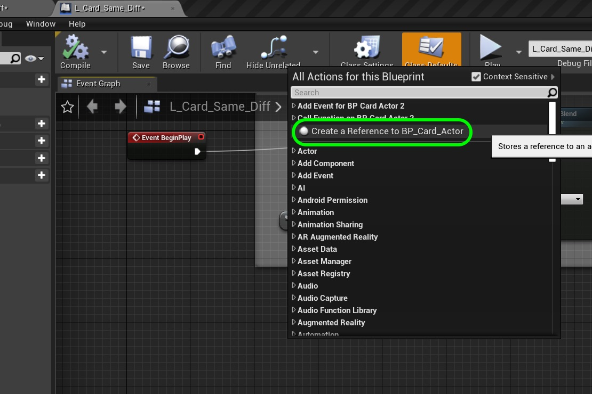

##### `Step 12.`\|`SPCRK`| :large_blue_diamond: :small_blue_diamond: :small_blue_diamond: 

Repeat this process for the second card and you should in the blueprint have two references, one for each card.  Add a comment box with some room to add more nodes.  Add the comment **Check if Card is the same or not**.

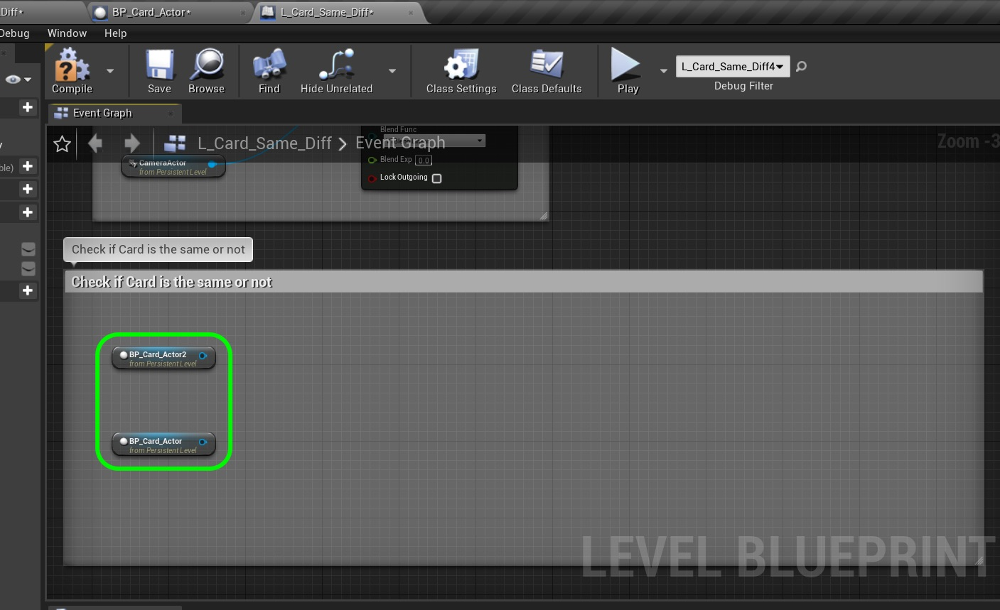

##### `Step 13.`\|`SPCRK`| :large_blue_diamond: :small_blue_diamond: :small_blue_diamond:  :small_blue_diamond: 

Now since the **SameCard()** method is static you do not have to pull of either actor pin to call it.  You can just right click on the graph and type **Same Card** to pick the node.

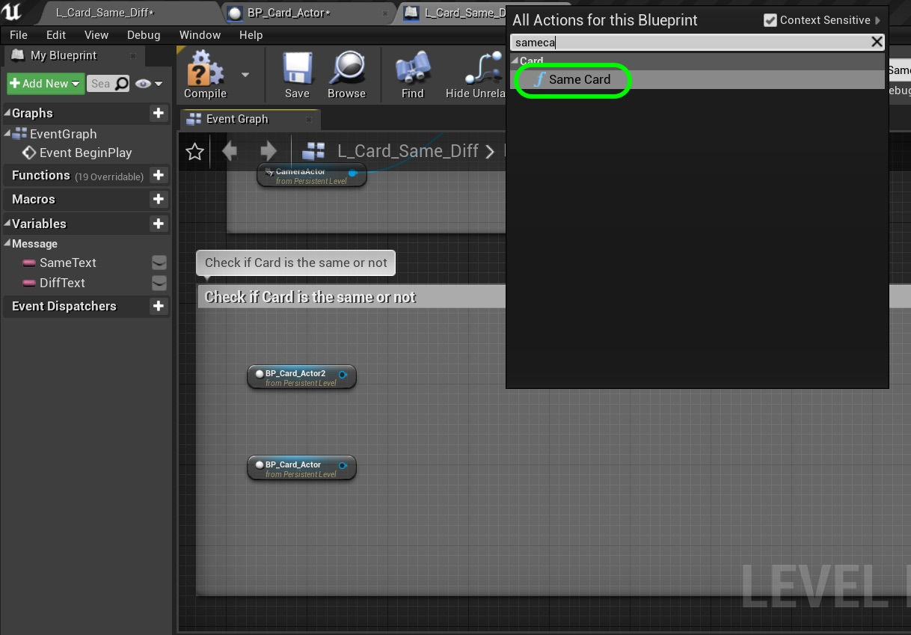

##### `Step 14.`\|`SPCRK`| :large_blue_diamond: :small_blue_diamond: :small_blue_diamond: :small_blue_diamond:  :small_blue_diamond: 

Connect the execution pin from the **Set View Target with Blend** node to **Same Card**.  Connect the two card reference pins to the input A & B pins to the method.

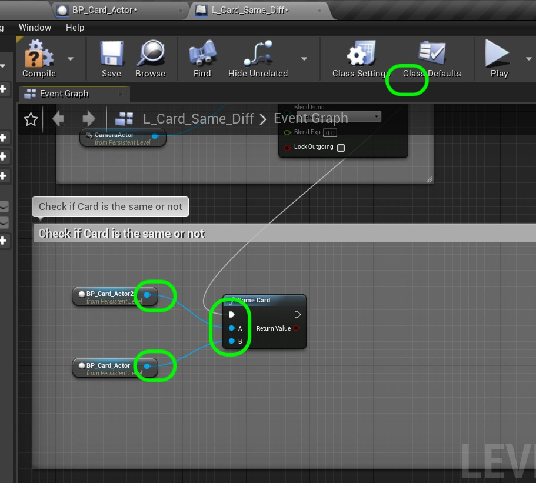

##### `Step 15.`\|`SPCRK`| :large_blue_diamond: :small_orange_diamond: 

Add a **Branch** (C++ if) node and attach it to the output of the **Same Card**. 

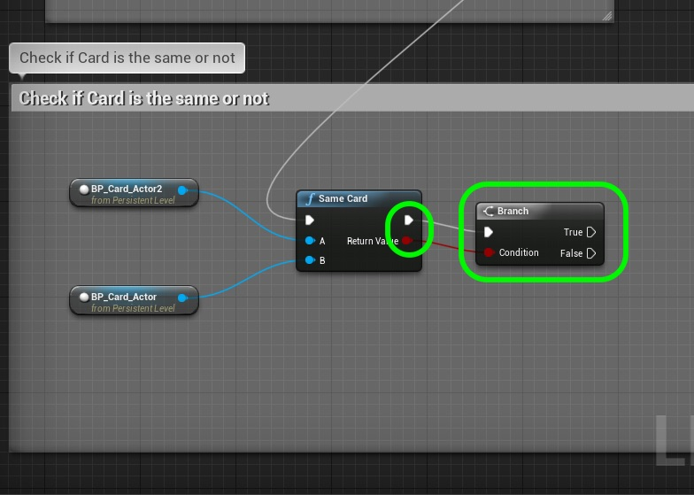

##### `Step 16.`\|`SPCRK`| :large_blue_diamond: :small_orange_diamond:   :small_blue_diamond: 

Now we need access to the BP_Same_Message blueprint to change the text.  Go to the editor and in the **World Outliner** select **BP_Same_Message**.  Go back to the level blueprint and right click on the **Event Graph** and right click in an open area and select **Create a Reference to BP_Same_Message**.

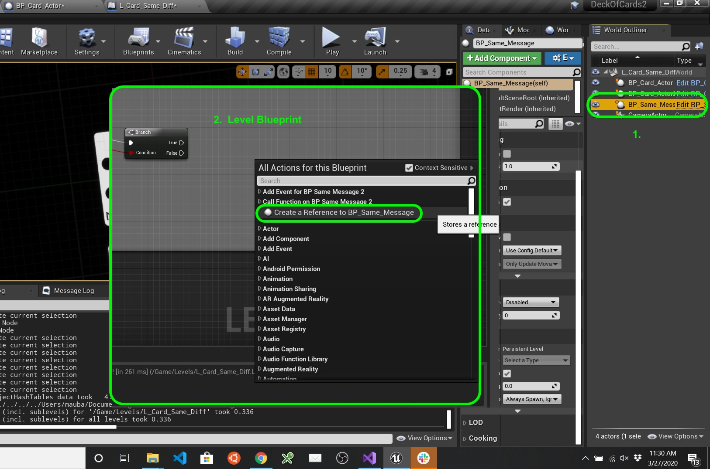

##### `Step 17.`\|`SPCRK`| :large_blue_diamond: :small_orange_diamond: :small_blue_diamond: :small_blue_diamond:

Pull from the **BP_Same_Message** pin and look for **Set Text(Text Render)** to alter the text in the component.

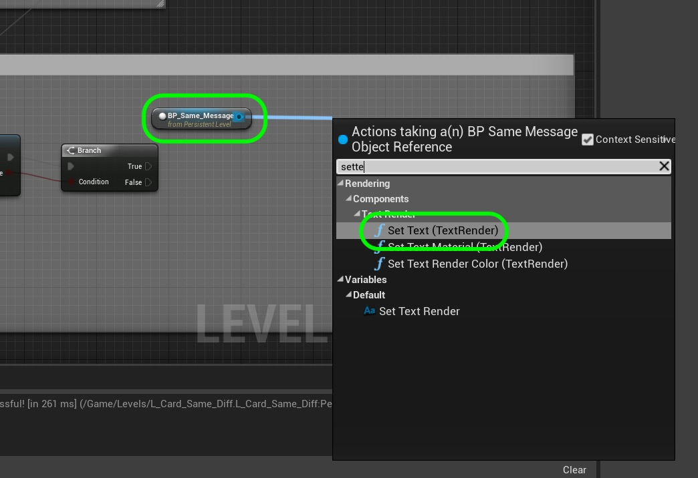

##### `Step 18.`\|`SPCRK`| :large_blue_diamond: :small_orange_diamond: :small_blue_diamond: :small_blue_diamond: :small_blue_diamond:

Connect the execution pin of **Set Text** from the **True** branch.

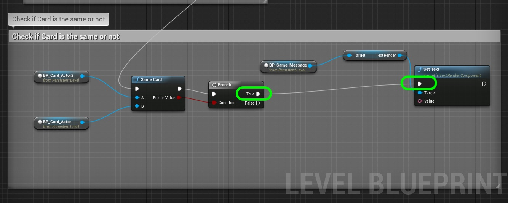

##### `Step 19.`\|`SPCRK`| :large_blue_diamond: :small_orange_diamond: :small_blue_diamond: :small_blue_diamond: :small_blue_diamond: :small_blue_diamond:

 Pull off of the **TextRender** node and select another **Set Text** node and connect it to the **False** branch.

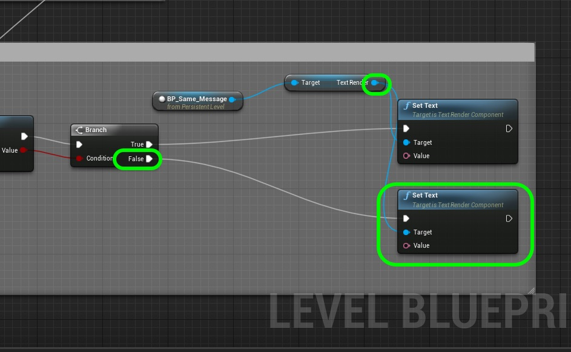

##### `Step 20.`\|`SPCRK`| :large_blue_diamond: :large_blue_diamond:

Create a new **Text** Variable and call it `DiffText`.  Make it **Private**, give it a **Tooltip** of `Different Message` and a **Category** of `Message` and **Default Diff Text** of `The two cards are different`.

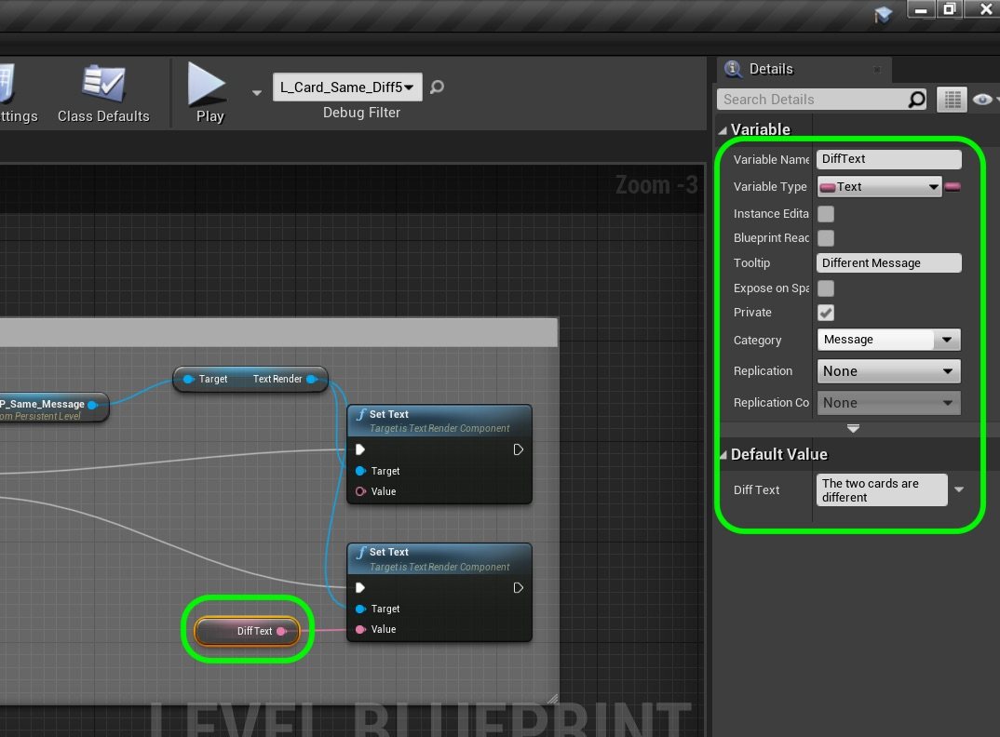

##### `Step 21.`\|`SPCRK`| :large_blue_diamond: :large_blue_diamond: :small_blue_diamond:

 Create a new **Text** Variable and call it `SameText`.  Make it **Private**, give it a **Tooltip** of `Same Message` and a **Category** of `Message` and **Default Diff Text** of `The two cards are the same`.

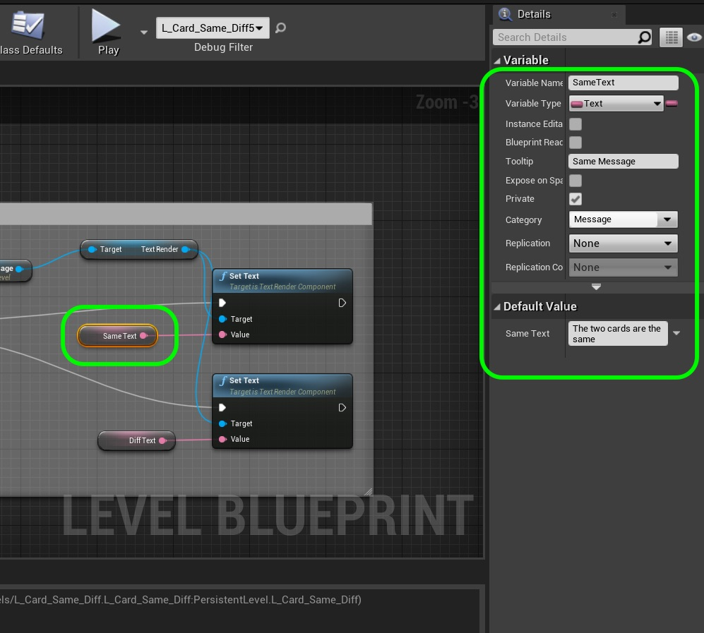

##### `Step 22.`\|`SPCRK`| :large_blue_diamond: :large_blue_diamond: :small_blue_diamond: :small_blue_diamond:

Run the game and make sure that the message is correct.  It should be true if the cards are both face up or face down (or one of each).  They should be false if either only the number or suit is the same.  Check every combination to make sure this check works.

___

| [previous](../)| [home](../README.md#user-content-gms2-top-down-shooter) | [next](../)|
|---|---|---|
