### More on Pointers

[previous](../) • [home](../README.md#user-content-gms2-top-down-shooter) • [next](../)

Let's take a deeper dive on pointers now that we can see that they are used to store memory in free store.  They are also very dangerous as they can create hard to track down memory leaks and nullptr errors.  Lets go...

 

---

##### `Step 1.`\|`SPCRK`|:small_blue_diamond:

Now lets add a new project.  Right click on the VS Solution and right click and select **Add \| New Project...**.

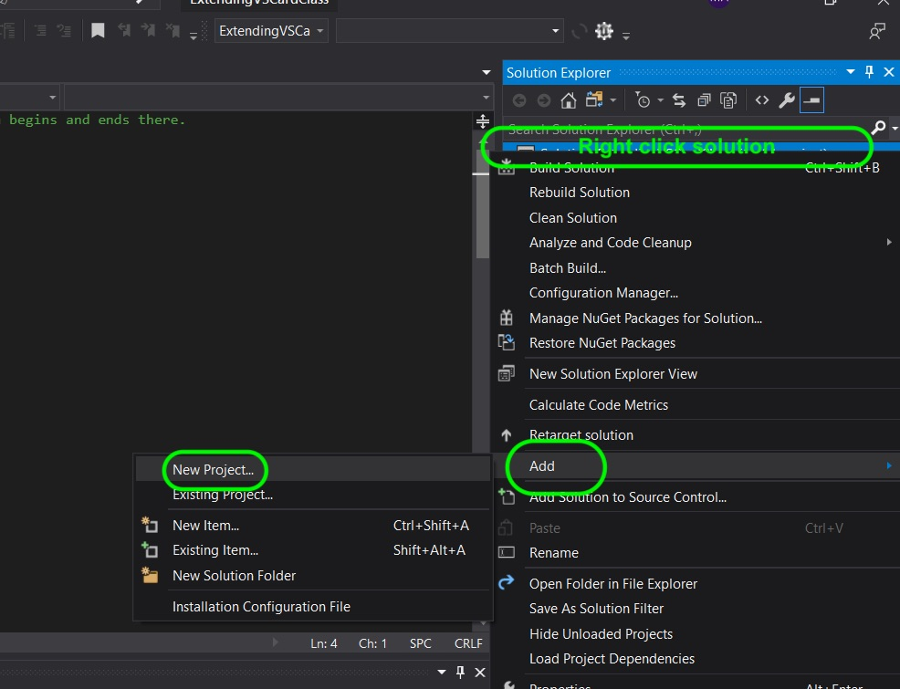

##### `Step 2.`\|`FHIU`|:small_blue_diamond: :small_blue_diamond: 

Call the project `Pointer-Const-ConstExpr` and then press the **Create** button.

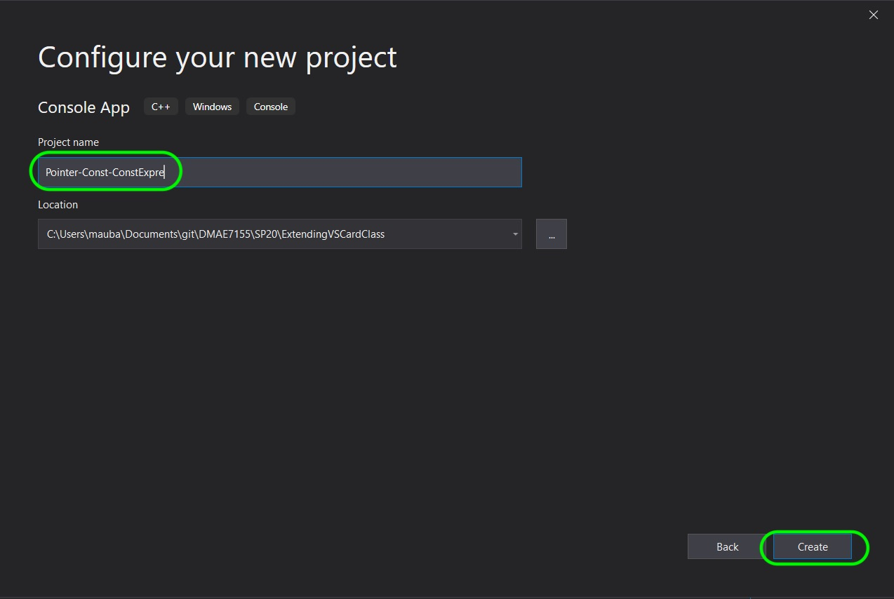

##### `Step 3.`\|`SPCRK`|:small_blue_diamond: :small_blue_diamond: :small_blue_diamond:

Right click on the new project in the **Solution Explorer** and select **Set as StartUp Project**.

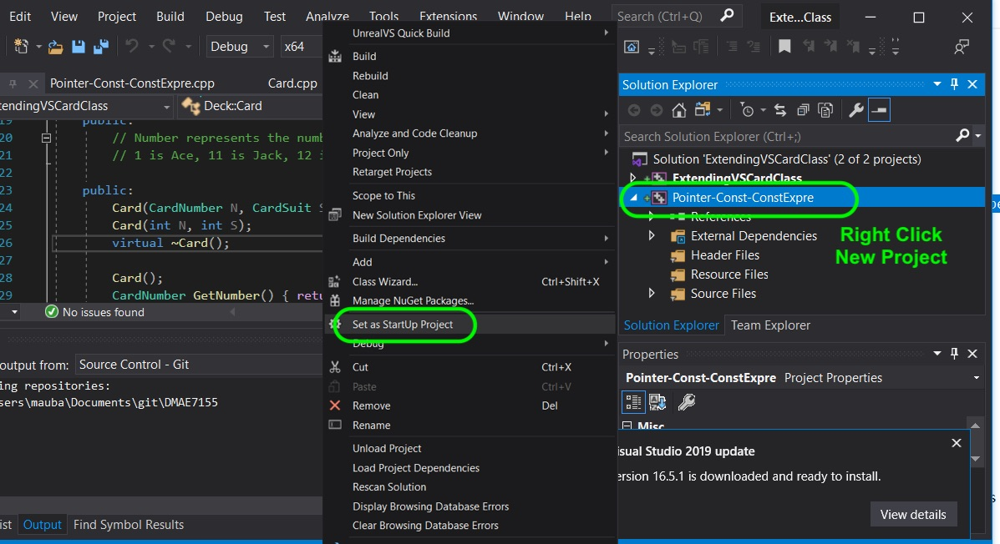

##### `Step 4.`\|`SPCRK`|:small_blue_diamond: :small_blue_diamond: :small_blue_diamond: :small_blue_diamond:

We do not need to assign the pointer right away.  We can instead set it to `0` which does not point to any memory and is essentially a null pointer (does not point to memory - initialized but addresses no object in memory).

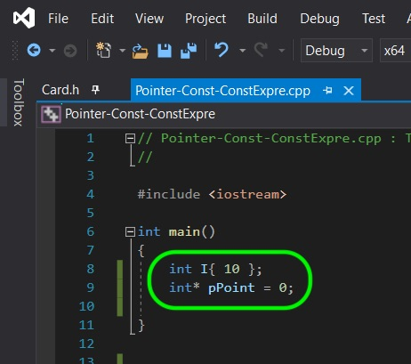

##### `Step 5.`\|`SPCRK`| :small_orange_diamond:

Try and dereference this null pointer that does not point to memory.  You will see that you have a runtime crash that says this pointer is a nullptr. To recover from a runtime error you can press the red **Stop** button to quit the program.

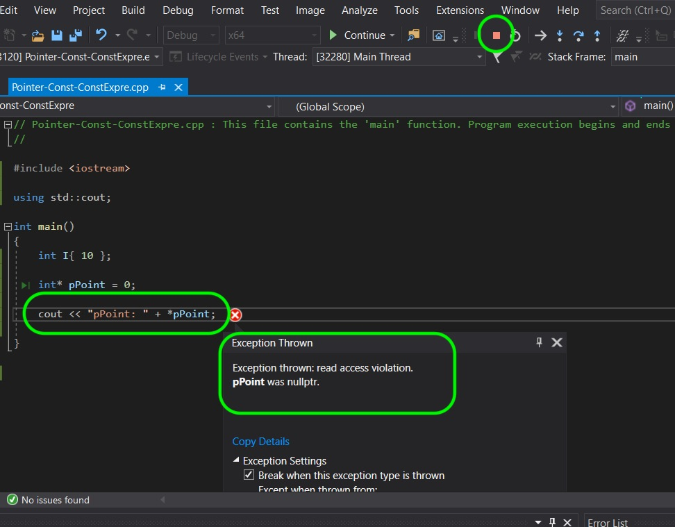

##### `Step 6.`\|`SPCRK`| :small_orange_diamond: :small_blue_diamond:

 We can also use a macro NULL to initialize a pointer without giving it an object to point to.

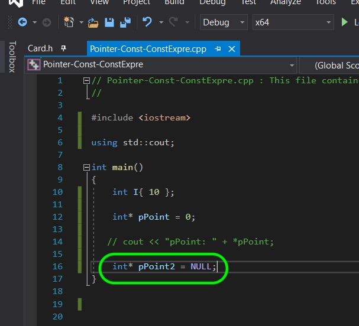

##### `Step 7.`\|`SPCRK`| :small_orange_diamond: :small_blue_diamond: :small_blue_diamond:

In C++11 they introduced `nullptr` a literal of special type.  NULL is sometimes defined as `#define NULL 0` and other times is defined as `#define NULL nulltpr`.  0 in some cases is a integral constant expression that evaultes to `0`.

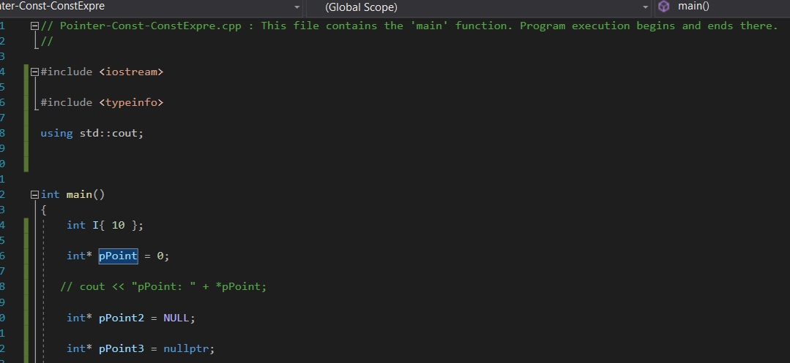

##### `Step 8.`\|`SPCRK`| :small_orange_diamond: :small_blue_diamond: :small_blue_diamond: :small_blue_diamond:

In this particular project lets see if these produce different types.  Lets add the `<typeinfo>` header and use `typeid(foo).name()` to find out type.  In my case they are all of type nullptr but this is not guaranteed in all environments.  It is best to use nullptr by default sot here is no potential ambiguity of type.

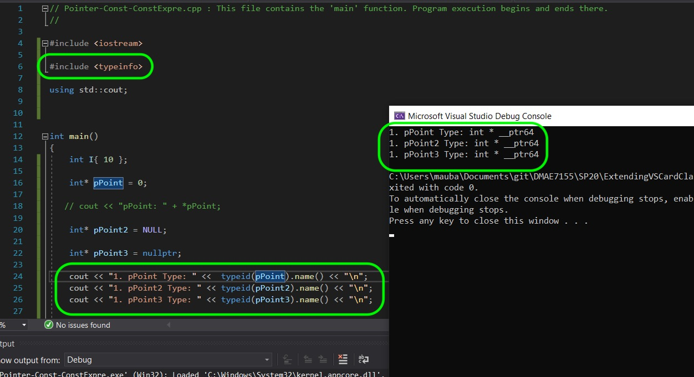

##### `Step 9.`\|`SPCRK`| :small_orange_diamond: :small_blue_diamond: :small_blue_diamond: :small_blue_diamond: :small_blue_diamond:

Now you can assign a valid memory reference to an existing integer.  Lets assign the address of `I` to `pPoint3` then derefence it.

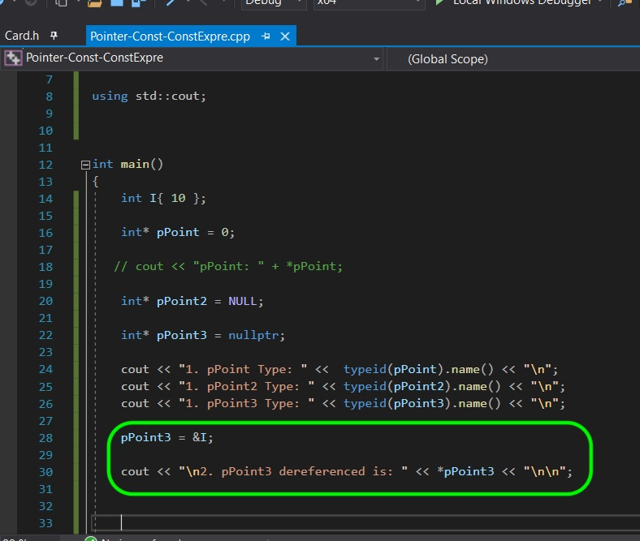

##### `Step 10.`\|`SPCRK`| :large_blue_diamond:

Compile and fix your errors and we should now see the the value of `I`.

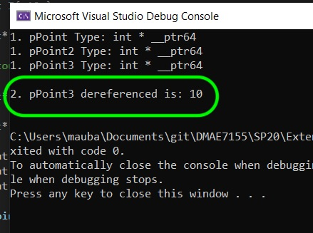

##### `Step 11.`\|`SPCRK`| :large_blue_diamond: :small_blue_diamond: 

 Now maybe we only want to assign `pPoint3` if it is a `nullptr` and not if it has a valid memory address.  A `nullptr` resolves to false so we can use it in an if statement like so.  This will only assign the address of `I` if the pointer is not pointing to a valid memory address.
 
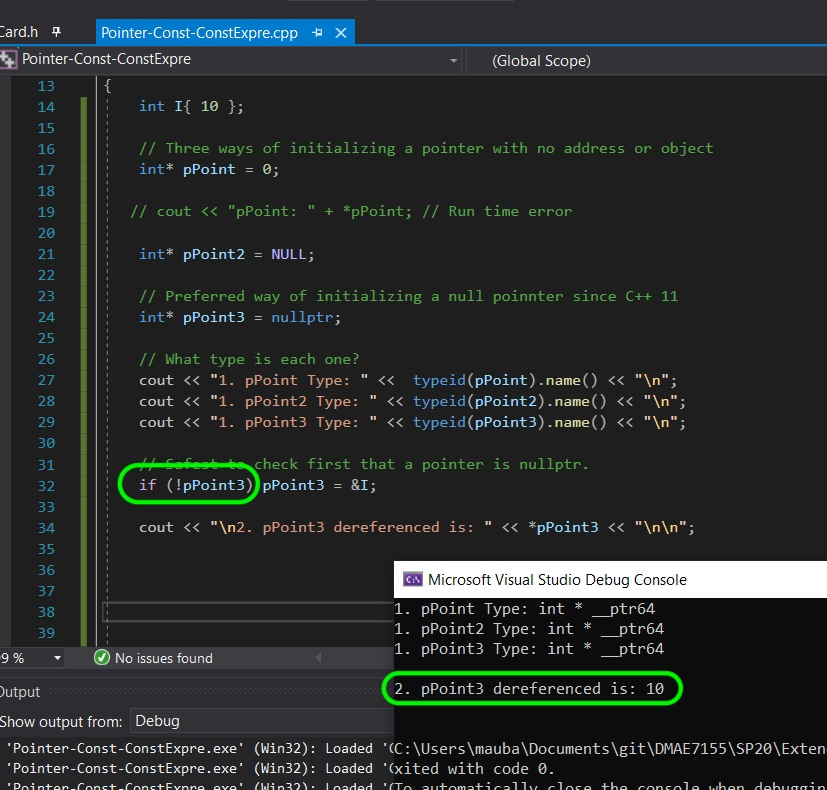

##### `Step 12.`\|`SPCRK`| :large_blue_diamond: :small_blue_diamond: :small_blue_diamond: 

There is another type of pointer called a void pointer where you decide the type at runtime.  So you use `void *` to indicate this type of pointer.  It also means that the pointer can be reassigned to another type.  In the below example it starts as a reference to a **double**, then becomes a reference to an **int**.  But when you try and dereference the void pointer the program doesn't know the size of the memory address as the type is mutable.  So it gives you a compile error.

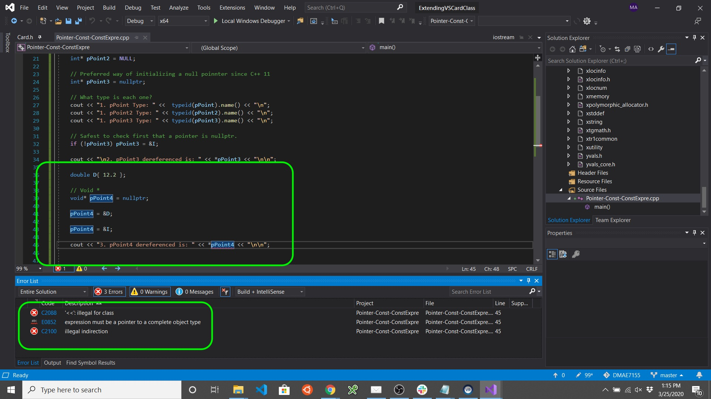

##### `Step 13.`\|`SPCRK`| :large_blue_diamond: :small_blue_diamond: :small_blue_diamond:  :small_blue_diamond: 

So you need to tell it what type of pointer this **void \*** is dereferencing.

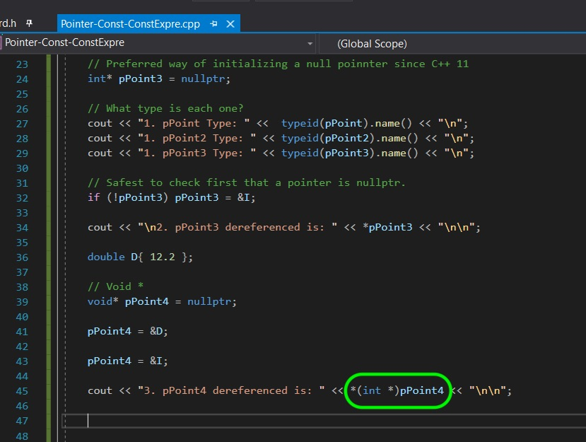

##### `Step 14.`\|`SPCRK`| :large_blue_diamond: :small_blue_diamond: :small_blue_diamond: :small_blue_diamond:  :small_blue_diamond: 

Compile and fix all errors.  Run it and you can see that it dereferenced it as an **int\***.

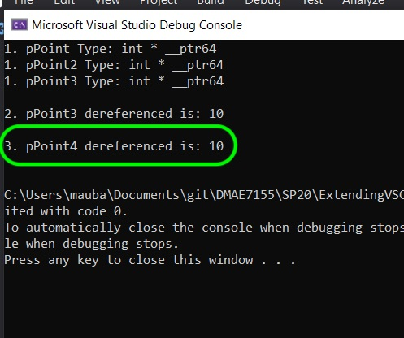

##### `Step 15.`\|`SPCRK`| :large_blue_diamond: :small_orange_diamond: 

We can assign a **void /*** ti any type.  Below we do the same thing to a **double** but make a change to the dereference. So if you run it, the pointer dereferences correctly.

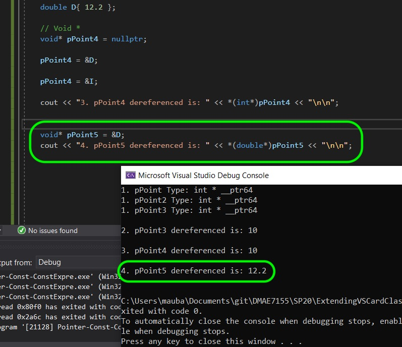

##### `Step 16.`\|`SPCRK`| :large_blue_diamond: :small_orange_diamond:   :small_blue_diamond: 

You have to be very careful because if you get the type wrong then it will interpret the reference value incorrectly.  It will try and read a double size of memory as an integer and you will get an invalid result but it will run.  Imagine the potential bugs!

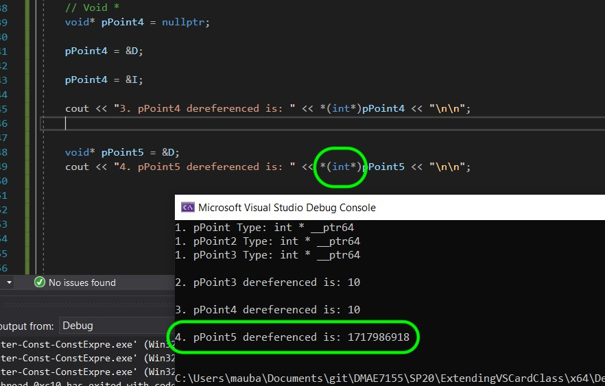

##### `Step 17.`\|`SPCRK`| :large_blue_diamond: :small_orange_diamond: :small_blue_diamond: :small_blue_diamond:

You can also have a pointer point to another pointer.  So you can point an `int **` pointer to pointer to an `int *` pointer.  So in this example we have a regular pointer to an **int** and a pointer to an **int** pointer.  To dereference the original **int** you need to double derefence this pointer with two `**`.  Run the below example on your own. Notice the original pointer shows a memory location of the original int, the pointer to pointer shows the memory location of the pointer (yours will be different but both these values HAVE to be different).  The final double dereference shows the original **int**.

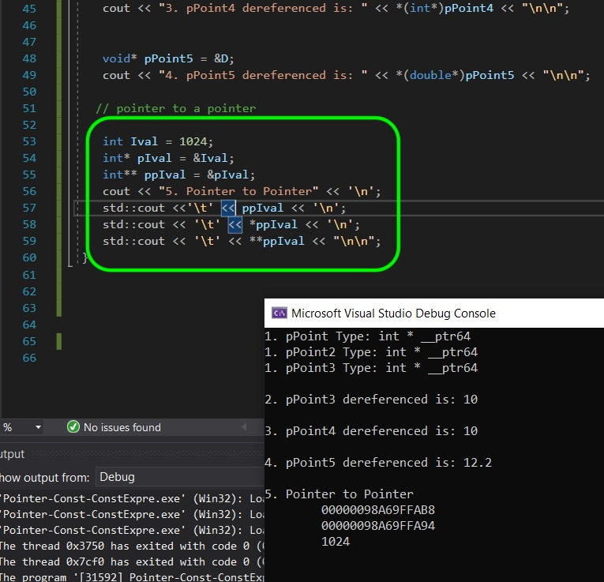

##### `Step 18.`\|`SPCRK`| :large_blue_diamond: :small_orange_diamond: :small_blue_diamond: :small_blue_diamond: :small_blue_diamond:

Now you can have a reference to a pointer as well.  This reference alias holds the pointer to the object it is pointing to.  So we need to dereference the underlying pointer to see the original **int**.  Type the below and look:

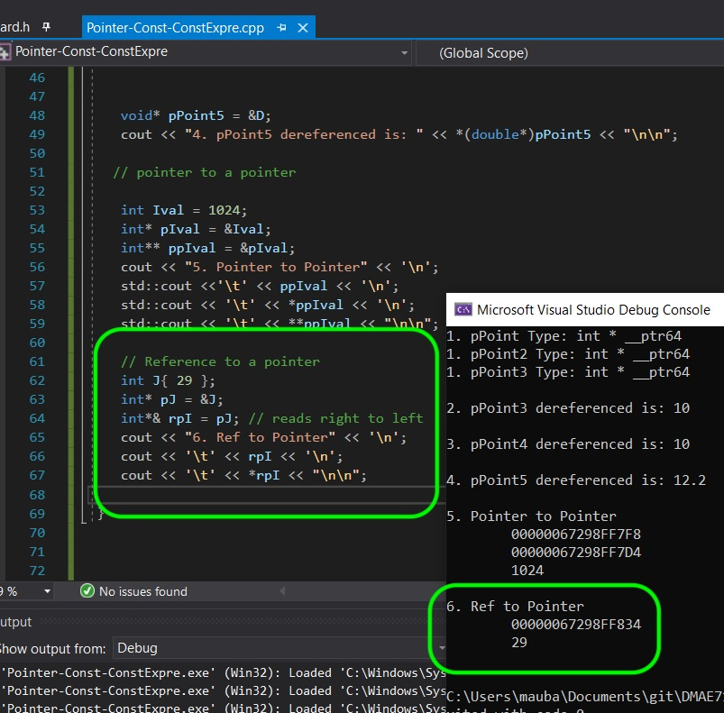

##### `Step 19.`\|`SPCRK`| :large_blue_diamond: :small_orange_diamond: :small_blue_diamond: :small_blue_diamond: :small_blue_diamond: :small_blue_diamond:

You cannot have a reference to a reference.  A reference is not an object so it cannot have an associated reference.  Next up we will look at `const` a bit more.

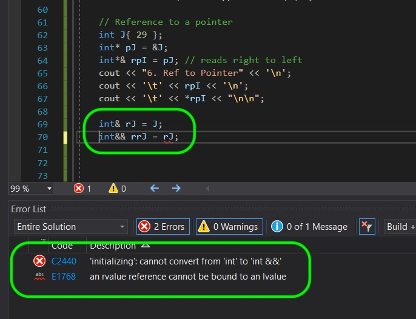
___

| [previous](../)| [home](../README.md#user-content-gms2-top-down-shooter) | [next](../)|
|---|---|---|
