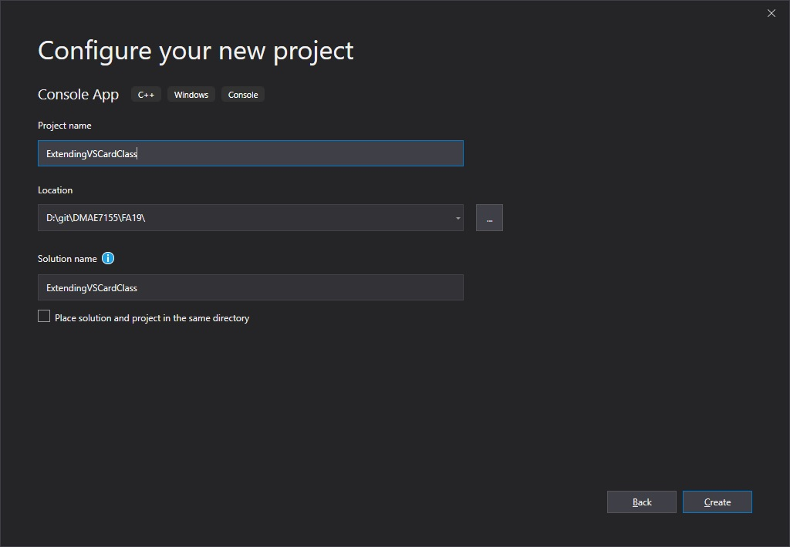
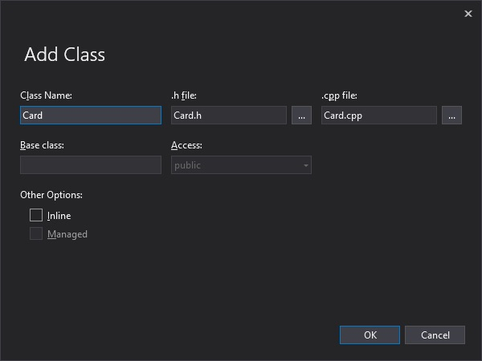
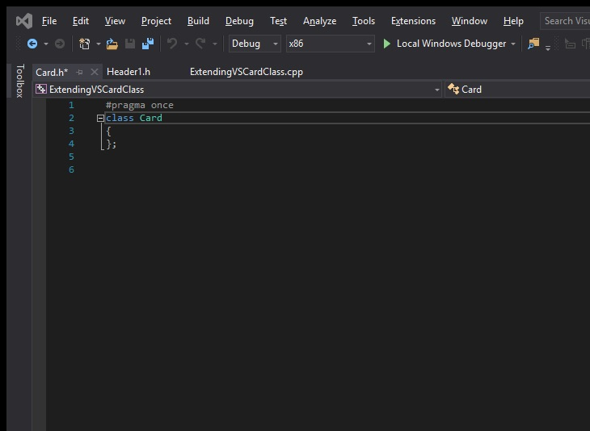
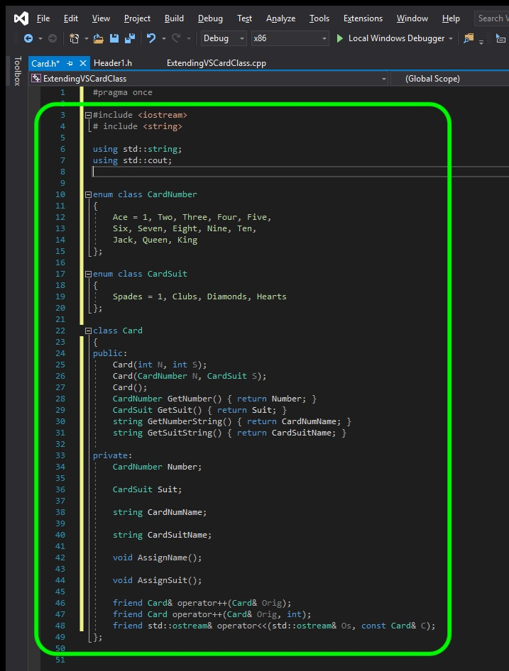
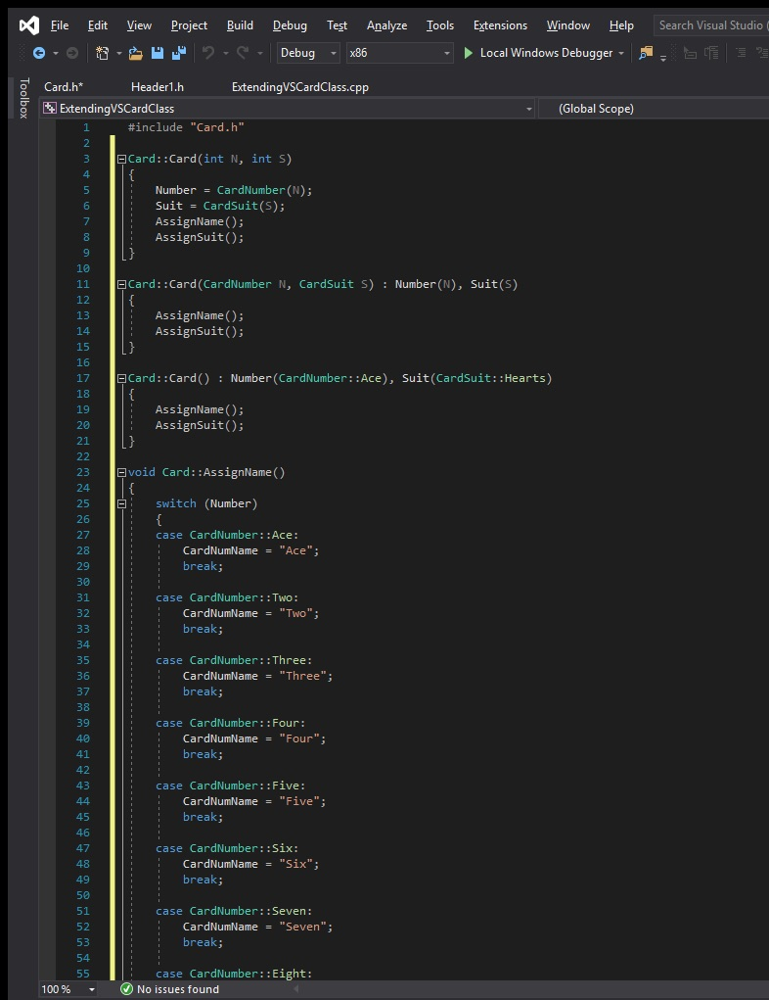
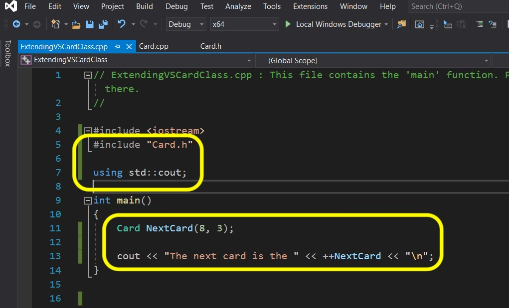

### Setting Up

[previous](../) • [home](../README.md#user-content-gms2-top-down-shooter) • [next](../)

Now we are going to take off where we left with our previous C++ Visual Studio project **Basic Class**.  In it we had the **Card Class** and **Main** all in the same page.  Lets recreate this project and separte the **Card** class into its own **.h** and **.cpp**.

 

---

##### `Step 1.`\|`SPCRK`|:small_blue_diamond:

 Create a new C++ Windows Console Application **project** in Visual Studio nand pick a directory to save it in.  Call the project `ExtendingVSCardClass` then press the **Create Projects** button. 

##### `Step 2.`\|`FHIU`|:small_blue_diamond: :small_blue_diamond: 

We will take what we have done previously in **Basic Class** project and move it over.  So in your new **ExtendingVSCardClass** project and press **Project \| Add Class** and add a **.h** and **.cpp** called `Card`. Press the **OK** button:

##### `Step 3.`\|`SPCRK`|:small_blue_diamond: :small_blue_diamond: :small_blue_diamond:

VS should stub in an empty **class.h** and **class.cpp**. You **.h** should look like this:

##### `Step 4.`\|`SPCRK`|:small_blue_diamond: :small_blue_diamond: :small_blue_diamond: :small_blue_diamond:

Now go and open **BasicClass.cpp** (from the **FunctionsTeamplatesClasses** project) and cut and paste the **Card** class declaration and paste it into **Card.h** like so:

##### `Step 5.`\|`SPCRK`| :small_orange_diamond:

Now copy and paste all the class definitions to the **Card.cpp** file.  Leave the **Main** function to put in the project main cpp.

##### `Step 6.`\|`SPCRK`| :small_orange_diamond: :small_blue_diamond:

Now copy **Main.cpp** content to **ExtendingVSCardClass.cpp**.  Also at the top add a reference to the new card class by adding `#include "Card.h"` and then for cout add `using std::cout;`.

##### `Step 7.`\|`SPCRK`| :small_orange_diamond: :small_blue_diamond: :small_blue_diamond:

Compile and run and it should look EXACTLY like the **Basic Class** project did when we left off.

___

| [previous](../)| [home](../README.md#user-content-gms2-top-down-shooter) | [next](../)|
|---|---|---|
