### Setting up Project and New Level

[previous](../) • [home](../README.md#user-content-gms2-top-down-shooter) • [next](../)

Lets copy over our last CPP Card Game exercise and set up a new level.

 

---

##### `Step 1.`\|`SPCRK`|:small_blue_diamond:

Create a new folder to copy the old project into somewhere convenient. Call it `UE Cards II`.

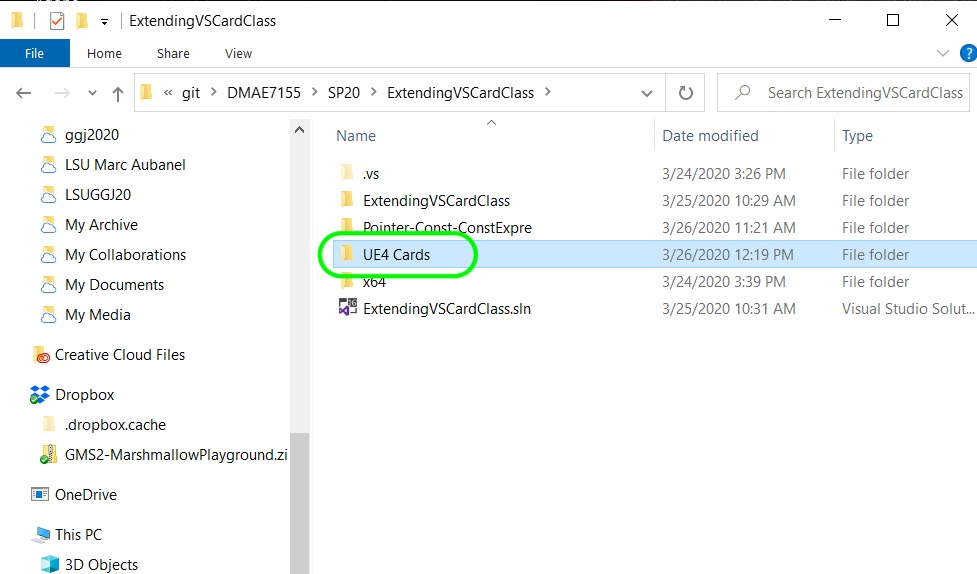

##### `Step 2.`\|`FHIU`|:small_blue_diamond: :small_blue_diamond: 

Go to the folder with the old **DeckOfCards** uproject and copy all the files.

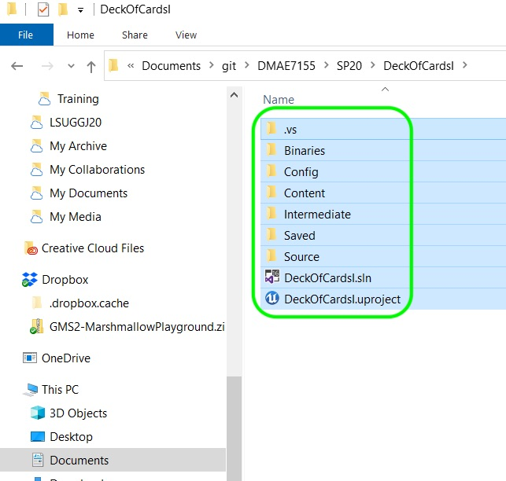

##### `Step 3.`\|`SPCRK`|:small_blue_diamond: :small_blue_diamond: :small_blue_diamond:

Paste it all into the new folder you created:

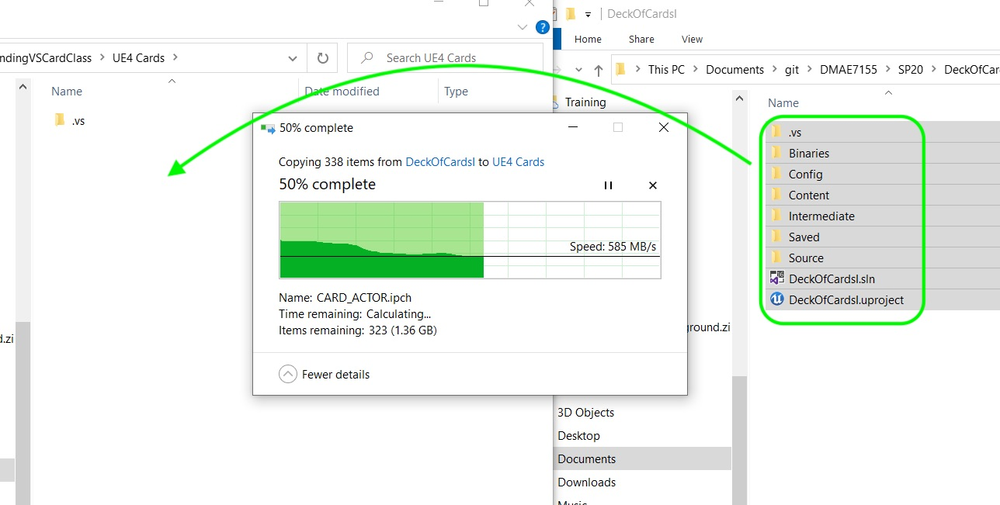

##### `Step 4.`\|`SPCRK`|:small_blue_diamond: :small_blue_diamond: :small_blue_diamond: :small_blue_diamond:

Delete the VS solution as the linker might have a different directory set up.  We will generate a new one.  Rename the project to `DeckOfCards2.uproject`.

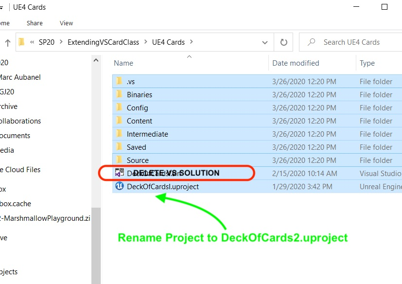

##### `Step 5.`\|`SPCRK`| :small_orange_diamond:

Now there are project generated files for the old location.  Just to be safe lets delete the **Binaries**, **Intermediate** and **Saved** folders.

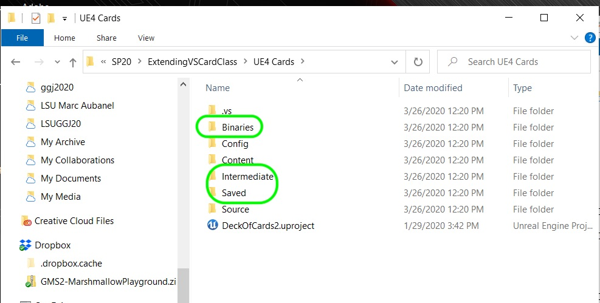

##### `Step 6.`\|`SPCRK`| :small_orange_diamond: :small_blue_diamond:

Now right click on the **.uproject** file and select **Generate Visual Studio project files**.

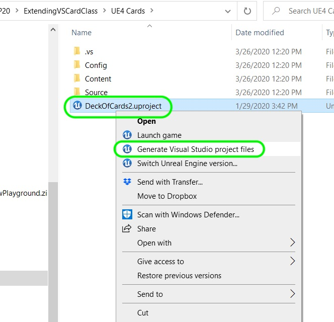

##### `Step 7.`\|`SPCRK`| :small_orange_diamond: :small_blue_diamond: :small_blue_diamond:

This will take a while so be patient.  Notice it regenerates a new **Intermediate** and **Saved** folder.

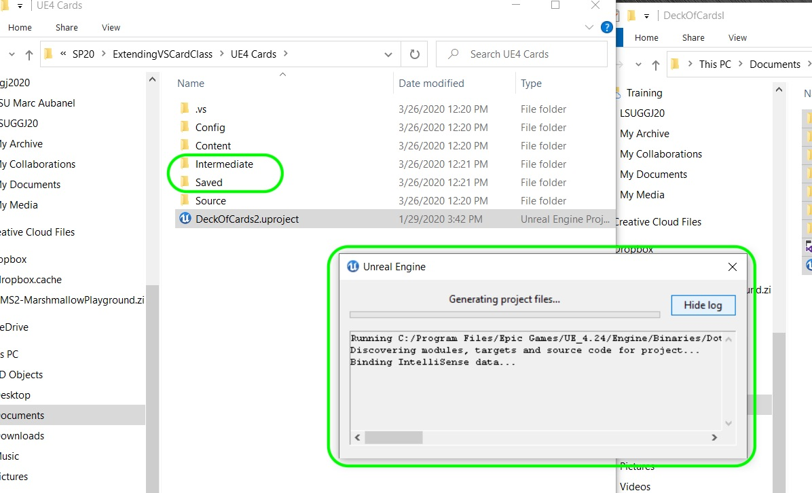

##### `Step 8.`\|`SPCRK`| :small_orange_diamond: :small_blue_diamond: :small_blue_diamond: :small_blue_diamond:

Double click on the **.uproject** file and it will most likely as if you want to recompile and probably state that the version has changed.  Just answer yes and proceed to load the game.

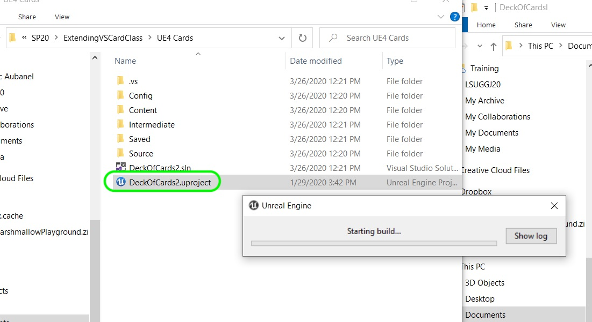

##### `Step 9.`\|`SPCRK`| :small_orange_diamond: :small_blue_diamond: :small_blue_diamond: :small_blue_diamond: :small_blue_diamond:

Make a new level and call it `L_Card_Same_Diff` to test the **== operator** for our card class.

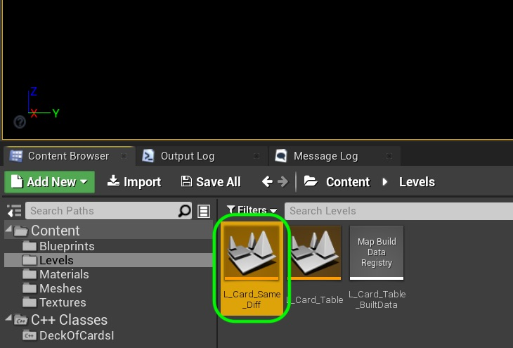

##### `Step 10.`\|`SPCRK`| :large_blue_diamond:

Open project settings and set the **L_Card_Same_Diff** level as the **Editor Startup Map**.

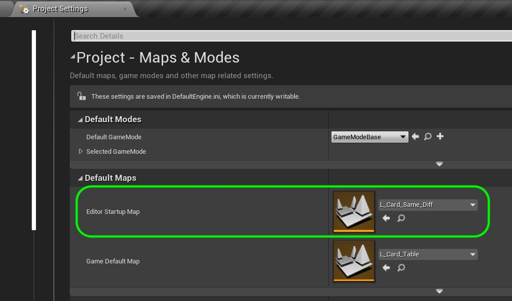

##### `Step 11.`\|`SPCRK`| :large_blue_diamond: :small_blue_diamond: 

Drag two copies onto the play area of **BP_Card_Actor**.

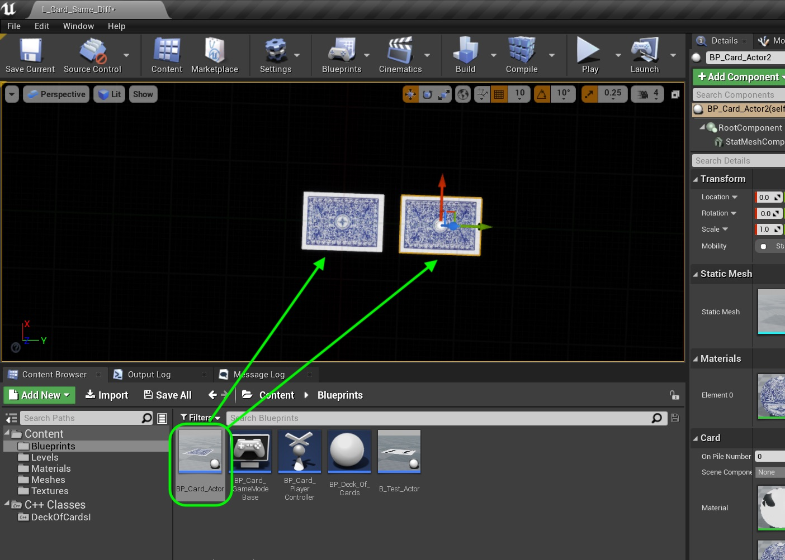

##### `Step 12.`\|`SPCRK`| :large_blue_diamond: :small_blue_diamond: :small_blue_diamond: 

We don't have our camera so save the level and open **L_Card_Table** and right click in the **World Outliner** on the camera and select **copy**.

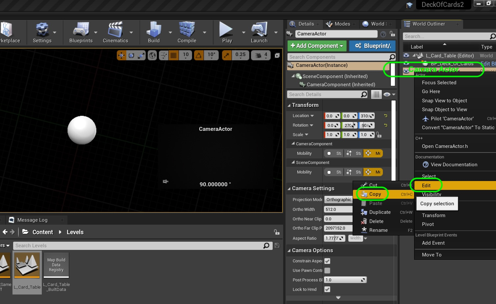

##### `Step 13.`\|`SPCRK`| :large_blue_diamond: :small_blue_diamond: :small_blue_diamond:  :small_blue_diamond: 

Now reload the **L_Card_Same_Diff** level and paste the camera into this level.

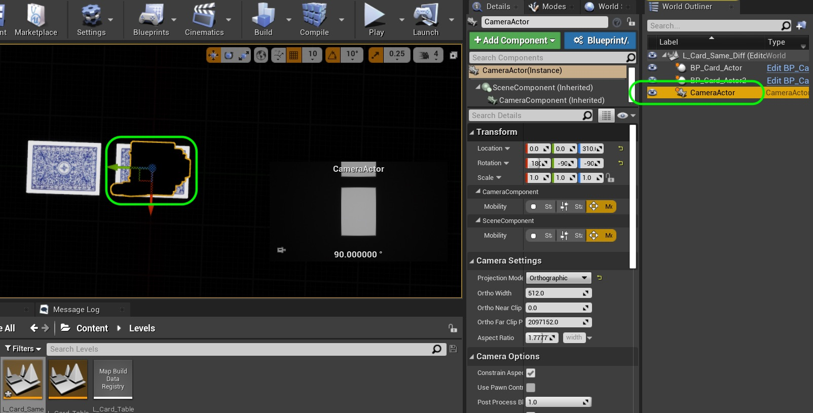

##### `Step 14.`\|`SPCRK`| :large_blue_diamond: :small_blue_diamond: :small_blue_diamond: :small_blue_diamond:  :small_blue_diamond: 

Run the game and you will notice that it is not using this new camera.  Open **L_Card_Table** and select **Open Level Blueprint**.

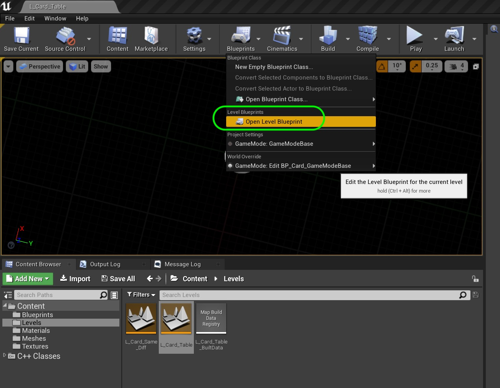

##### `Step 15.`\|`SPCRK`| :large_blue_diamond: :small_orange_diamond: 

Select the three nodes (not the Begin Play event) and copy (cntrl-c) the blueprint nodes.

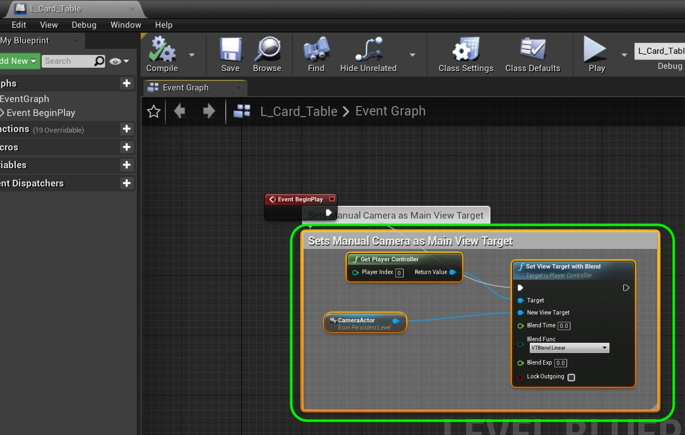

##### `Step 16.`\|`SPCRK`| :large_blue_diamond: :small_orange_diamond:   :small_blue_diamond: 

Now reload the **L_Card_Same_Diff** level and open the **Level Blueprint**.  Paste the content of the old level blueprint into it.  Notice the camera reference is unknown as it doesn't know the location of the camera in this room.  We will fix that.

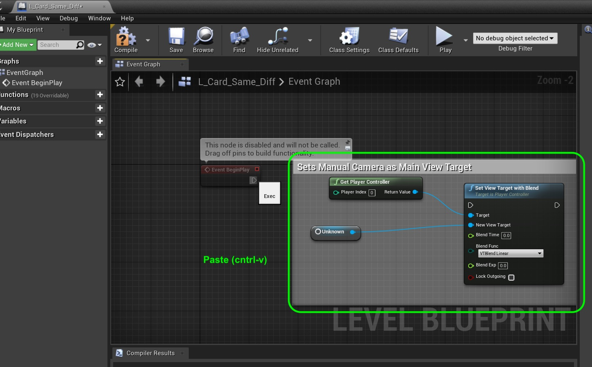

##### `Step 17.`\|`SPCRK`| :large_blue_diamond: :small_orange_diamond: :small_blue_diamond: :small_blue_diamond:

 Connect the execution pin from **Event BeginPlay** to **Set View Target with Blend** nodes.

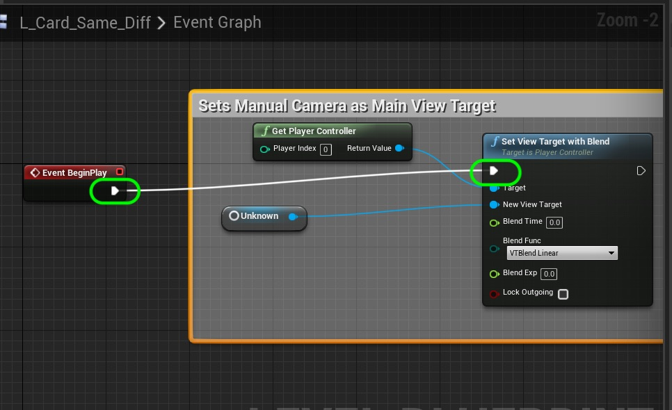

##### `Step 18.`\|`SPCRK`| :large_blue_diamond: :small_orange_diamond: :small_blue_diamond: :small_blue_diamond: :small_blue_diamond:

Select the camera actor in the level.

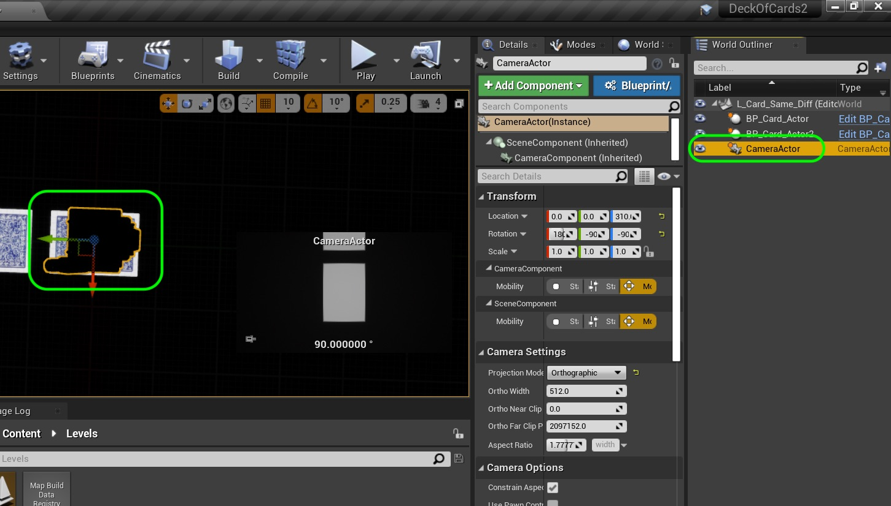

##### `Step 19.`\|`SPCRK`| :large_blue_diamond: :small_orange_diamond: :small_blue_diamond: :small_blue_diamond: :small_blue_diamond: :small_blue_diamond:

Go back to the **Level Blueprint** and right click on the empty graph and select **Create a Reference to CameraActor**.

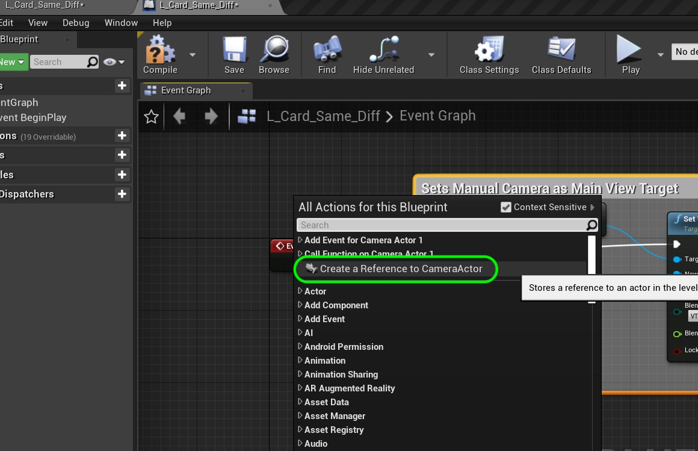

##### `Step 20.`\|`SPCRK`| :large_blue_diamond: :large_blue_diamond:

Delete the **Unknown** node and attach the new **CameraActor** pin to the **New View Target** pin in the **Set View Target with Blend** node.

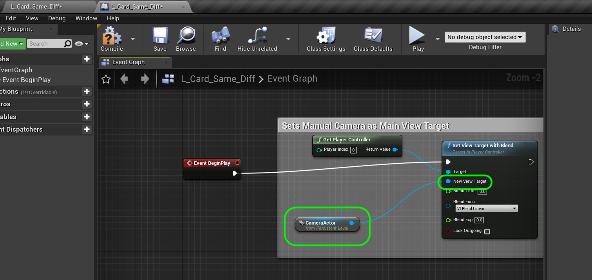

##### `Step 21.`\|`SPCRK`| :large_blue_diamond: :large_blue_diamond: :small_blue_diamond:

Compile and run the game and look to see if the cards are lined up correctly.  In my case one card is off screen.

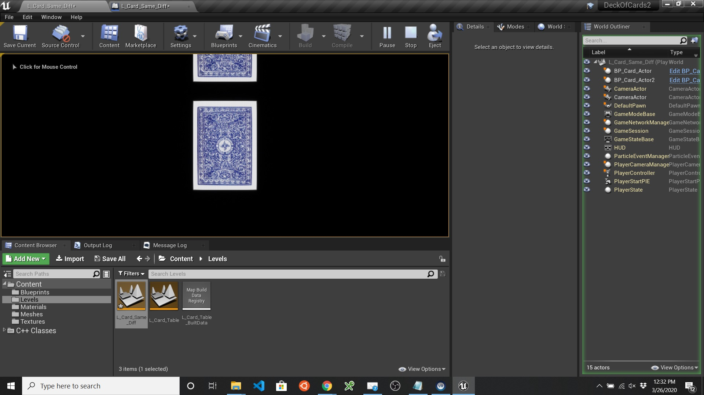

##### `Step 22.`\|`SPCRK`| :large_blue_diamond: :large_blue_diamond: :small_blue_diamond: :small_blue_diamond:

##### `Step 23.`\|`SPCRK`| :large_blue_diamond: :large_blue_diamond: :small_blue_diamond: :small_blue_diamond: :small_blue_diamond:

##### `Step 24.`\|`SPCRK`| :large_blue_diamond: :large_blue_diamond: :small_blue_diamond: :small_blue_diamond: :small_blue_diamond: :small_blue_diamond:

##### `Step 25.`\|`SPCRK`| :large_blue_diamond: :large_blue_diamond: :small_orange_diamond:

___

| [previous](../)| [home](../README.md#user-content-gms2-top-down-shooter) | [next](../)|
|---|---|---|
