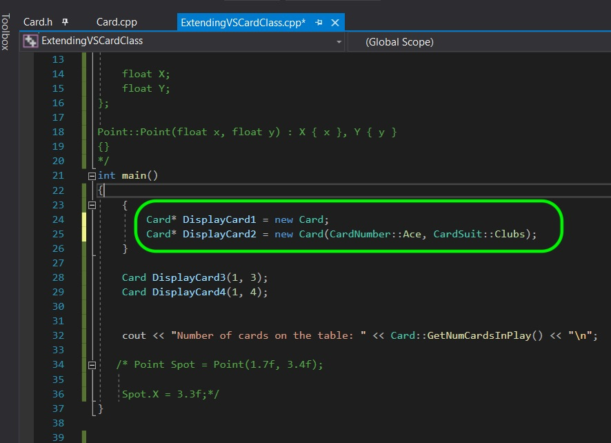
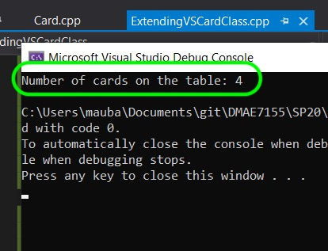
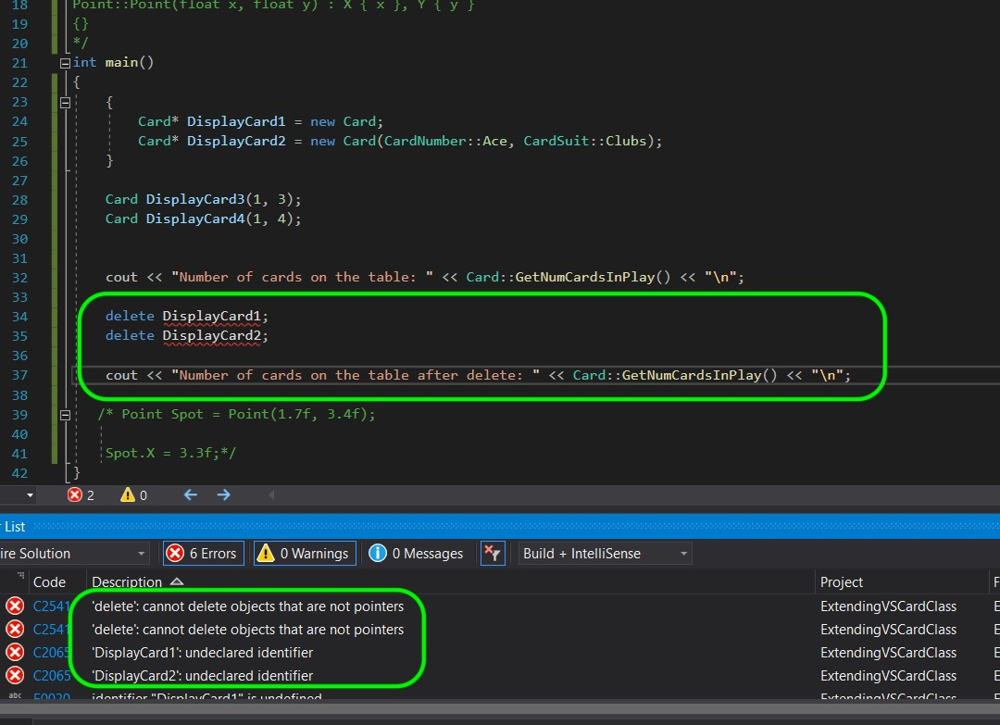
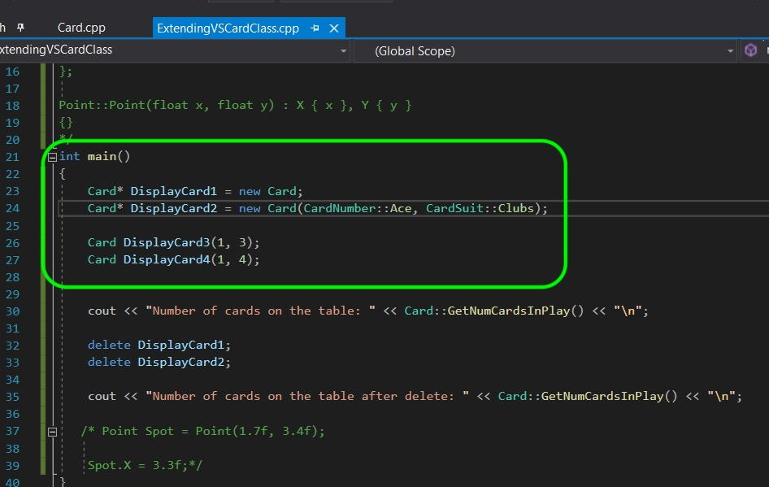

### Stack and Heap

[previous](../) • [home](../README.md#user-content-gms2-top-down-shooter) • [next](../)

We have been up to now using the same part of memory to store information.  What if we have an object that once constructed creates data that we want to use when a function returns?  Lets talk quickly about the [heap and the stack](https://www.learncpp.com/cpp-tutorial/79-the-stack-and-the-heap/).  What the call stack does is keep track of all variables and functions that are still in scope and keeps tracks of all of the function's parameters and local variables. A stack is a last-in, first-out structure with the last item pushed being and the first item to pop off. We don't need to worry about erasing memory as the next item that gets pushed onto the stack will use the memory used by the last item that is popped off.  The heap (also referred to as free store) is used for dynamic memory allocation.  This is useful for large amounts of data (like player animation, audio, models from a level).  In c++ this is done with the operator `new`. This allocates memory but it is up to you to free it.  **New** returns a pointer.  When operator `delete` is called the memory is returned to the heap and can be used again.

 

---

##### `Step 1.`\|`SPCRK`|:small_blue_diamond:

Now lets create two cards and put them on the heap.  To do this we need to use the `new` expression and store the pointer to the part of memory in the heap.  It will NOT be deleted when it goes out of scope.

##### `Step 2.`\|`FHIU`|:small_blue_diamond: :small_blue_diamond: 

Compile and run and notice that even though those cards to out of scope they are still in the heap and their destructors have not run.

##### `Step 3.`\|`SPCRK`|:small_blue_diamond: :small_blue_diamond: :small_blue_diamond:

Now add a `delete` operator to free up this memory.  We now have a memory leak.  The variable that stored the pointer to the heap is now out of scope.  So we have the memory allocated and no way of freeing it up.  This is a common source of errors and in Unreal we want to use their garbage collection as much as we can. We need to be very careful that when we use `new` that it will delete no matter what happens next.

##### `Step 4.`\|`SPCRK`|:small_blue_diamond: :small_blue_diamond: :small_blue_diamond: :small_blue_diamond:

OK, lets put the pointer back in scope.  Now we can delete the two cards on the heap and and double check that the destructor ran.  It is far more common that we would initialize the heap in the constructor and free up the memory in the destructor, this is not a practical example.

##### `Step 5.`\|`SPCRK`| :small_orange_diamond:

Now compile, fix any errors and see that the `delete` command destroys the object and frees up memory in the freestore.

___

| [previous](../)| [home](../README.md#user-content-gms2-top-down-shooter) | [next](../)|
|---|---|---|
