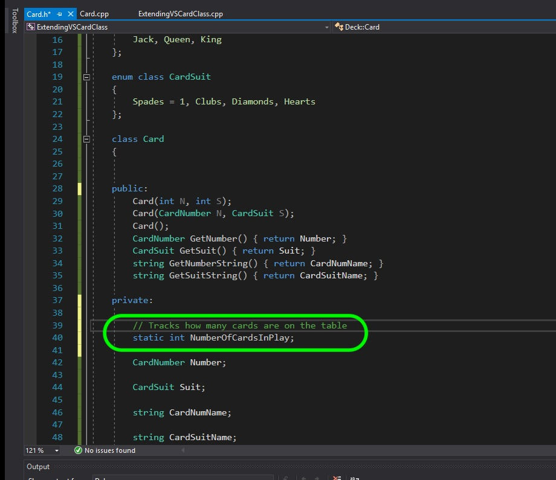
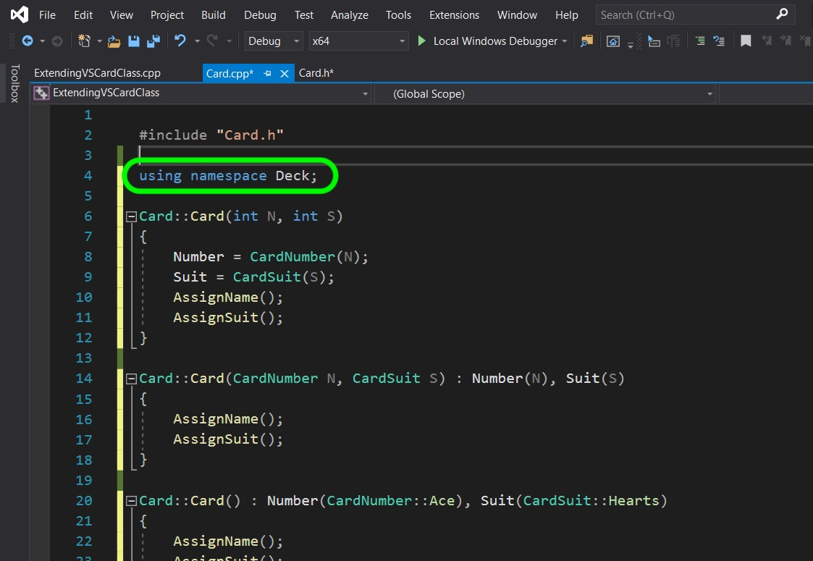
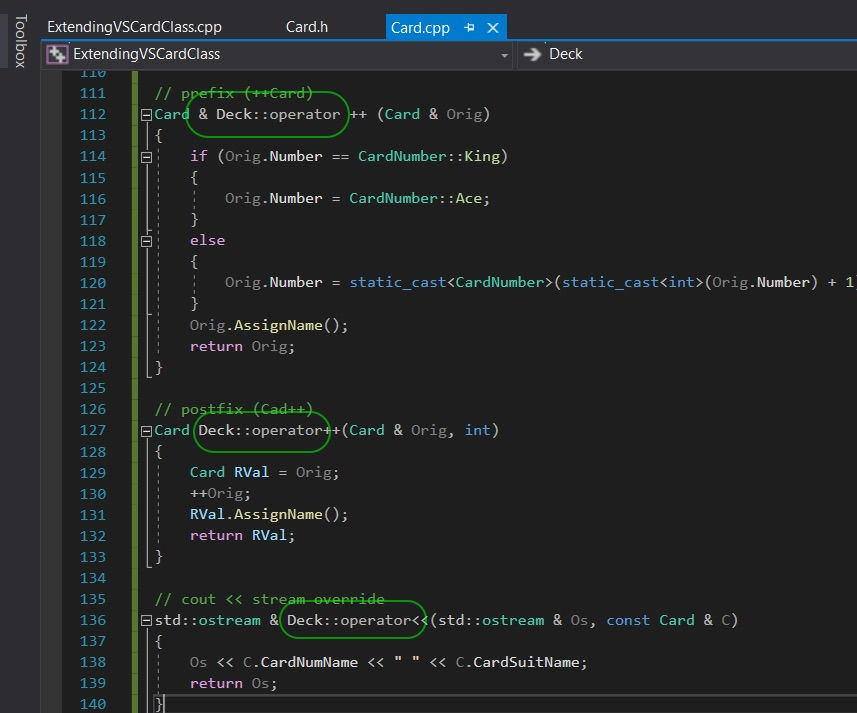
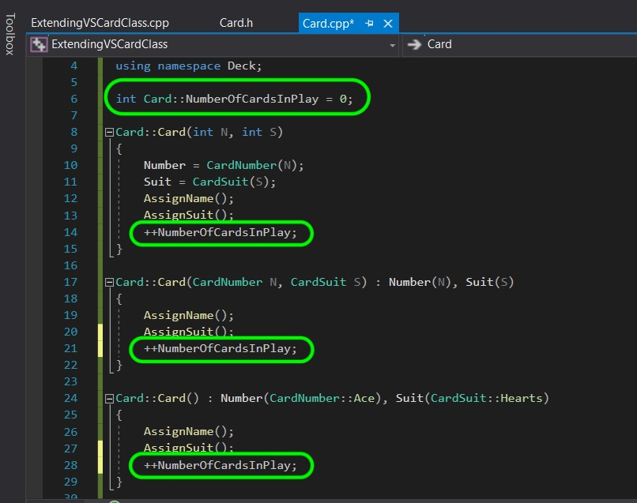
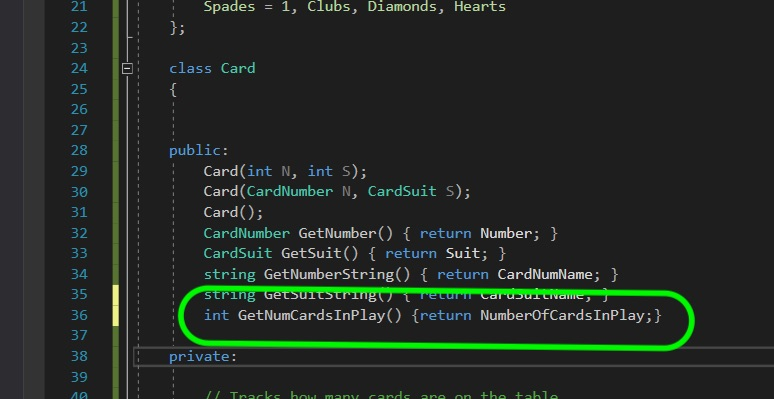
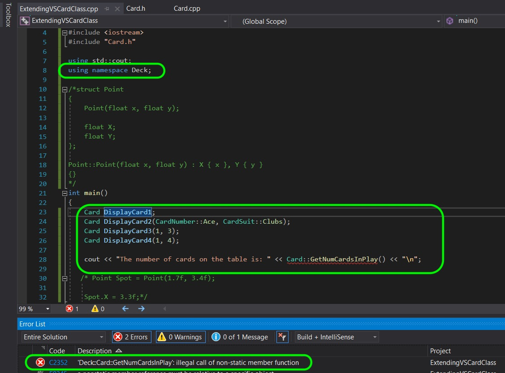
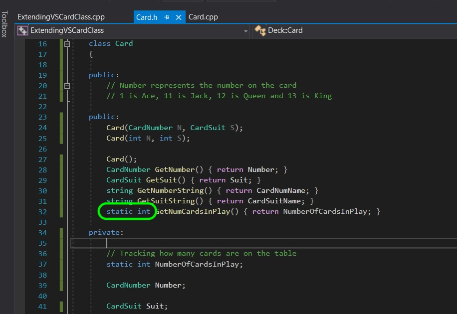
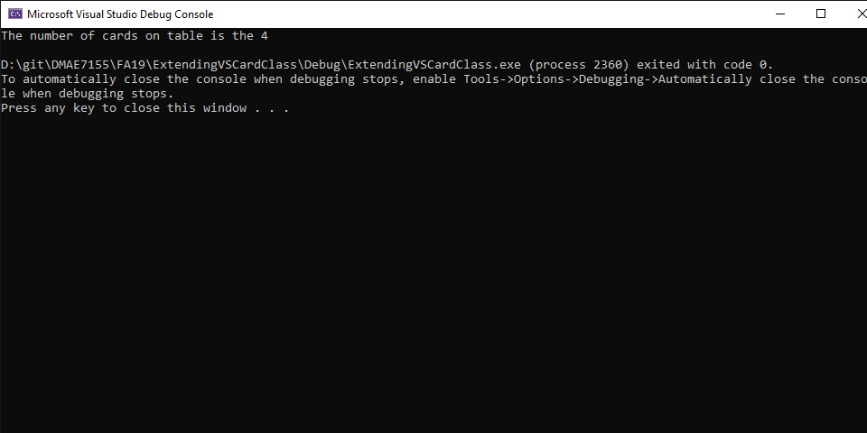

### Static Members of a Class

[previous](../) • [home](../README.md#user-content-gms2-top-down-shooter) • [next](../)

Now lets look at what a **[static](https://en.cppreference.com/w/cpp/language/static)** member of a class. 

 

---

##### `Step 1.`\|`SPCRK`|:small_blue_diamond:

Lets look at a static member.  Sometimes we have a single instance of a variable (or function) that we want to be accessible to the entire class and does not instantiate with each instance of the class that is created.  A common use would be to count up how many cards exist in the current running game.  It is declared with `static` in front of the **type**.  Here we add a variable called `static int NumberOfCardsInPlay`.

##### `Step 2.`\|`FHIU`|:small_blue_diamond: :small_blue_diamond: 

Before defining the static member lets show you another way of applying the Deck namespace.  We can also use `using namespace Deck;`.  Press compile and you will notice some errors.

##### `Step 3.`\|`SPCRK`|:small_blue_diamond: :small_blue_diamond: :small_blue_diamond:

Now the issue is that the operator overrides can't find the class that they refer to and need the namespace appended before the **operator** in the three places we use it.

##### `Step 4.`\|`SPCRK`|:small_blue_diamond: :small_blue_diamond: :small_blue_diamond: :small_blue_diamond:

It is customary to define static members first. It is done on its own and in our case is `int Deck::Card::NumberOfCardsInPlay = 0;` Then you need to imcrement this static member in each constructor.  It shouldn't matter how we call the class, we should always increment the number of cards in play. Add this increment in EACH constructor override.

##### `Step 5.`\|`SPCRK`| :small_orange_diamond:

Now we can't access this member as it is private.  We need to create a getter for it so lets create a public function called `GetNumCardsInPlay()` and return an integer.

##### `Step 6.`\|`SPCRK`| :small_orange_diamond: :small_blue_diamond:

Go to **main()** and instantiate four cards.  Then we call the **GetNumCardsInPlay()** function to get the number of cards. Now compile and you get an error message.  Please note that when calling a class with no parameters that you do not use parenthesis ().  So instead of `Card DisplayCard1()` we use `Card DisplayCard1` instead. `Card DispalyCard1()` is not a variable but a prototype of a function called **DisplayCard1**.

##### `Step 7.`\|`SPCRK`| :small_orange_diamond: :small_blue_diamond: :small_blue_diamond:

We cannot access a static member in a non-static function.  So go back to **Card.h** and change the function to `static int GetNumCardsInPlay()`.

##### `Step 8.`\|`SPCRK`| :small_orange_diamond: :small_blue_diamond: :small_blue_diamond: :small_blue_diamond:

Compile and fix all errors then run the program.  You should see that this variable was called each time a class was created and it is correct with 4 cards in play.

___

| [previous](../)| [home](../README.md#user-content-gms2-top-down-shooter) | [next](../)|
|---|---|---|
