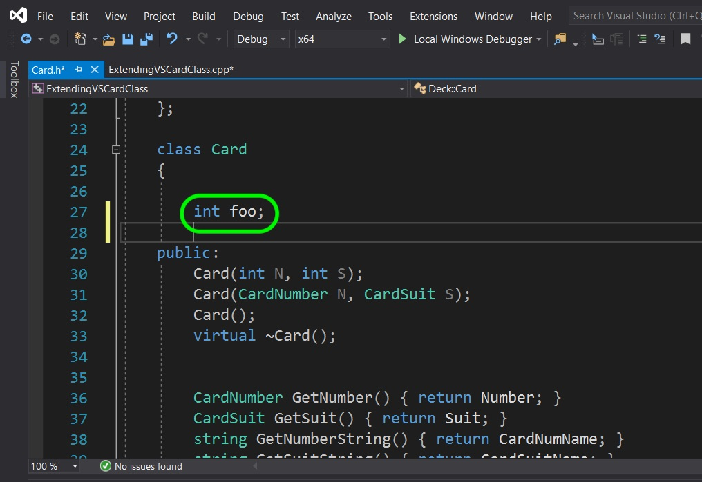
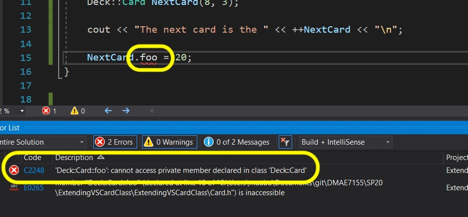
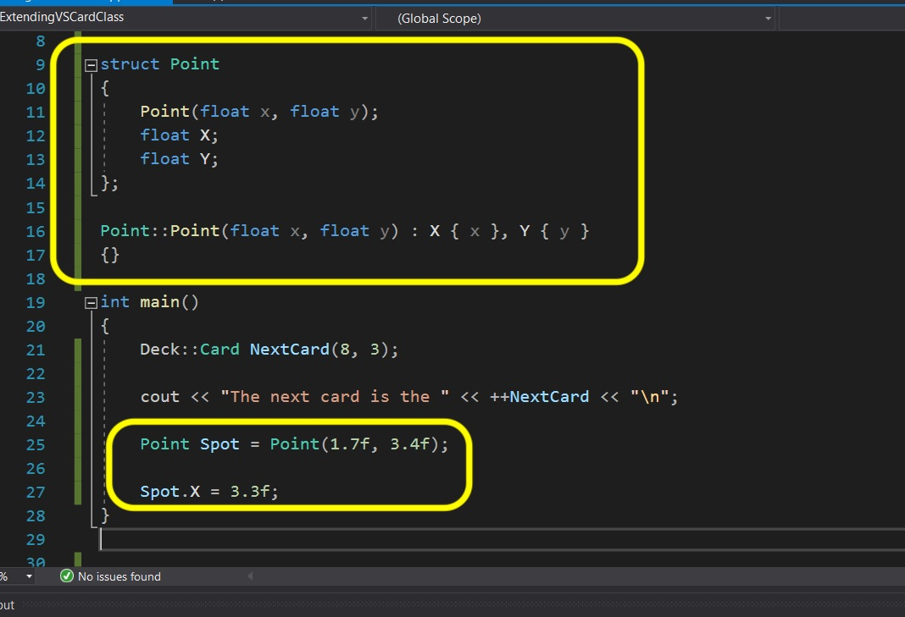
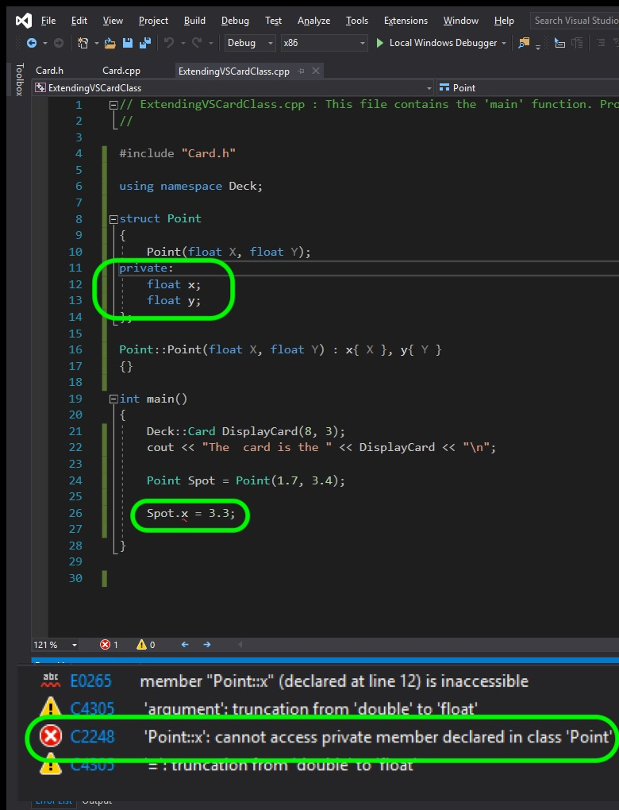
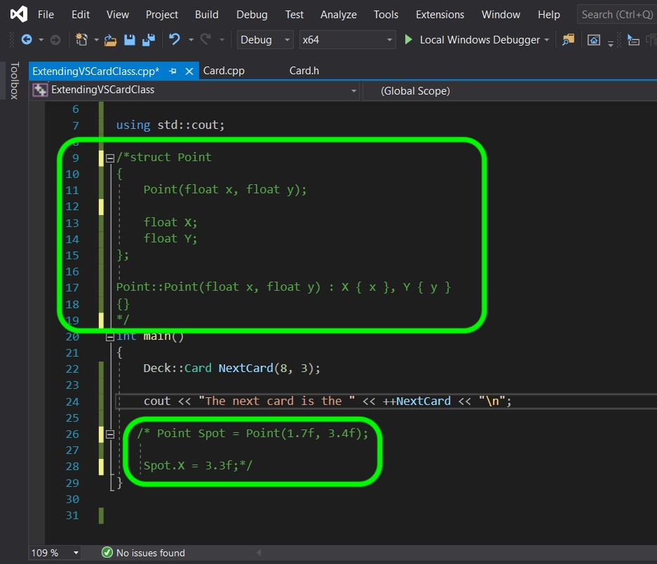

### Structs and Classes

[previous](../) • [home](../README.md#user-content-gms2-top-down-shooter) • [next](../)

C++ has another data structure called a **struct**.  This is very similar to a class except that it's members are public by default.  Lets take a look to see what I mean.  Lets first look at what a class defaults to.

 

---

##### `Step 1.`\|`SPCRK`|:small_blue_diamond:

Now a member in a class with no access specifiers (public, private or friend), defaults to private.  Go to the ** Card.h** and add a member called `int foo` and add it to the top of the header with no access specifier.  

##### `Step 2.`\|`FHIU`|:small_blue_diamond: :small_blue_diamond: 

 Now go to the **main()** function and try and access the variable.  You get a compile error. So we know that classes default members are private and NOT accessible.
 

##### `Step 3.`\|`SPCRK`|:small_blue_diamond: :small_blue_diamond: :small_blue_diamond:

Delete the **Foo** variable in both the **.h** and **.cpp**.  We also have **struct** that are very much like classes.  The major difference is that it defaults to its members being public where a **class** defaults to private.  Before the **main()** function add a **Struct** called `Point` and add two members called `x` and `y`. Now in Main create an instance of this struct and try and access one of its members. Press compile and all should be fine.

##### `Step 4.`\|`SPCRK`|:small_blue_diamond: :small_blue_diamond: :small_blue_diamond: :small_blue_diamond:

But we can still declare the **struct** member as private. If we do so and press compile, then we get a compile error stating that the members cannot be accessed.

##### `Step 5.`\|`SPCRK`| :small_orange_diamond:

Comment out the structas we do not need this.  When do we use a struct and when do we use a class?  We typically use a struct when there are no invarients with the structure. An invarient is when something must be true at a given point to describe a set of values of an object.  In the **Card** class we do have an invarient.  The card numbers are limited and the card suit is limited.  In a 2-d point in a game it could be any valid **float** and there is no rule that limits what a **Point** struct can be.  It is often use for simple data strcutures in games.  In Unreal you would have used a **Struct** in their `FVector` struct (The **F** stands for floating point). That struct contains a point in 3D space with `X`, `Y` and `Z` member variables.

___

| [previous](../)| [home](../README.md#user-content-gms2-top-down-shooter) | [next](../)|
|---|---|---|
