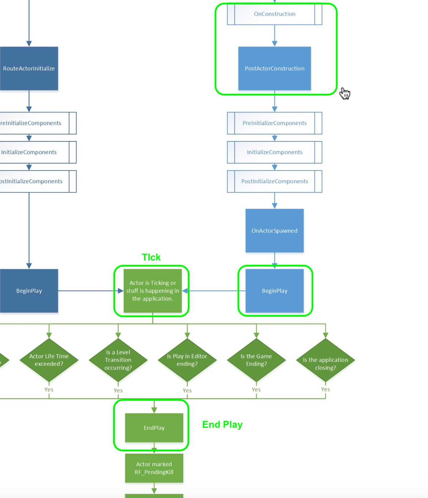
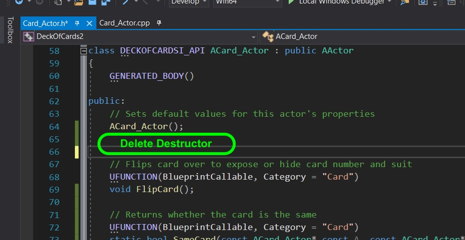
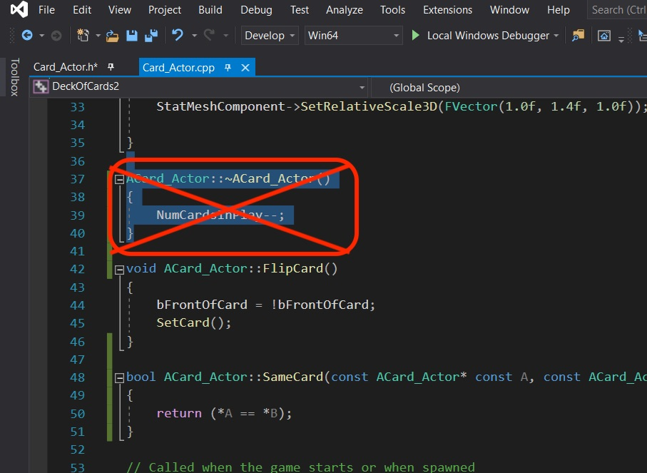
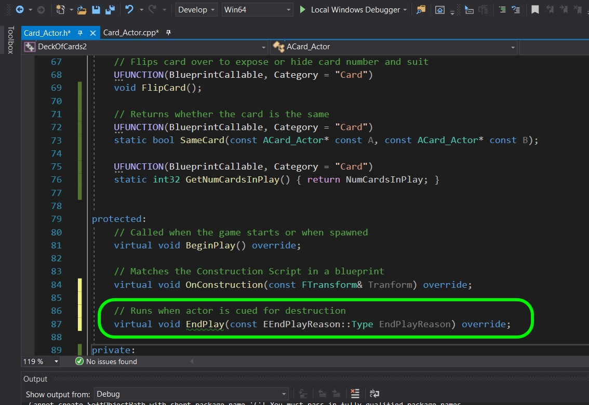
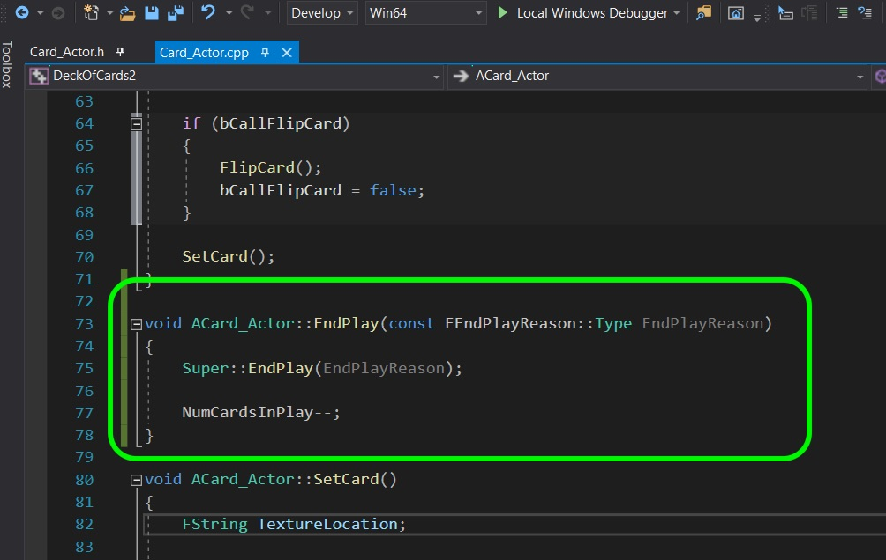
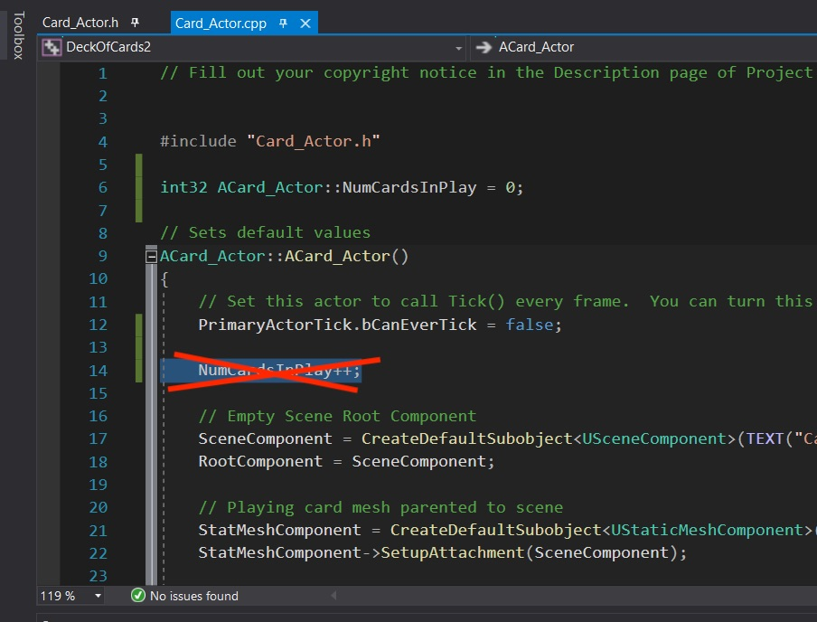
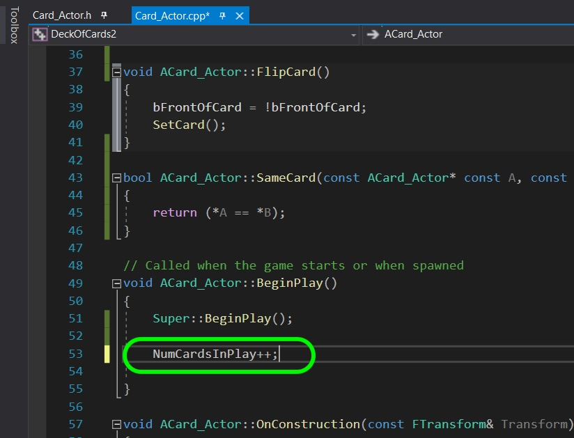
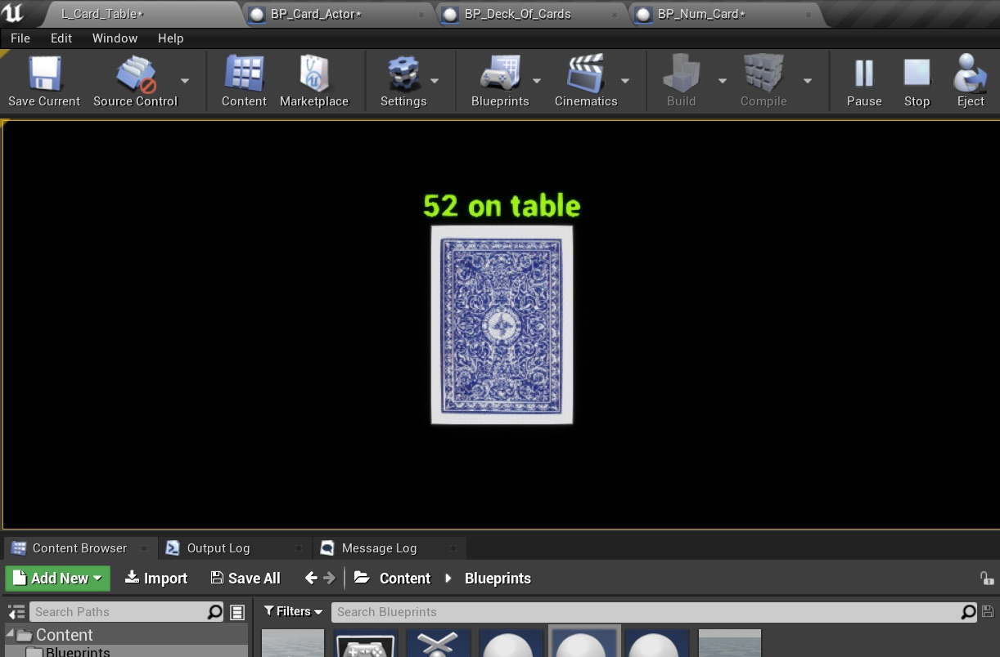

### UE4 Destructor II

[previous](../) • [home](../README.md#user-content-gms2-top-down-shooter) • [next](../)

UE4 Destructor continued...

 

---

##### `Step 1.`\|`SPCRK`|:small_blue_diamond:

Now compile and run the game.  You will notice that the destructor takes a LONG time to run.  The engine handles deleting the objects and doing its own garbage collection.  We can see that this is not a good place to adjust our number of cards as the card is no longer on the play surface and is gone from the game - but still in free store memory.

##### `Step 2.`\|`FHIU`|:small_blue_diamond: :small_blue_diamond: 

Lets look at the [actor lifecycle](https://docs.unrealengine.com/en-US/Programming/UnrealArchitecture/Actors/ActorLifecycle/index.html) in UE4.  We have used the **On Construction** for updating where there is a change in the editor, there is **Begin Play** for when the play button is pressed, there is the **Tick** that runs every frame when the actor is in the scene.  Then when the actor is destroyed there is an **End Play** event.  Lets put the subtration of the card in play here.

##### `Step 3.`\|`SPCRK`|:small_blue_diamond: :small_blue_diamond: :small_blue_diamond:

Go back to **Card_Actor.h** and delete the destructor `virtual ~ACard_Actor()`.

##### `Step 4.`\|`SPCRK`|:small_blue_diamond: :small_blue_diamond: :small_blue_diamond: :small_blue_diamond:

Go to **Card_Actor.cpp** and delete the destructor definition.

##### `Step 5.`\|`SPCRK`| :small_orange_diamond:

Go back to the **Card_Actor.h** and add a protected **End Play** event.

##### `Step 6.`\|`SPCRK`| :small_orange_diamond: :small_blue_diamond:

Now go to the cpp and define the **End Play** override.  All we do is call the **SUPER** and decrement from `numcardsinplay`.

##### `Step 7.`\|`SPCRK`| :small_orange_diamond: :small_blue_diamond: :small_blue_diamond:

 Run the game and destroy cards.  Now you will notice that as soon as it disappears from teh game surface the number goes down.  The only remaining issue is that we are having a similar problem with the constructor.  It is not representing the actual number of cards that we have constructed and used in game.  

##### `Step 8.`\|`SPCRK`| :small_orange_diamond: :small_blue_diamond: :small_blue_diamond: :small_blue_diamond:

Go back to **Card_Actor.cpp** and delete the decrement of `NumCardsInPlay`.

##### `Step 9.`\|`SPCRK`| :small_orange_diamond: :small_blue_diamond: :small_blue_diamond: :small_blue_diamond: :small_blue_diamond:

 Instead move it to **Begin Play**.

##### `Step 10.`\|`SPCRK`| :large_blue_diamond:

Now no matter how much you run the game it will always start with 52 cards which is exaclty what we want! That's it for this walk through - good job.

___

| [previous](../)| [home](../README.md#user-content-gms2-top-down-shooter) | [next](../)|
|---|---|---|
