### UE4 Destructor

[previous](../) • [home](../README.md#user-content-gms2-top-down-shooter) • [next](../)

Now this number can be fixed by implementing the destructor so when a class is destroyed that it will deduct a number from the `static int NumbersOfCardsInPlay`.

 

---

##### `Step 1.`\|`SPCRK`|:small_blue_diamond:

Now go to **Projetc Settings** and put the **Editor Startup Map** back to **L_Card_Table**.

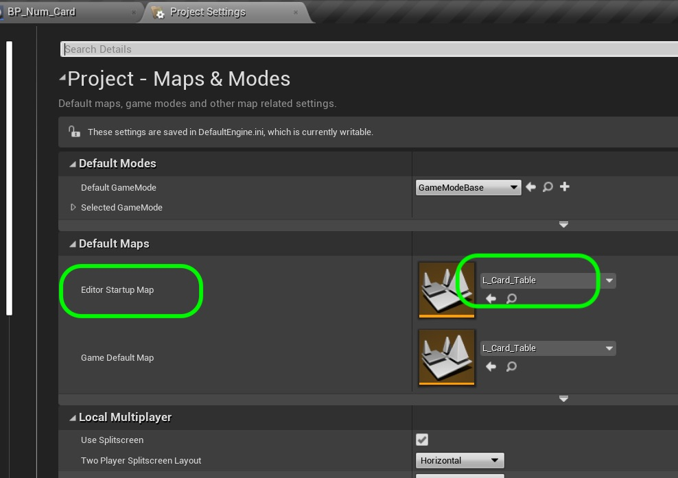

##### `Step 2.`\|`FHIU`|:small_blue_diamond: :small_blue_diamond: 

Go back to **Card_Actor.h** and after the constructor add a **Destructor** `virtual ~ACardActor();`.

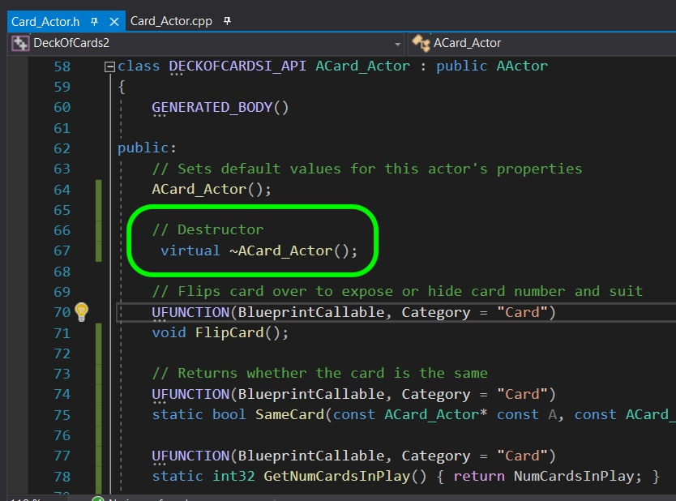

##### `Step 3.`\|`SPCRK`|:small_blue_diamond: :small_blue_diamond: :small_blue_diamond:

 Go to the **Card_Actor.cpp** and define the destructor where all we do is decrement **NumCardsInPlay**.

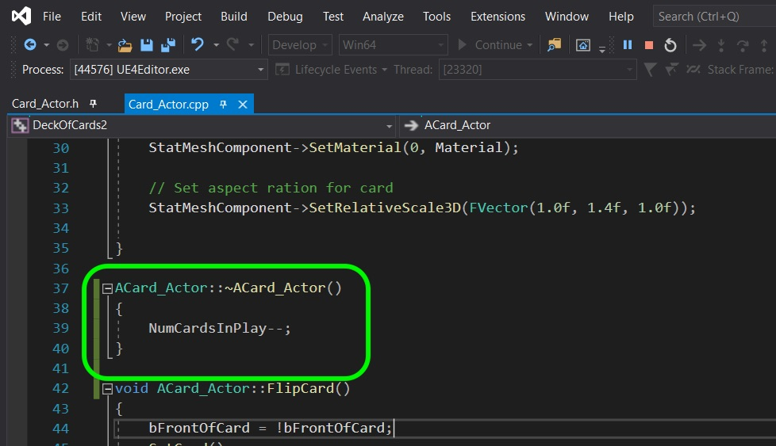

##### `Step 4.`\|`SPCRK`|:small_blue_diamond: :small_blue_diamond: :small_blue_diamond: :small_blue_diamond:

Run the  destroygame and you can see the destructor is run.  Strangely I have 56 cards showing up when I know I am dealing 52 cards.  Lets put a pin in this and will address this later.  I want to first destroy a card in game and see their garbage collection running.

##### `Step 5.`\|`SPCRK`| :small_orange_diamond:

Lets add the ability to right click and remove cards from the table.  This will show us when the destructor runs and how Unreal is doing its garbage collection.  Open up **BP_PlayerController** and open **Click Event Keys**.  Press the **+** button and add a **Right Mouse Button**.

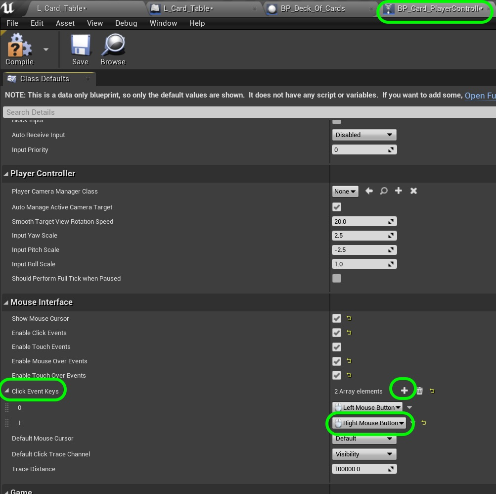

##### `Step 6.`\|`SPCRK`| :small_orange_diamond: :small_blue_diamond:

Reopen **BP_Num_Card** and add a new Function called `UpdateText`.

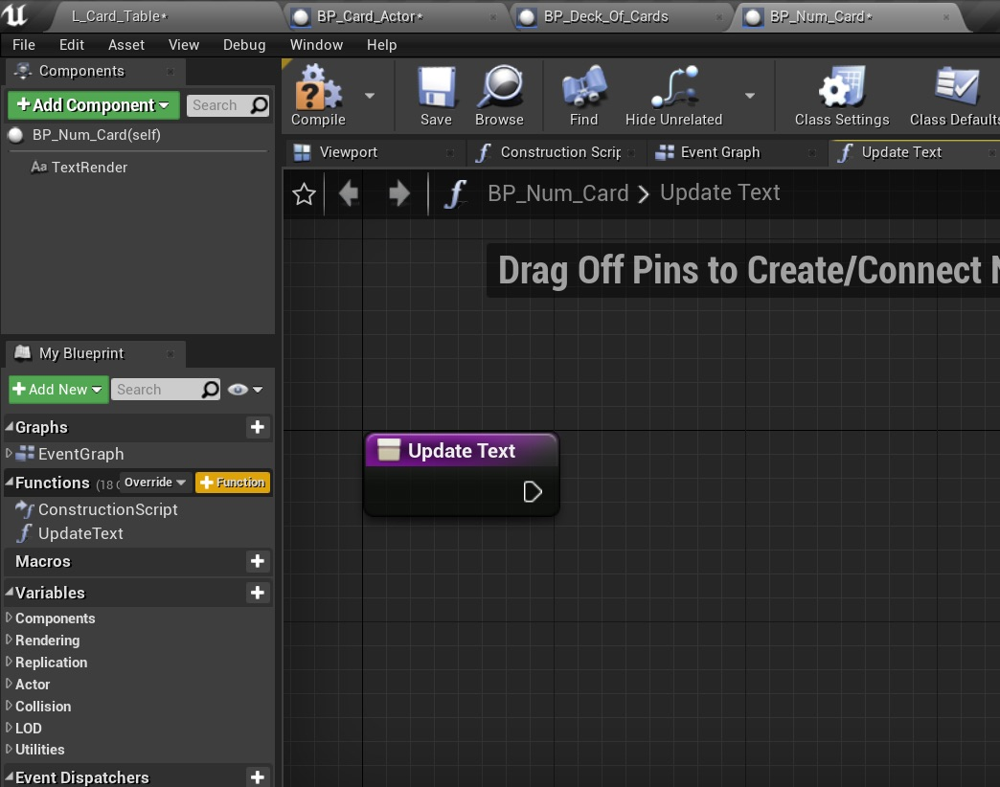

##### `Step 7.`\|`SPCRK`| :small_orange_diamond: :small_blue_diamond: :small_blue_diamond:

Go to the **Event Graph** and lets move all the nodes to the function.  Select all nodes except for **Begin Play** and copy and cut all the nodes.

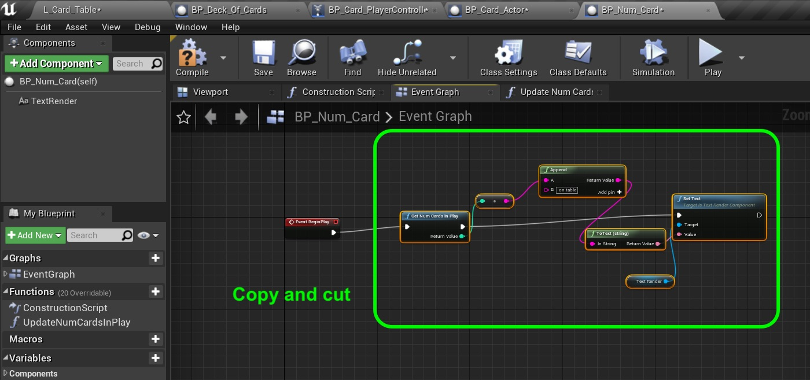

##### `Step 8.`\|`SPCRK`| :small_orange_diamond: :small_blue_diamond: :small_blue_diamond: :small_blue_diamond:

Got to the **Update Text** function and paste the nodes there.  Connect the execution node to the function node.

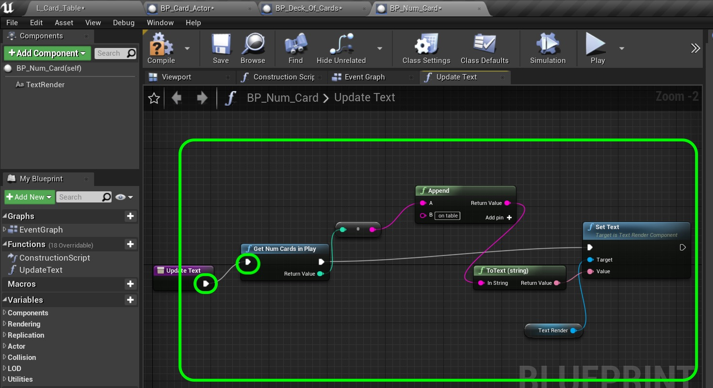

##### `Step 9.`\|`SPCRK`| :small_orange_diamond: :small_blue_diamond: :small_blue_diamond: :small_blue_diamond: :small_blue_diamond:

Go back to the **Event Graph** and add to the **Begin Play** a call to the new function **Update Text**.

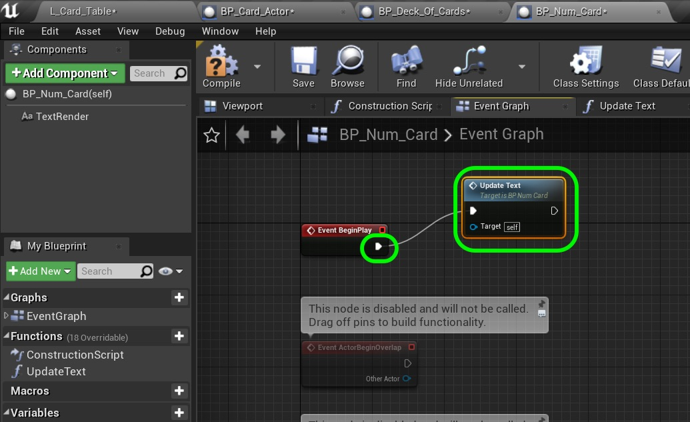

##### `Step 10.`\|`SPCRK`| :large_blue_diamond:

We need some way of accessing this function in the **BP_Num_Card** function from the card when it is right clicked.  Open up **BP_Deck_Of_Cards** and add a new Variable called `NumCardTextRef` and make it type **BP_Num_Card** object reference (the blue ball).

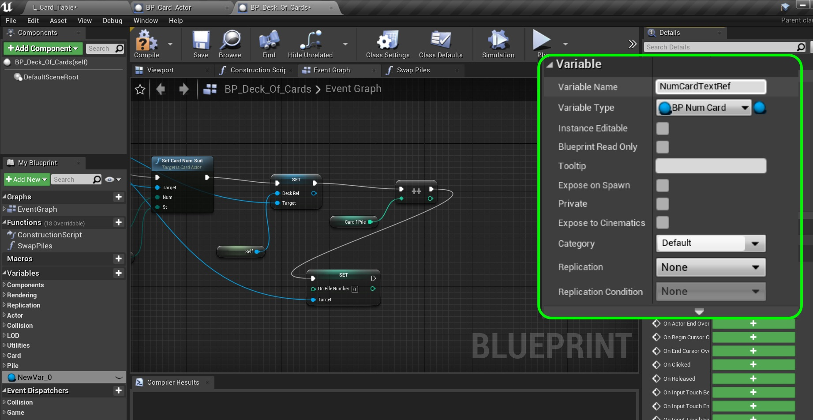

##### `Step 11.`\|`SPCRK`| :large_blue_diamond: :small_blue_diamond: 

Do the same thing in **BP_Card_Actor** and add a **BP_Num_Card** object reference Variable called `NumCardTextRef`.

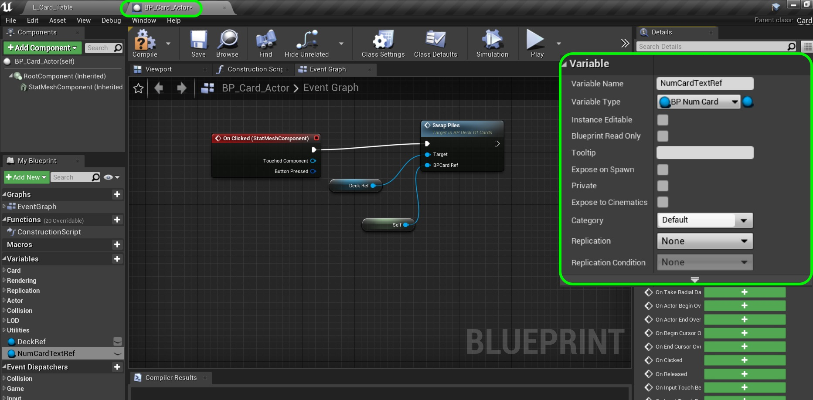

##### `Step 12.`\|`SPCRK`| :large_blue_diamond: :small_blue_diamond: :small_blue_diamond: 

Go back to **BP_Deck_Of_Cards** and add a **Get All Actors of Class** node.  This node should not be used in an update loop as it is expensive but is fine once at the begining of the game. Set the class to `BP_Num_Card` class. This will search for all instances of this class in the level (which there is only one).

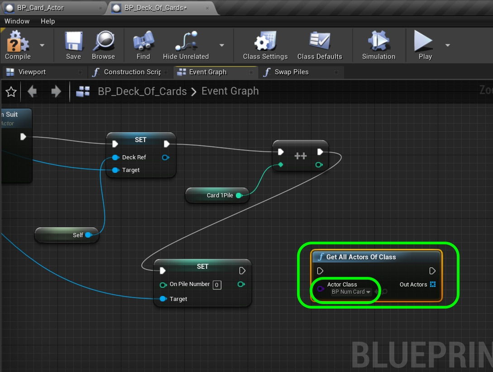

##### `Step 13.`\|`SPCRK`| :large_blue_diamond: :small_blue_diamond: :small_blue_diamond:  :small_blue_diamond: 

 Now connect the execution pin to **Get All Actors Of Class).  Pull off of the array exit pin and select a **Get** node.  This will get us access into the array.  Since there is only one item we will access item `0` which is defult.  Then add a **Set New Card Text Ref** node and attafch it to the **Get** node.

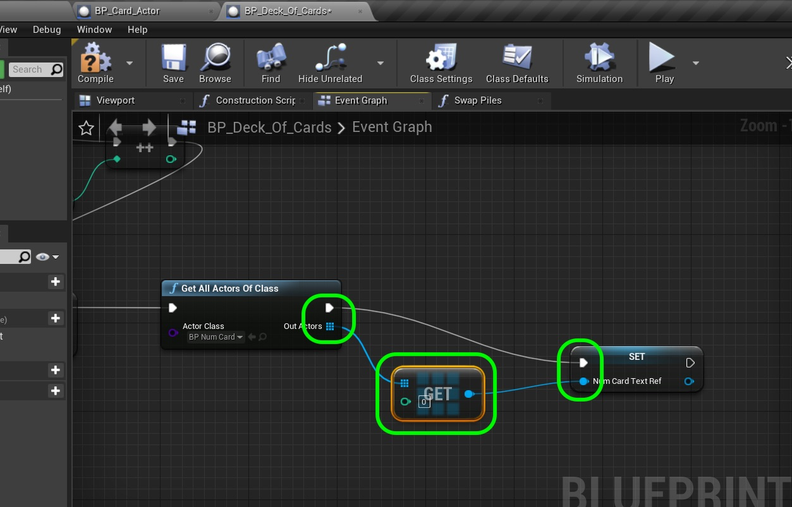

##### `Step 14.`\|`SPCRK`| :large_blue_diamond: :small_blue_diamond: :small_blue_diamond: :small_blue_diamond:  :small_blue_diamond: 

Pull off of the **Create Actor** node and select **Set Num Card Text Ref** in each card to give it a reference.

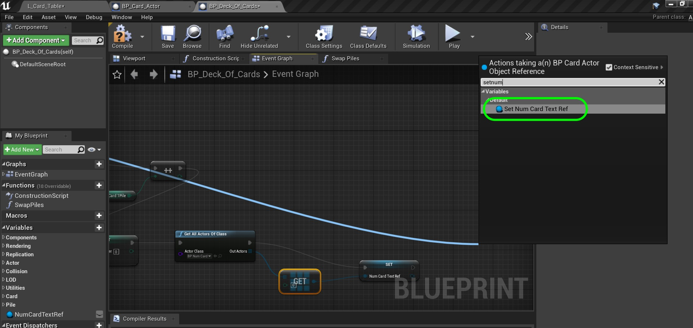

##### `Step 15.`\|`SPCRK`| :large_blue_diamond: :small_orange_diamond: 

Connect the **Set New Card Textz Ref** to the **Set** node. Now all cards have access to the text blueprint and can call its function.  We will do that on the next page.

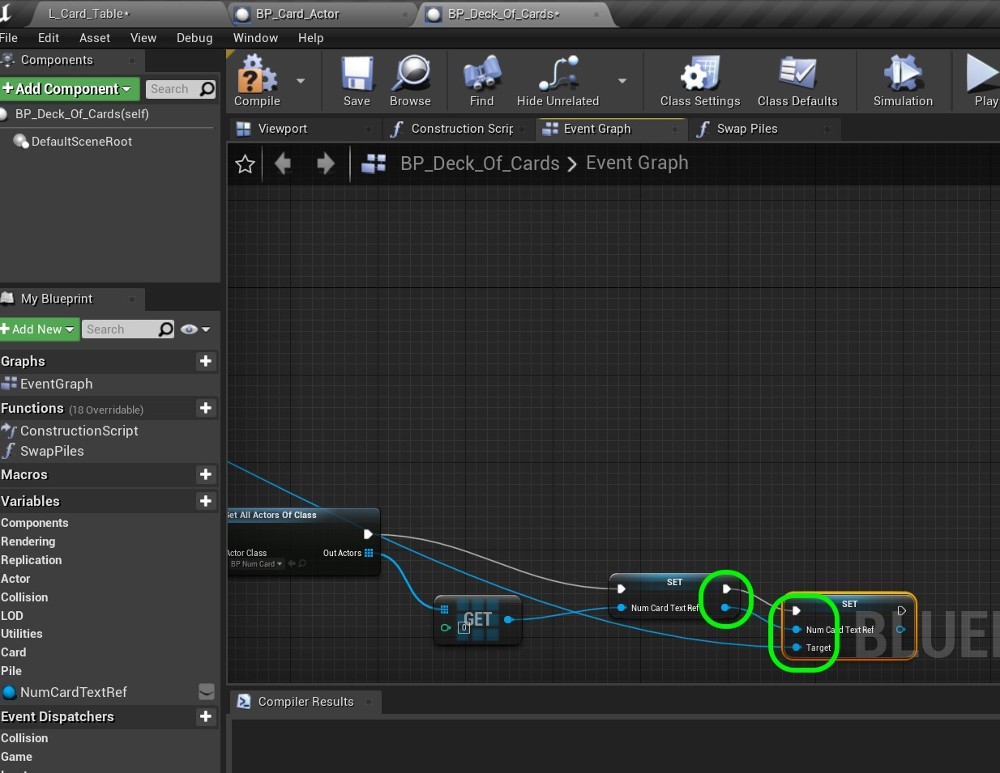

##### `Step 16.`\|`SPCRK`| :large_blue_diamond: :small_orange_diamond:   :small_blue_diamond: 

When the mouse button is pressed in **BP_Card_Actor** we want to call this function we created to update the text in the display. Drag a **Get New Card Text Ref** and pull of the pin and add the **Update Text** function node.

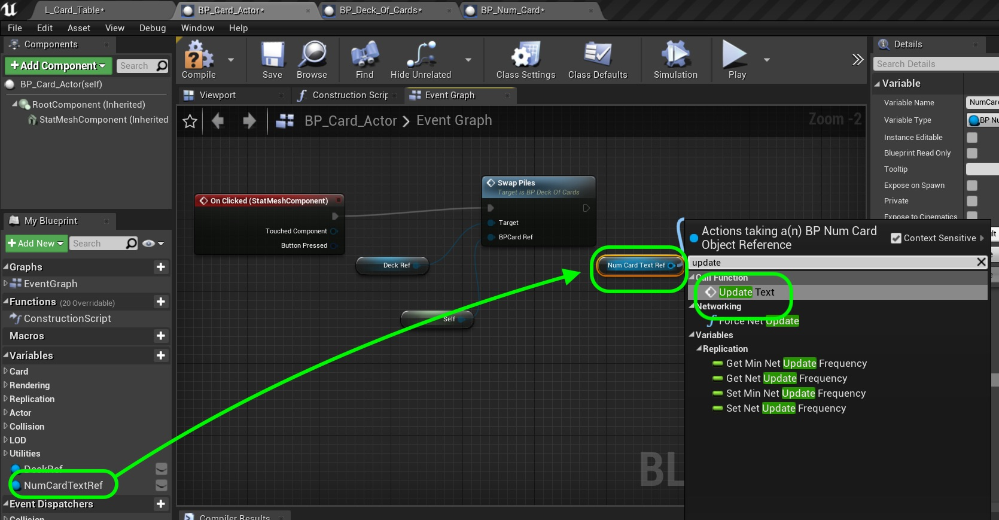

##### `Step 17.`\|`SPCRK`| :large_blue_diamond: :small_orange_diamond: :small_blue_diamond: :small_blue_diamond:

 Connect the execution pin.  Now we need to differentiate between a left button and right button press next.

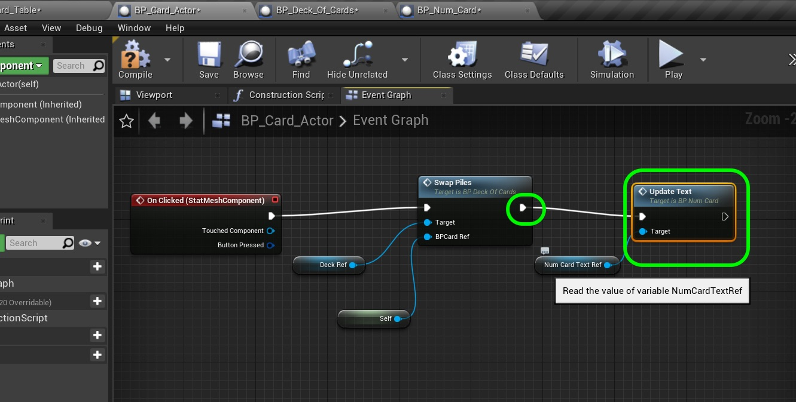

##### `Step 18.`\|`SPCRK`| :large_blue_diamond: :small_orange_diamond: :small_blue_diamond: :small_blue_diamond: :small_blue_diamond:

The **Button Pressed** node on the **On Clicked** event holds a structure of enumerators with which key was pressed.  Pull off of this pin and enter **==** to find **Equal(Key)**. 

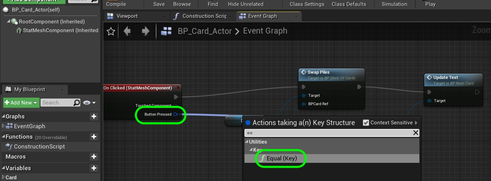

##### `Step 19.`\|`SPCRK`| :large_blue_diamond: :small_orange_diamond: :small_blue_diamond: :small_blue_diamond: :small_blue_diamond: :small_blue_diamond:

Now in the drop down menu select the **Mouse \| Left Mouse Button** variable.

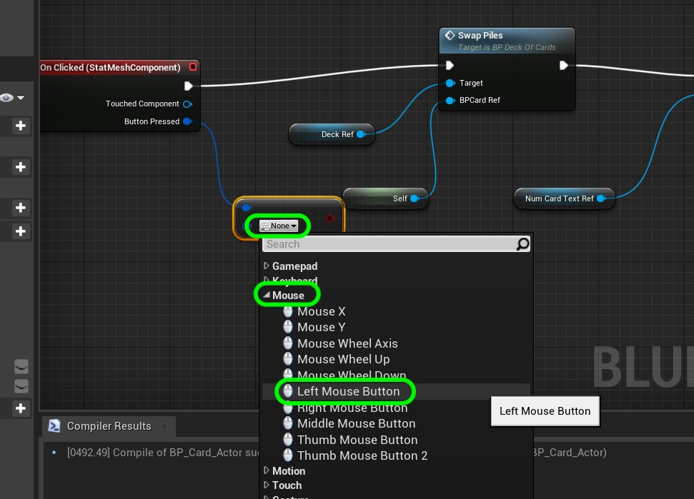

##### `Step 20.`\|`SPCRK`| :large_blue_diamond: :large_blue_diamond:

Pull off of the **==** node and select a **Branch.  Send the **True** execution node to **Swap Piles**. This gets us back to where we were before but only when the left mouse button is pressed.  

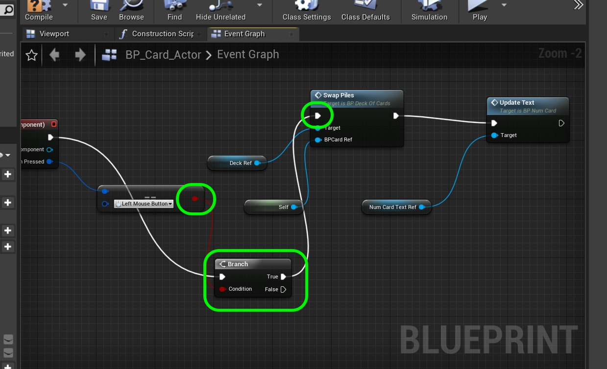

##### `Step 21.`\|`SPCRK`| :large_blue_diamond: :large_blue_diamond: :small_blue_diamond:

If the left mouse button fails add another **Branch** coming from the **False** execution pin and check to see if the **Right Mouse Button** is pressed.  If so then go to **Destroy Actor** wich cues the object for deletion.  UE4 handles the garbage collection and we will get a sense of it shortly.  At the very end update the text so it displays the new number of cards on the table.

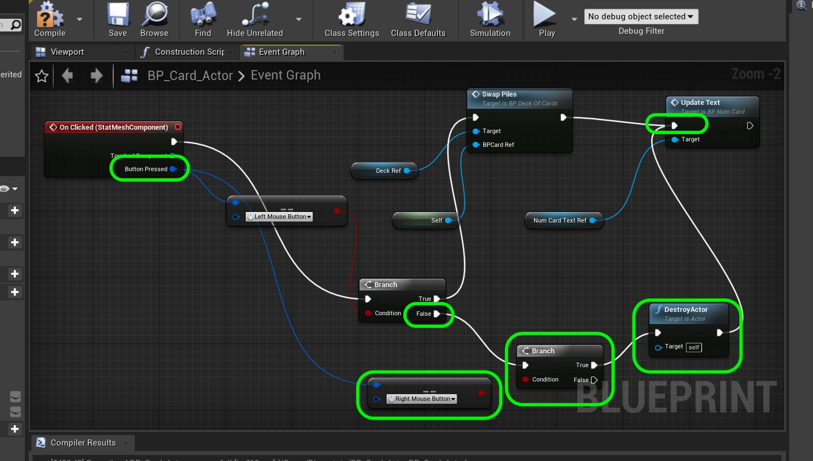

___

| [previous](../)| [home](../README.md#user-content-gms2-top-down-shooter) | [next](../)|
|---|---|---|
