### UE4 Static

[previous](../) • [home](../README.md#user-content-gms2-top-down-shooter) • [next](../)

We have created a static **UFUNCTION** with no issues, but Unreal does not allow us to use static **UPROPERTIES** so we will find a work around on how to use them. Lets recreate what we did in the C++ Card class with a `static int NumbersOfCardsInPlay`.

 

---

##### `Step 1.`\|`SPCRK`|:small_blue_diamond:

Open up **Card_Actor.h** and add to the top of **private:** a **static int32**.  We will try and make it a **UPROPERTY** so we can use it in blueprints.

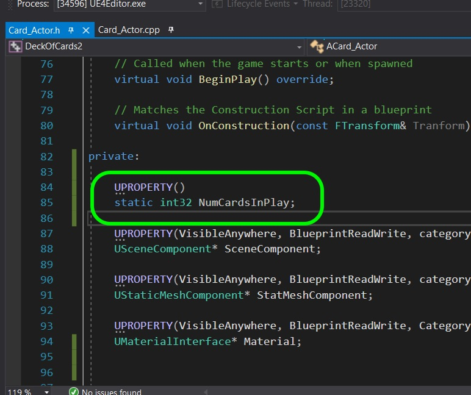

##### `Step 2.`\|`FHIU`|:small_blue_diamond: :small_blue_diamond: 

Now go to the editor and press the **Compile** button.  You will get an error with a message and essentially you cannot make a static member with a **UPROPERTY**.  

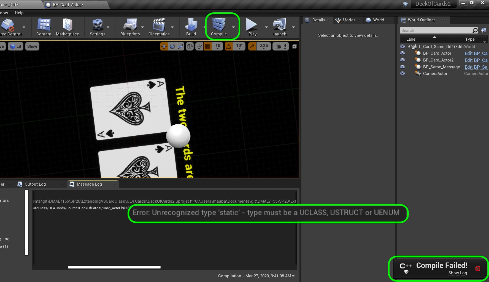

##### `Step 3.`\|`SPCRK`|:small_blue_diamond: :small_blue_diamond: :small_blue_diamond:

Remove the UPROPERTY() macro in the **Card_Actor.h**.

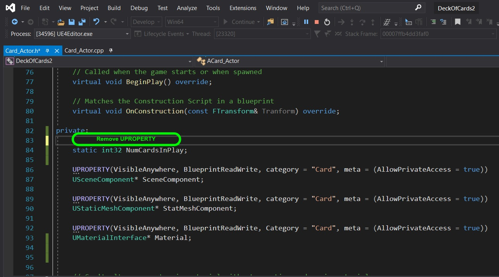

##### `Step 4.`\|`SPCRK`|:small_blue_diamond: :small_blue_diamond: :small_blue_diamond: :small_blue_diamond:

Go back to the editor and press **Compile**.  You will notice that you no longer have errors.  This way we can still use static members we will just have to write a static **UFUNCTION** as a getter.

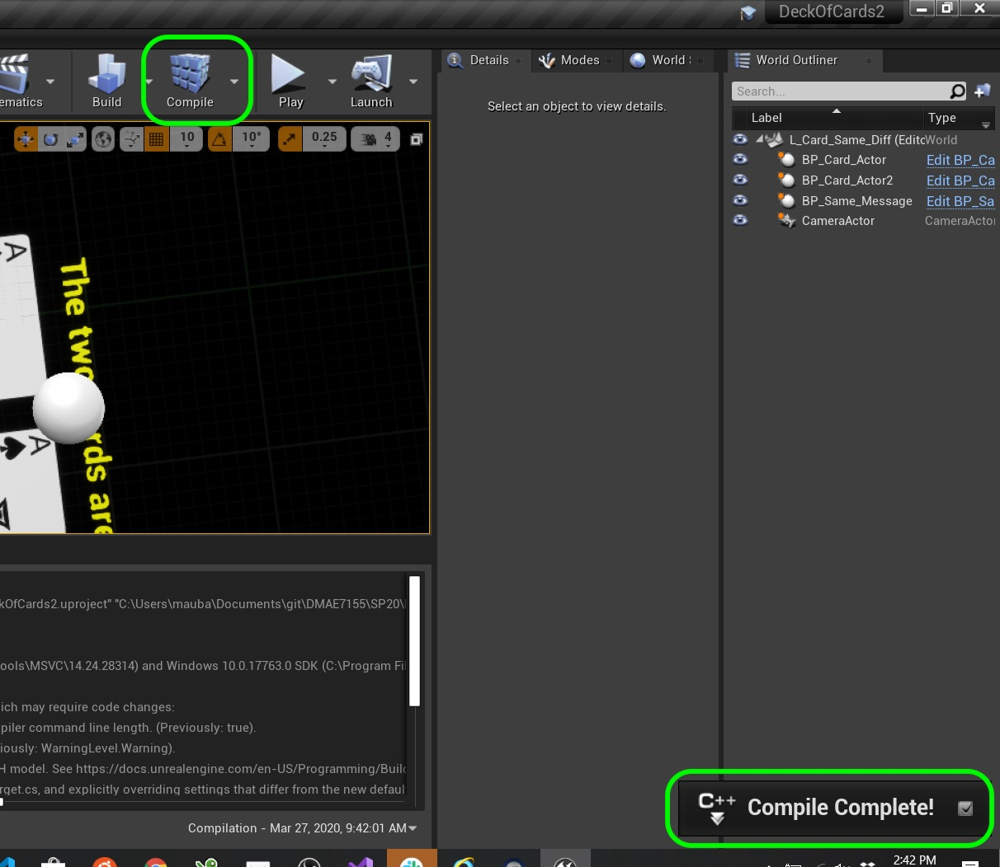

##### `Step 5.`\|`SPCRK`| :small_orange_diamond:

 Now open **Card_Actor.cpp** and add to the very top the default value of `0` for **NumCardsInPlay**. Now in the class constructor `ACard_Actor::ACard_Actor()` increment this value by one every time it is called.

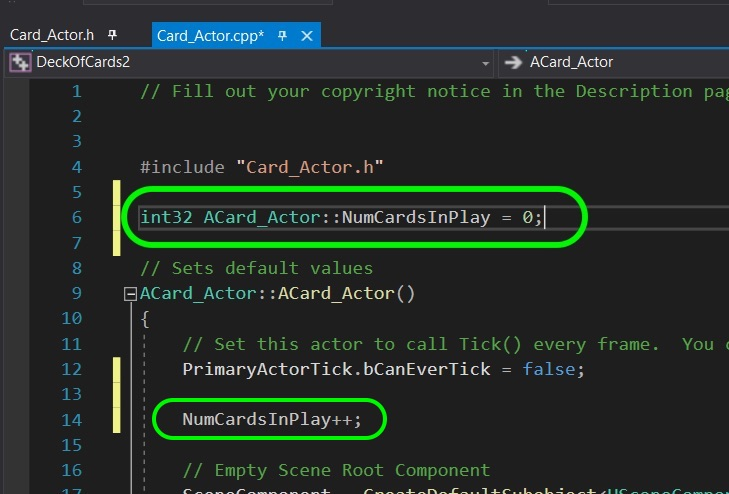

##### `Step 6.`\|`SPCRK`| :small_orange_diamond: :small_blue_diamond:

Now lets add a **UFUNCTION** that returns our static variable.  Please note that a static function can only include static members. We will make it **BlueprintCallable** so you can access this value in a blueprint.

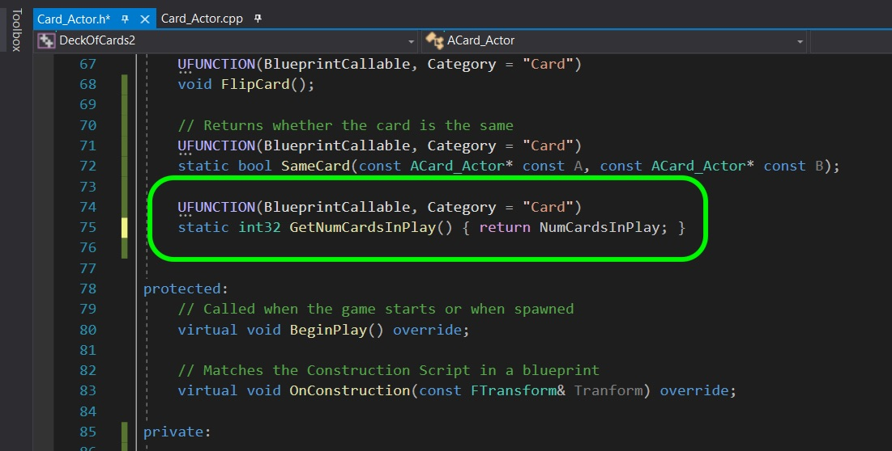

##### `Step 7.`\|`SPCRK`| :small_orange_diamond: :small_blue_diamond: :small_blue_diamond:

 Add a new **BluePrint Class** and select **Actor**.  Name this new blueprint `BP_Num_Card`.

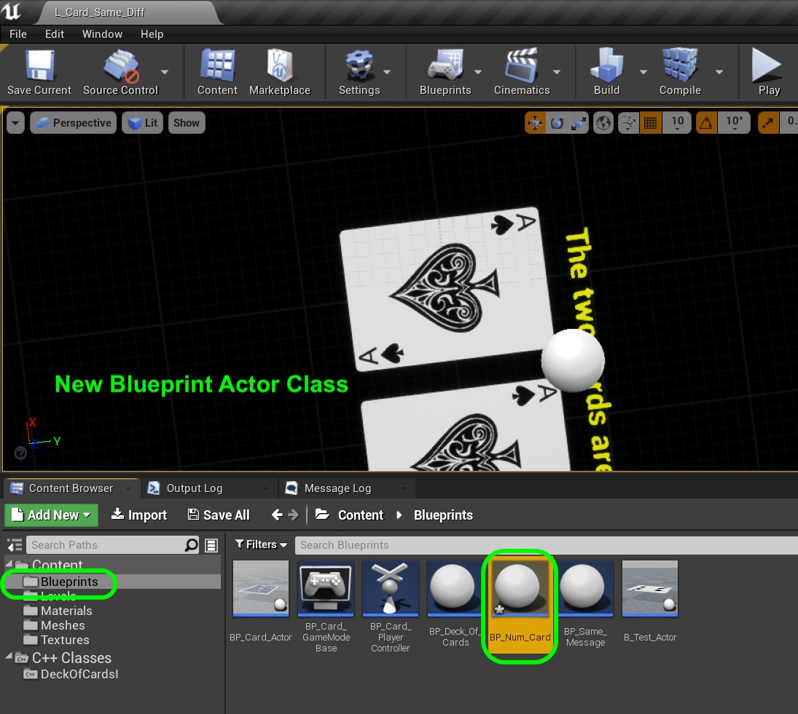

##### `Step 8.`\|`SPCRK`| :small_orange_diamond: :small_blue_diamond: :small_blue_diamond: :small_blue_diamond:

Press the **Add Component** button and add a **TextRender** component. Change the **Materials** to **UnlitText**, the color to something bright, and the **Horizontal Alignment** to **Center**.

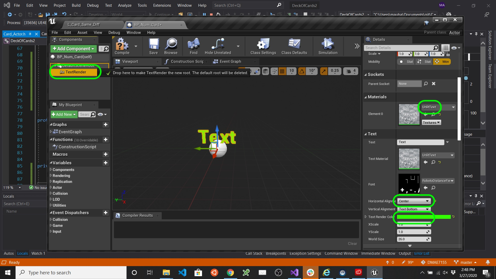

##### `Step 9.`\|`SPCRK`| :small_orange_diamond: :small_blue_diamond: :small_blue_diamond: :small_blue_diamond: :small_blue_diamond:

Save your work in the current level.  Change levels to **L_Card_Table** as we will use this level to show how many cards we have on the table.  Drag a copy of **BP_Num_Card** into the level and rotate it into position to where the text is pointing the camera.

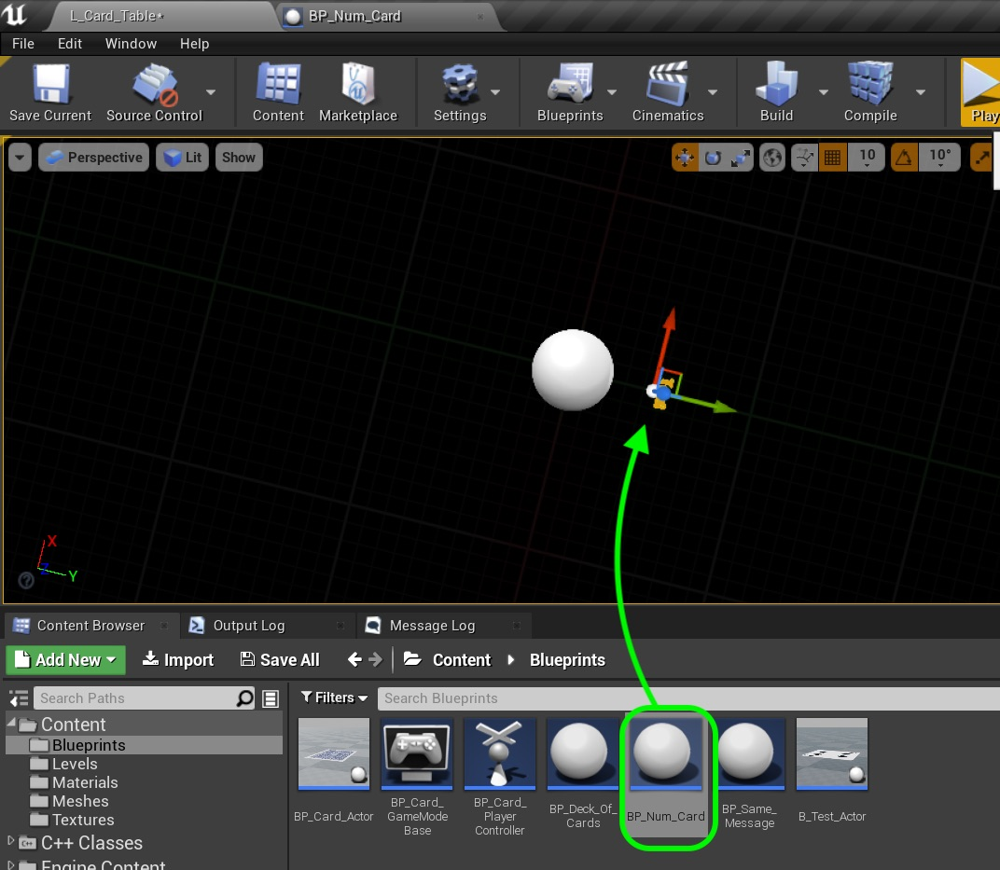

##### `Step 10.`\|`SPCRK`| :large_blue_diamond:

 Go back and forth until you get the text on top of the card in the room like so.

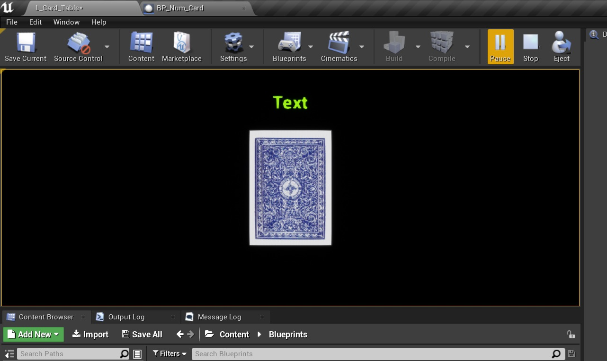

##### `Step 11.`\|`SPCRK`| :large_blue_diamond: :small_blue_diamond: 

Now open up **BP_Num_Card** and in the **Event Graph** right click and search for the static function we added.  If you don't find it press the **Compile** button to make sure the editor knows this function is there. To find it type in **GetNumCardsInPlay**.

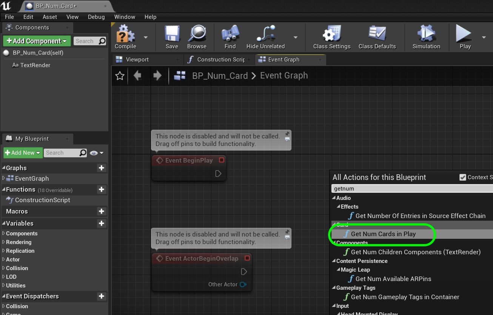

##### `Step 12.`\|`SPCRK`| :large_blue_diamond: :small_blue_diamond: :small_blue_diamond: 

 Attach the execution pin with **Event Begin Play** and add a **Append String** node to the graph.

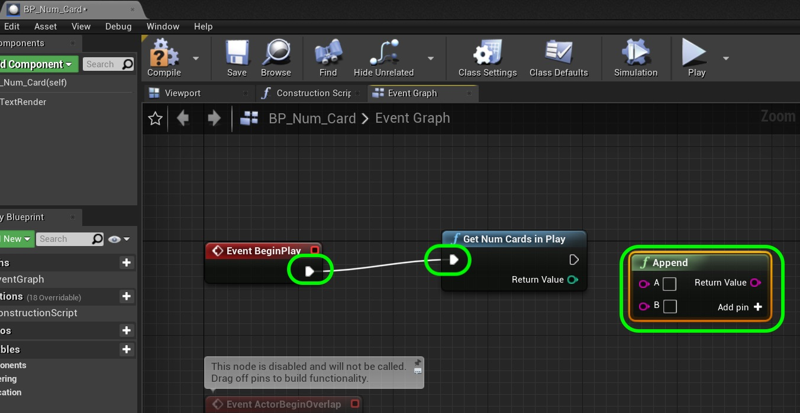

##### `Step 13.`\|`SPCRK`| :large_blue_diamond: :small_blue_diamond: :small_blue_diamond:  :small_blue_diamond: 

 Plug the output of **Get Num Cards in Play** into the top of the **Append** node. That will give us the number of cards then in the **B** node type in `on table`.  Notice there is a space before **on** so that there is a space between the number and on.

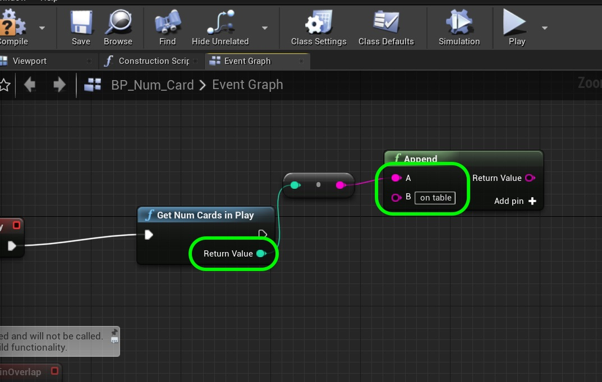

##### `Step 14.`\|`SPCRK`| :large_blue_diamond: :small_blue_diamond: :small_blue_diamond: :small_blue_diamond:  :small_blue_diamond: 

Drag a **Get TextRender** node onto the graph and then pull from the pin and select **Set Text**.

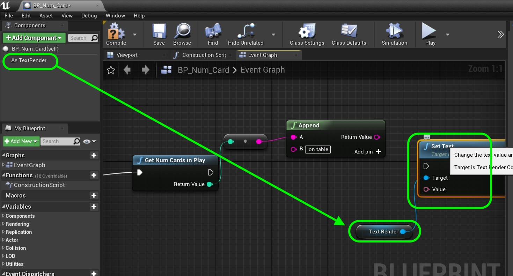

##### `Step 15.`\|`SPCRK`| :large_blue_diamond: :small_orange_diamond: 

Connect the **Return Value** pin of the **Append** node to the **Value** input pin of the **Set Text** node. Connect the execution pin to **SetText** node from **GetNumCardsInPlay** node. 

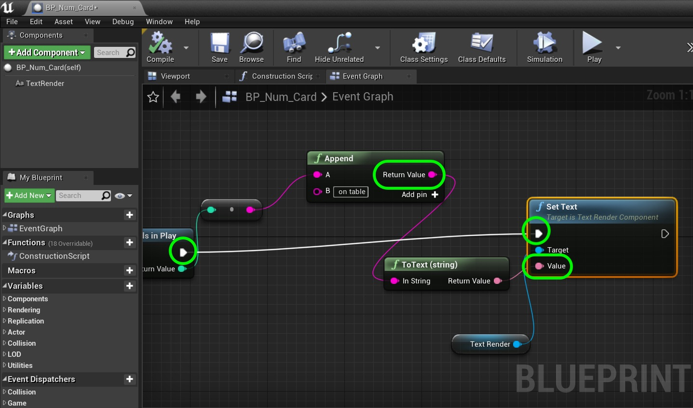

##### `Step 16.`\|`SPCRK`| :large_blue_diamond: :small_orange_diamond:   :small_blue_diamond: 

Compile the game and run.  Now the thing to understand is that when you boot up the editor it runs the constructor on all the classes in the level.  So if we keep stopping and starting the number just keeps going up.  This is because the static member keeps the memory and does not get garbage collected.  So even though each time there are only 52 cards on the table, that variable keeps getting added to.

___

| [previous](../)| [home](../README.md#user-content-gms2-top-down-shooter) | [next](../)|
|---|---|---|
