### UStructs

[previous](../) • [home](../README.md#user-content-gms2-top-down-shooter) • [next](../)

In Unreal we have access to UStructs so that a struct can be recognized by Unreal and used in Blueprints.  Even tough not necessary we can create a card struct that contains both enumerators.  Lets do this to show how we can use UStructs in Unreal.

 

---

##### `Step 1.`\|`SPCRK`|:small_blue_diamond:

 Open **CardActor.h** and add after the enumerators but before the class the following new **USTRUCT**.  As with most data structures in Unreal we will use their Macro and make it accessible in blueprints (**BlueprintType**).  It will not compile unless the struct name starts with an **F** typedef.  We call the parent structures code with the **GENERATED_BODY()** Macro. We then assign two UPROPERTY's just like we do in a class (structs are practically the same).  Since a struct defaults to **public** we don't need to specifiy the keyword. This struct will consst of two enumerators an **ECardNumber** and **ECardSuit**. 

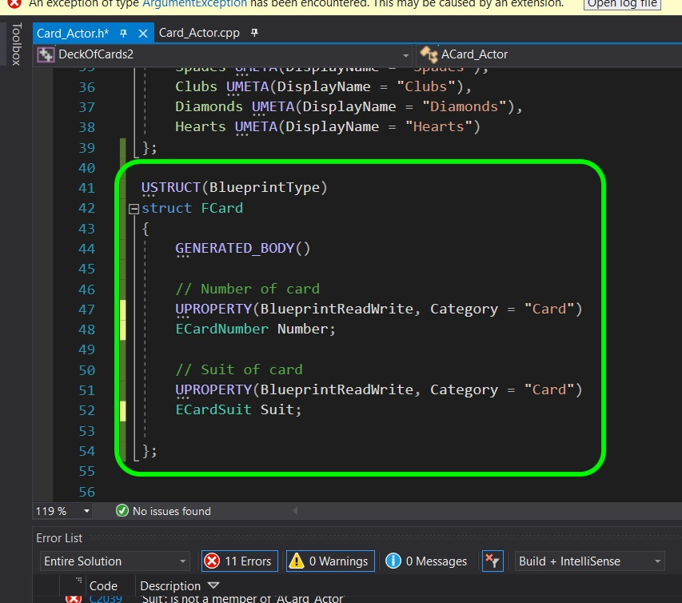

##### `Step 2.`\|`FHIU`|:small_blue_diamond: :small_blue_diamond: 

Now **delete** the **Number** and **Suit** property and replace it with a single **FCard** struct property.

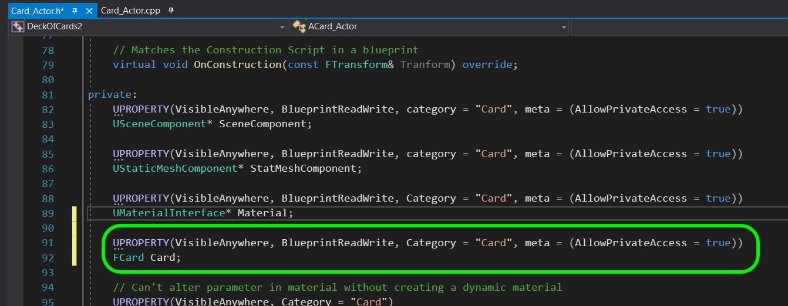

##### `Step 3.`\|`SPCRK`|:small_blue_diamond: :small_blue_diamond: :small_blue_diamond:

 Go down in the **.h** file to the comparison operator.  We no longer access them directly, we get to the variable through the struct.

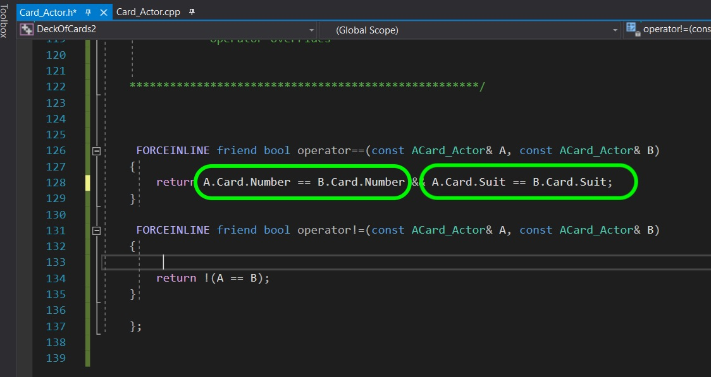

##### `Step 4.`\|`SPCRK`|:small_blue_diamond: :small_blue_diamond: :small_blue_diamond: :small_blue_diamond:

Now open the **Card_Actor.cpp** and look for the **SetCard()** definition.  You need to access **Suit** through the **FCard Card** struct.

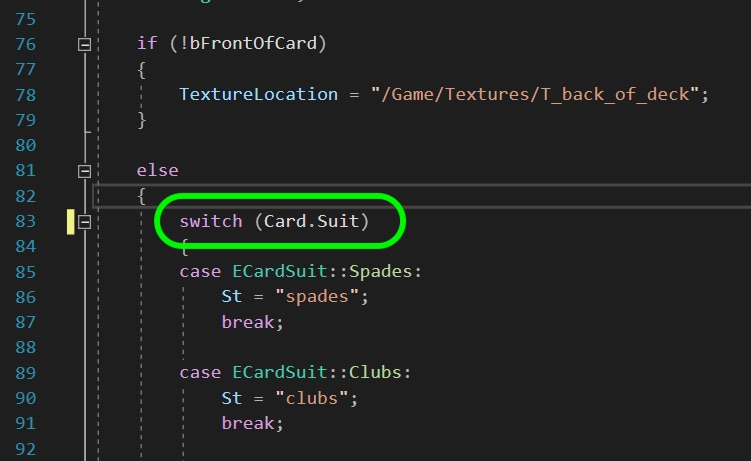

##### `Step 5.`\|`SPCRK`| :small_orange_diamond:

Do the same thing for the number.

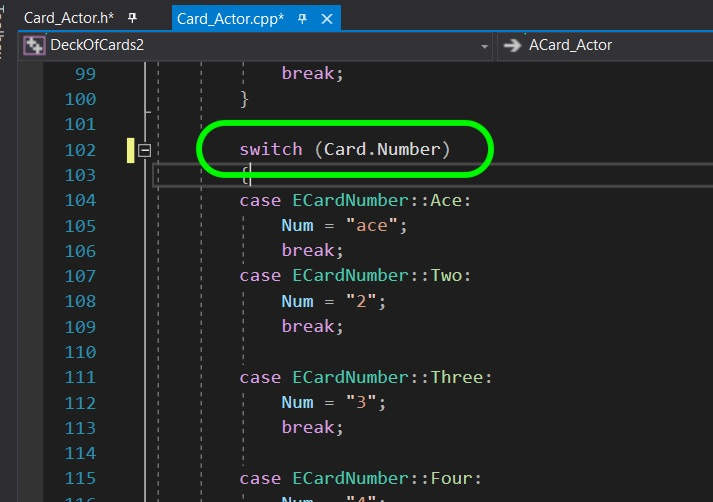

##### `Step 6.`\|`SPCRK`| :small_orange_diamond: :small_blue_diamond:

 Now the final thing we have to fix before it will compile is the **SetCardNumSuit** method.  We need to replace the direct variables to go through the **struct**.

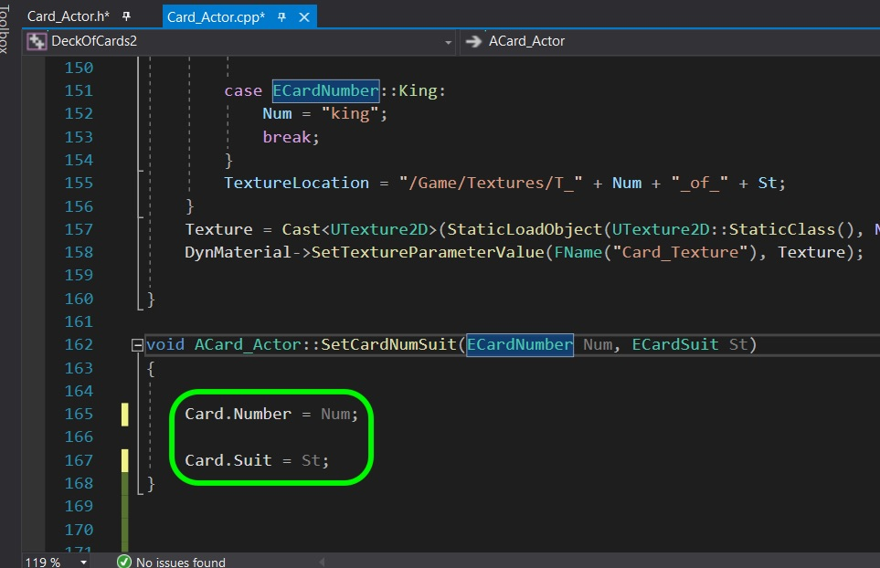

##### `Step 7.`\|`SPCRK`| :small_orange_diamond: :small_blue_diamond: :small_blue_diamond:

Now go back into the game and make sure it still works.  You should notice no difference.

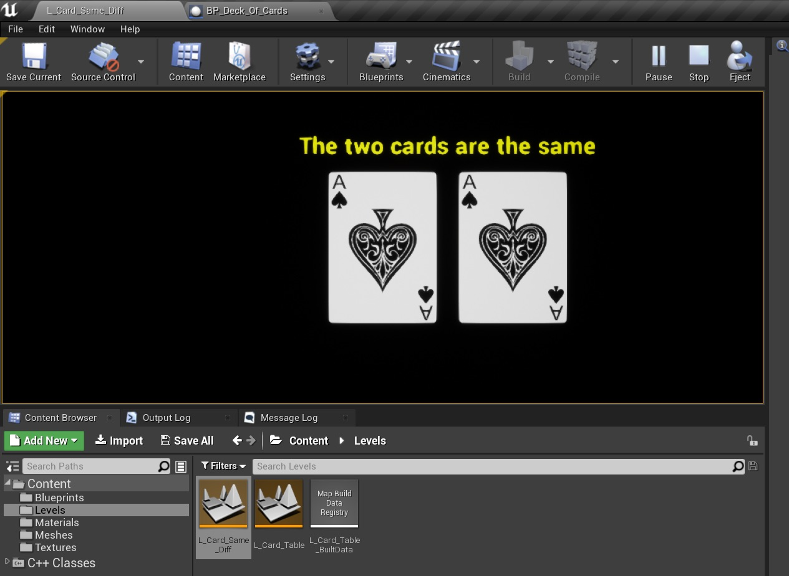

##### `Step 8.`\|`SPCRK`| :small_orange_diamond: :small_blue_diamond: :small_blue_diamond: :small_blue_diamond:

Now since this was such a fundamental change we should load up the **L_Card_Table** level and make sure it still works as well!

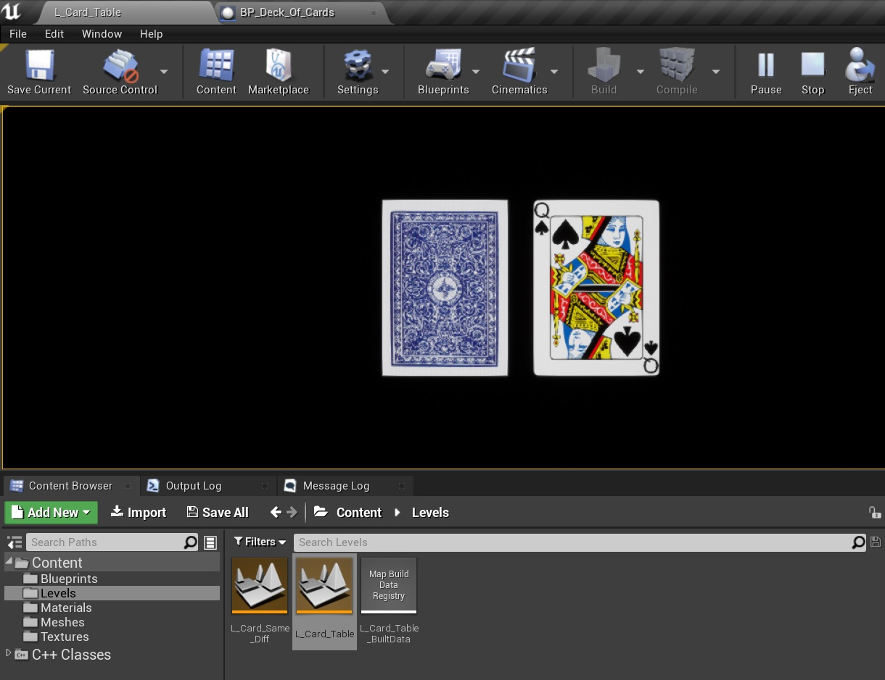

##### `Step 9.`\|`SPCRK`| :small_orange_diamond: :small_blue_diamond: :small_blue_diamond: :small_blue_diamond: :small_blue_diamond:

Lets double check that this struct can be accessed in a blueprint.  Open up **BP_Card_Actor** in Unreal and click on the eyball next to the **Add New +** button.  Select **Show Inherited Variables** so you can get access to the variables you have allowed access from the C++ class.

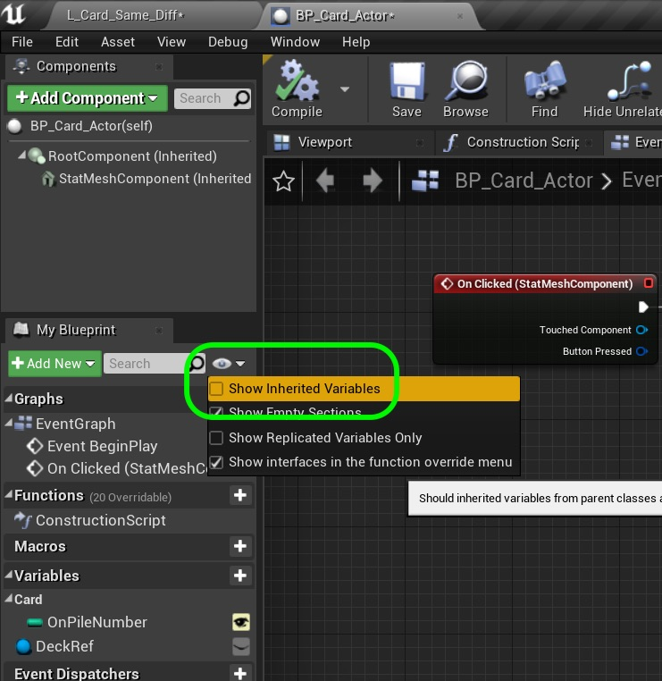

##### `Step 10.`\|`SPCRK`| :large_blue_diamond:

I believe we made all of our editable cards **Card** category.  So click on it to reveal all the variables in that category.

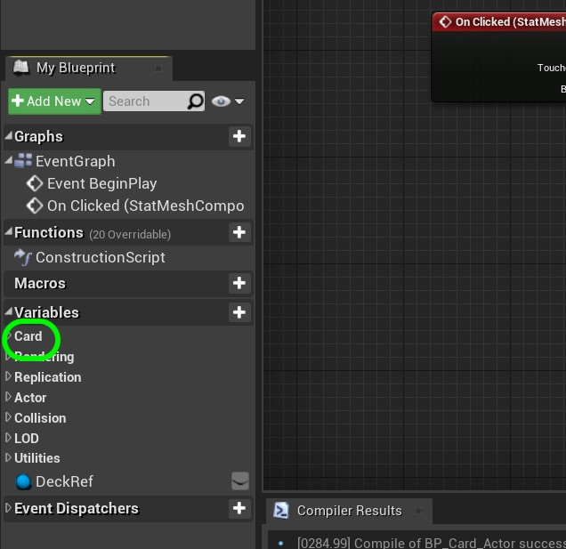

##### `Step 11.`\|`SPCRK`| :large_blue_diamond: :small_blue_diamond: 

Drag **Card** variable onto the graph and select **Set Card**.

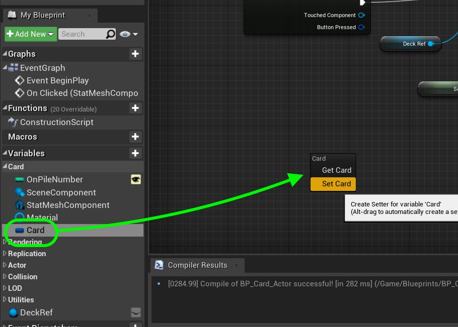

##### `Step 12.`\|`SPCRK`| :large_blue_diamond: :small_blue_diamond: :small_blue_diamond: 

Right click on the **Card** pin and select **Split Struct Pin**.  

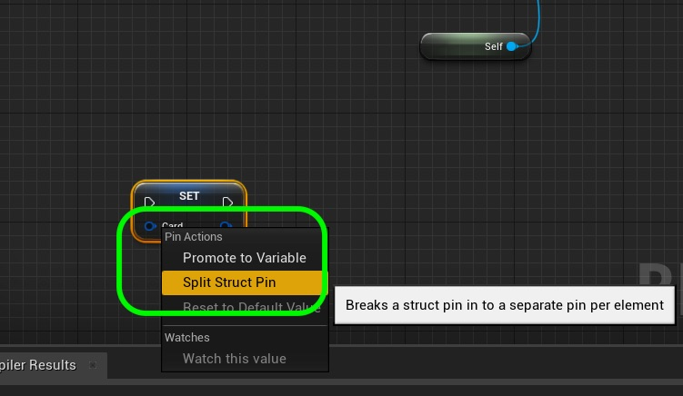

##### `Step 13.`\|`SPCRK`| :large_blue_diamond: :small_blue_diamond: :small_blue_diamond:  :small_blue_diamond: 

You will then see our default card struct has split into its two data members.  It is available to use in blueprints.

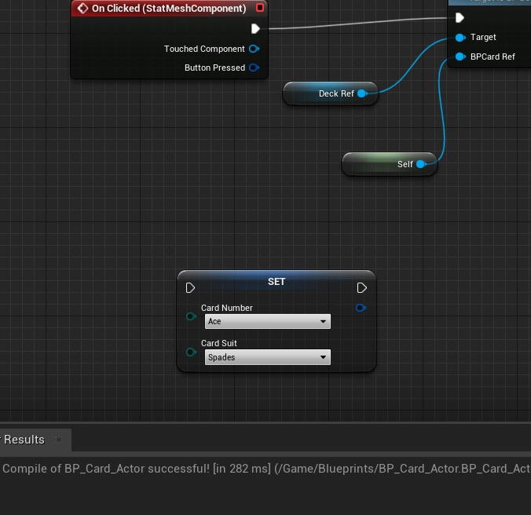

##### `Step 14.`\|`SPCRK`| :large_blue_diamond: :small_blue_diamond: :small_blue_diamond: :small_blue_diamond:  :small_blue_diamond: 

Delete this node as we do not need to do anything with it.  Also for future reference you now can access this struct type in a variable.  You can go to the structure section and type *Card** - you can drop the **F** as the blueprints do not show these. Next up we will look at more on static members as well as constructors and destructors.

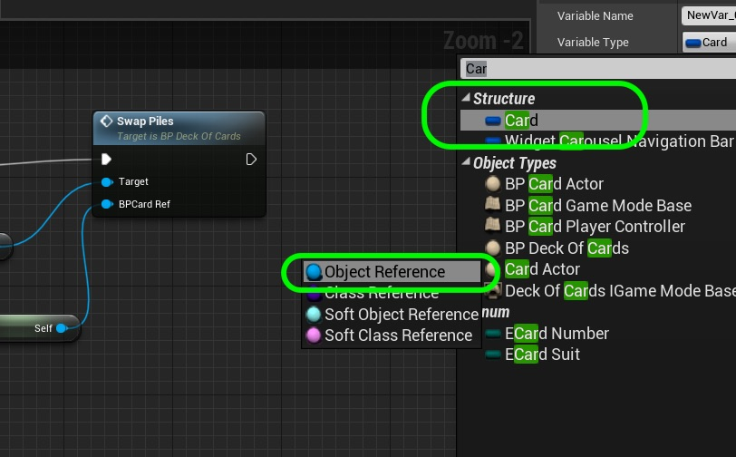

___

| [previous](../)| [home](../README.md#user-content-gms2-top-down-shooter) | [next](../)|
|---|---|---|
